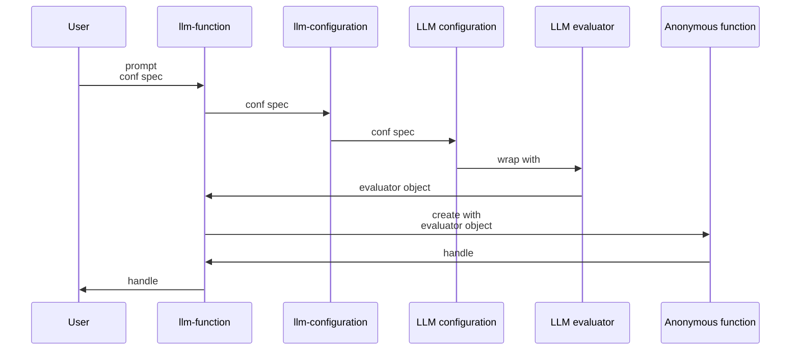
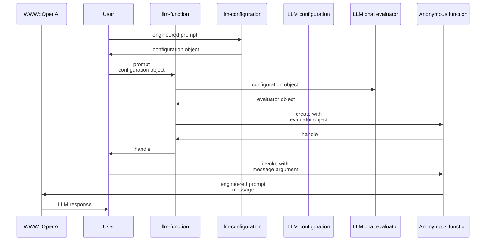

# LLM::Functions 

## In brief

Thi Raku package provides functions and function objects to access, interact, and utilize 
Large Language Mondels (LLMs), like 
[OpenAI](https://platform.openai.com), [OAI1], and 
[PaLM](https://developers.generativeai.google/products/palm), [ZG1].

For more details how the concrete LLMs are accessed see the packages
["WWW::OpenAI"](https://raku.land/zef:antononcube/WWW::OpenAI), [AAp2], and
["WWW::PaLM"](https://raku.land/zef:antononcube/WWW::PaLM), [AAp3].

-----

## Installation

Package installations from both sources use [zef installer](https://github.com/ugexe/zef)
(which should be bundled with the "standard" Rakudo installation file.)

To install the package from [Zef ecosystem](https://raku.land/) use the shell command:

```
zef install LLM::Functions
```

To install the package from the GitHub repository use the shell command:

```
zef install https://github.com/antononcube/Raku-LLM-Functions.git
```

------

## Design

"Out of the box"
["LLM::Functions"](https://raku.land/zef:antononcube/LLM::Functions) uses
["WWW::OpenAI"](https://raku.land/zef:antononcube/WWW::OpenAI), [AAp2], and
["WWW::PaLM"](https://raku.land/zef:antononcube/WWW::PaLM), [AAp3].
Other LLM access packages can utilized via appropriate LLM configurations.

The configurations are instances of the class `LLM::Functions::Configuration`.
The configurations are used by instances of the class `LLM::Functions::Evaluator`.

New LLM functions are constructed with the function `llm-function`.

The function `llm-function`:

- Has the option "llm-evaluator" that takes evaluators, configurations, or string shorthands as values
- Returns anonymous functions (that access LLMs via evaluators/configurations.)
- Gives result functions that can be applied to different types of arguments depending on the first argument
- Takes as a first argument a prompt that can be a:
    - String
    - Function with positional arguments
    - Function with named arguments


Here is a sequence diagram that corresponds to typical creation procedure of LLM configuration and evaluator objects,
and corresponding LLM-functions are created:



Here is a sequence diagram for making a LLM configuration with a global (engineered) prompt,
and using that configuration to complete a chat message:



------

## Configurations

### OpenAI-based

Here is a default, OpenAI-based configuration:

```perl6
use LLM::Functions;
.raku.say for llm-configuration(Whatever).Hash;
```

Here is the ChatGPT-based configuration:

```perl6
.say for llm-configuration('ChatGPT').Hash;
```

**Remark:** Both the "OpenAI" and "ChatGPT" configuration use the "WWW::OpenAI" package.
The "OpenAI" configuration is for text-completions;
the "ChatGPT" configuration is for chat-completions. 

### PaLM-based

Here is the PaLM configuration

```perl6
.say for llm-configuration('PaLM').Hash;
```

-----

## Basic usage of LLM functions

### Textual prompts

Here we make a LLM function with simple (short textual) prompt:

```perl6
my &func = llm-function('Show a recipe for:');
```

Here we evaluate over a message: 

```perl6
say &func('greek salad');
```

### Positional arguments

Here we make a LLM function with function-prompt:

```perl6
my &func2 = llm-function({"How many $^a can fit inside one $^b?"}, llm-evaluator => 'palm');
```

Here were we apply the function:

```perl6
&func2("tenis balls", "toyota corolla 2010");
```

### Named arguments

Here the first argument is a template with two named arguments: 

```perl6
my &func3 = llm-function(-> :$dish, :$cuisine {"Given a recipe for $dish in the $cuisine cuisine."}, llm-evaluator => 'palm');
```

Here is an invocation:

```perl6
&func3(dish => 'salad', cuisine => 'Russion', max-tokens => 300);
```

--------

## Using chat-global prompts

The configuration objects can be given prompts that influence the LLM responses 
"globally" throughout the whole chat.

For detailed examples see the documents:

- ["Using engineered prompts"](./docs/Using-engineered-prompts.md)
- ["Expand tests into documentation examples"](./docs/Expand-tests-into-doc-examples.md)

--------

## References

### Articles

[ZG1] Zoubin Ghahramani,
["Introducing PaLM 2"](https://blog.google/technology/ai/google-palm-2-ai-large-language-model/),
(2023),
[Google Official Blog on AI](https://blog.google/technology/ai/).

### Packages, repositories, sites

[AAp1] Anton Antonov,
[LLM::Functions Raku package](https://github.com/antononcube/Raku-LLM-Functions),
(2023),
[GitHub/antononcube](https://github.com/antononcube).

[AAp2] Anton Antonov,
[WWW::OpenAI Raku package](https://github.com/antononcube/Raku-WWW-OpenAI),
(2023),
[GitHub/antononcube](https://github.com/antononcube).

[AAp3] Anton Antonov,
[WWW::PaLM Raku package](https://github.com/antononcube/Raku-WWW-PaLM),
(2023),
[GitHub/antononcube](https://github.com/antononcube).

[AAp4] Anton Antonov,
[Text::CodeProcessing Raku package](https://github.com/antononcube/Raku-Text-CodeProcessing),
(2021),
[GitHub/antononcube](https://github.com/antononcube).

[OAI1] OpenAI Platform, [OpenAI platform](https://platform.openai.com/).

