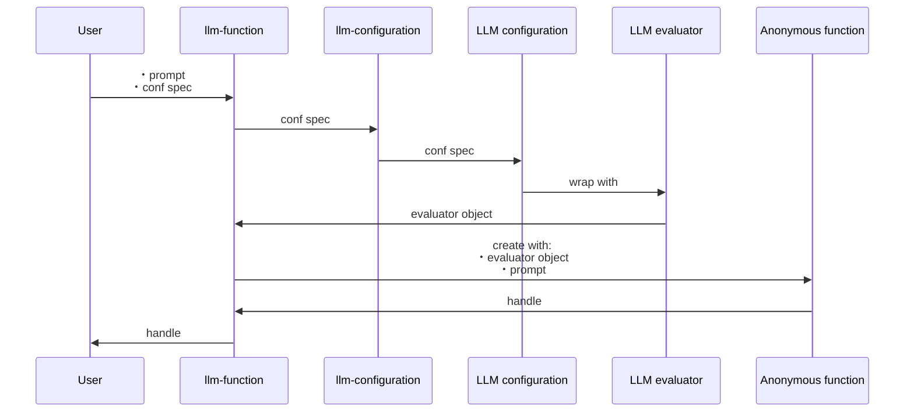
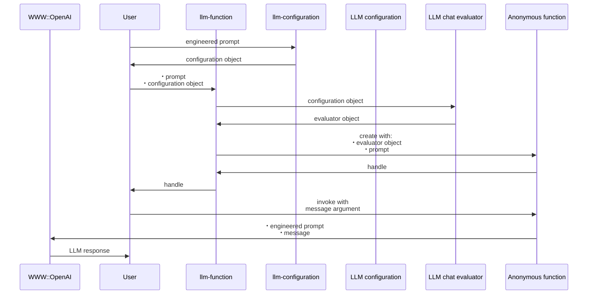

# LLM::Functions 

## In brief

This Raku package provides functions and function objects to access, interact, and utilize 
Large Language Models (LLMs), like 
[OpenAI](https://platform.openai.com), [OAI1], and 
[PaLM](https://developers.generativeai.google/products/palm), [ZG1].

For more details how the concrete LLMs are accessed see the packages
["WWW::OpenAI"](https://raku.land/zef:antononcube/WWW::OpenAI), [AAp2], and
["WWW::PaLM"](https://raku.land/zef:antononcube/WWW::PaLM), [AAp3].

The primary motivation to have handy, configurable functions for utilizing LLMs
came from my work on the packages
["ML::FindTextualAnswer"](https://raku.land/zef:antononcube/ML::FindTextualAnswer), [AAp5], and
["ML::NLPTemplateEngine"](https://raku.land/zef:antononcube/ML::NLPTemplateEngine), [AAp6].

A very similar design of functionalities is developed by Wolfram Research Inc.;
see the paclet
["LLMFunctions"](https://resources.wolframcloud.com/PacletRepository/resources/Wolfram/LLMFunctions/), [WRIp1].

For well curated and instructive examples of LLM prompts see the
[Wolfram Prompt Repository](https://resources.wolframcloud.com/PromptRepository/).

The article
["Generating documents via templates and LLMs"](https://rakuforprediction.wordpress.com/2023/07/11/generating-documents-via-templates-and-llms/), [AA1],
shows an alternative way of streamlining LLMs usage (via Markdown, Org-mode, or Pod6 templates.)

-----

## Installation

Package installations from both sources use [zef installer](https://github.com/ugexe/zef)
(which should be bundled with the "standard" Rakudo installation file.)

To install the package from [Zef ecosystem](https://raku.land/) use the shell command:

```
zef install LLM::Functions
```

To install the package from the GitHub repository use the shell command:

```
zef install https://github.com/antononcube/Raku-LLM-Functions.git
```

------

## Design

"Out of the box"
["LLM::Functions"](https://raku.land/zef:antononcube/LLM::Functions) uses
["WWW::OpenAI"](https://raku.land/zef:antononcube/WWW::OpenAI), [AAp2], and
["WWW::PaLM"](https://raku.land/zef:antononcube/WWW::PaLM), [AAp3].
Other LLM access packages can be utilized via appropriate LLM configurations.

Configurations:
- Are instances of the class `LLM::Functions::Configuration`
- Are used by instances of the class `LLM::Functions::Evaluator`
- Can be converted to Hash objects (i.e. have a `.Hash` method)

New LLM functions are constructed with the function `llm-function`.

The function `llm-function`:

- Has the option "llm-evaluator" that takes evaluators, configurations, or string shorthands as values
- Returns anonymous functions (that access LLMs via evaluators/configurations.)
- Gives result functions that can be applied to different types of arguments depending on the first argument
- Takes as a first argument a prompt that can be a:
    - String
    - Function with positional arguments
    - Function with named arguments

Here is a sequence diagram that follows the steps of a typical creation procedure of 
LLM configuration- and evaluator objects, and the corresponding LLM-function that utilizes them:



Here is a sequence diagram for making a LLM configuration with a global (engineered) prompt,
and using that configuration to generate a chat message response:



------

## Configurations

### OpenAI-based

Here is the default, OpenAI-based configuration:

```perl6
use LLM::Functions;
.raku.say for llm-configuration('OpenAI').Hash;
```

Here is the ChatGPT-based configuration:

```perl6
.say for llm-configuration('ChatGPT').Hash;
```

**Remark:** `llm-configuration(Whatever)` is equivalent to `llm-configuration('OpenAI')`.

**Remark:** Both the "OpenAI" and "ChatGPT" configuration use functions of the package "WWW::OpenAI", [AAp2].
The "OpenAI" configuration is for text-completions;
the "ChatGPT" configuration is for chat-completions. 

### PaLM-based

Here is the default PaLM configuration:

```perl6
.say for llm-configuration('PaLM').Hash;
```

-----

## Basic usage of LLM functions

### Textual prompts

Here we make a LLM function with a simple (short, textual) prompt:

```perl6
my &func = llm-function('Show a recipe for:');
```

Here we evaluate over a message: 

```perl6
say &func('greek salad');
```

### Positional arguments

Here we make a LLM function with a function-prompt:

```perl6
my &func2 = llm-function({"How many $^a can fit inside one $^b?"}, llm-evaluator => 'palm');
```

Here were we apply the function:

```perl6
&func2("tenis balls", "toyota corolla 2010");
```

### Named arguments

Here the first argument is a template with two named arguments: 

```perl6
my &func3 = llm-function(-> :$dish, :$cuisine {"Give a recipe for $dish in the $cuisine cuisine."}, llm-evaluator => 'palm');
```

Here is an invocation:

```perl6
&func3(dish => 'salad', cuisine => 'Russion', max-tokens => 300);
```

--------

## Using chat-global prompts

The configuration objects can be given prompts that influence the LLM responses 
"globally" throughout the whole chat. (See the second sequence diagram above.)

For detailed examples see the documents:

- ["Using engineered prompts"](./docs/Using-engineered-prompts_woven.md)
- ["Expand tests into documentation examples"](./docs/Expand-tests-into-doc-examples_woven.md)

--------

## TODO

- [ ] TODO Resources
  - [ ] TODO Gather prompts
  - [ ] TODO Process prompts into a suitable database
    - Using JSON.
- [ ] TODO Implementation
  - [ ] TODO Prompt class
    - For retrieval and management
  - [ ] TODO Chat class / object
    - For long conversations
- [ ] TODO CLI
  - [ ] TODO Based on Chat objects
- [ ] TODO Documentation  
  - [ ] TODO Detailed parameters description
  - [X] DONE Using engineered prompts
  - [X] DONE Expand tests in documentation examples
  - [ ] TODO Using retrieved prompts
  - [ ] TODO Longer conversations / chats

--------

## References

### Articles

[AA1] Anton Antonov,
["Generating documents via templates and LLMs"](https://rakuforprediction.wordpress.com/2023/07/11/generating-documents-via-templates-and-llms/),
(2023),
[RakuForPrediction at WordPress](https://rakuforprediction.wordpress.com).

[ZG1] Zoubin Ghahramani,
["Introducing PaLM 2"](https://blog.google/technology/ai/google-palm-2-ai-large-language-model/),
(2023),
[Google Official Blog on AI](https://blog.google/technology/ai/).

### Repositories, sites

[OAI1] OpenAI Platform, [OpenAI platform](https://platform.openai.com/).

[WRIr1] Wolfram Research, Inc.
[Wolfram Prompt Repository](https://resources.wolframcloud.com/PromptRepository/).

### Packages, paclets

[AAp1] Anton Antonov,
[LLM::Functions Raku package](https://github.com/antononcube/Raku-LLM-Functions),
(2023),
[GitHub/antononcube](https://github.com/antononcube).

[AAp2] Anton Antonov,
[WWW::OpenAI Raku package](https://github.com/antononcube/Raku-WWW-OpenAI),
(2023),
[GitHub/antononcube](https://github.com/antononcube).

[AAp3] Anton Antonov,
[WWW::PaLM Raku package](https://github.com/antononcube/Raku-WWW-PaLM),
(2023),
[GitHub/antononcube](https://github.com/antononcube).

[AAp4] Anton Antonov,
[Text::CodeProcessing Raku package](https://github.com/antononcube/Raku-Text-CodeProcessing),
(2021),
[GitHub/antononcube](https://github.com/antononcube).

[AAp5] Anton Antonov,
[ML::FindTextualAnswer Raku package](https://github.com/antononcube/Raku-ML-FindTextualAnswer),
(2023),
[GitHub/antononcube](https://github.com/antononcube).

[AAp6] Anton Antonov,
[ML::NLPTemplateEngine Raku package](https://github.com/antononcube/Raku-ML-NLPTemplateEngine),
(2023),
[GitHub/antononcube](https://github.com/antononcube).

[WRIp1] Wolfram Research, Inc.
[LLMFunctions paclet](https://resources.wolframcloud.com/PacletRepository/resources/Wolfram/LLMFunctions/),
(2023),
[Wolfram Language Paclet Repository](https://resources.wolframcloud.com/PacletRepository/).
