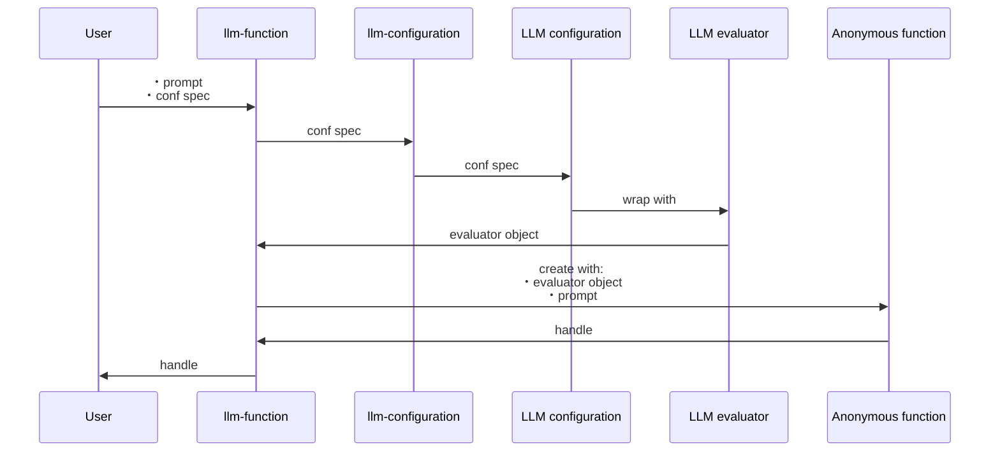
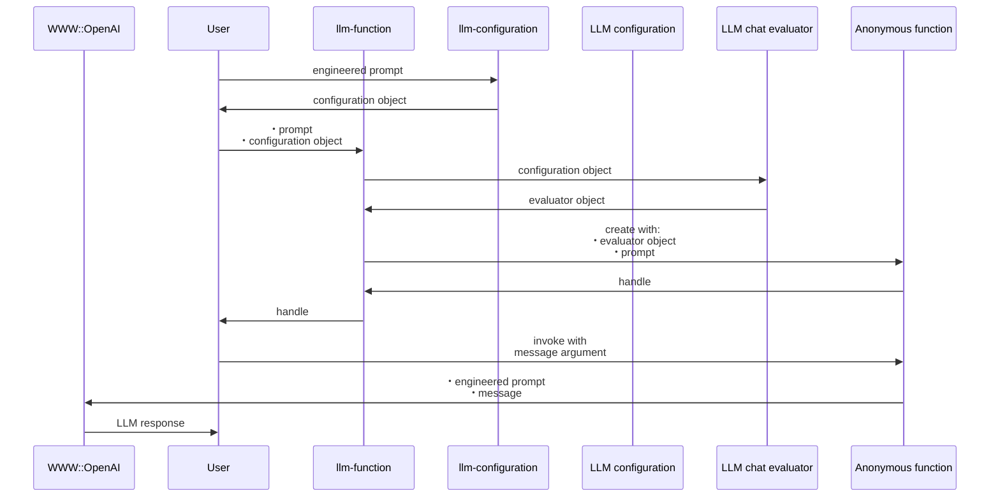

# LLM::Functions 

[](https://github.com/antononcube/Raku-LLM-Functions/actions/workflows/macos.yml)
[](https://github.com/antononcube/Raku-LLM-Functions/actions/workflows/linux.yml)
[](https://github.com/antononcube/Raku-LLM-Functions/actions/workflows/windows.yml)
[](https://raku.land/zef:antononcube/LLM::Functions)

## In brief

This Raku package provides functions and function objects to access, interact, and utilize 
Large Language Models (LLMs), like 
[OpenAI](https://platform.openai.com), [OAI1], and 
[PaLM](https://developers.generativeai.google/products/palm), [ZG1].

For more details how the concrete LLMs are accessed see the packages
["WWW::OpenAI"](https://raku.land/zef:antononcube/WWW::OpenAI), [AAp2], and
["WWW::PaLM"](https://raku.land/zef:antononcube/WWW::PaLM), [AAp3].

The LLM functions built by this package can have evaluators that use "sub-parsers" -- see 
["ML::NLPTemplateEngine"](https://raku.land/zef:antononcube/Text::SubParsers), [AAp4].

The primary motivation to have handy, configurable functions for utilizing LLMs
came from my work on the packages
["ML::FindTextualAnswer"](https://raku.land/zef:antononcube/ML::FindTextualAnswer), [AAp6], and
["ML::NLPTemplateEngine"](https://raku.land/zef:antononcube/ML::NLPTemplateEngine), [AAp7].

A very similar system of functionalities is developed by Wolfram Research Inc.;
see the paclet
["LLMFunctions"](https://resources.wolframcloud.com/PacletRepository/resources/Wolfram/LLMFunctions/), [WRIp1].

For well curated and instructive examples of LLM prompts see the
[Wolfram Prompt Repository](https://resources.wolframcloud.com/PromptRepository/).

The article
["Generating documents via templates and LLMs"](https://rakuforprediction.wordpress.com/2023/07/11/generating-documents-via-templates-and-llms/), [AA1],
shows an alternative way of streamlining LLMs usage. (Via Markdown, Org-mode, or Pod6 templates.)

-----

## Installation

Package installations from both sources use [zef installer](https://github.com/ugexe/zef)
(which should be bundled with the "standard" Rakudo installation file.)

To install the package from [Zef ecosystem](https://raku.land/) use the shell command:

```
zef install LLM::Functions
```

To install the package from the GitHub repository use the shell command:

```
zef install https://github.com/antononcube/Raku-LLM-Functions.git
```

------

## Design

"Out of the box"
["LLM::Functions"](https://raku.land/zef:antononcube/LLM::Functions) uses
["WWW::OpenAI"](https://raku.land/zef:antononcube/WWW::OpenAI), [AAp2], and
["WWW::PaLM"](https://raku.land/zef:antononcube/WWW::PaLM), [AAp3].
Other LLM access packages can be utilized via appropriate LLM configurations.

Configurations:
- Are instances of the class `LLM::Functions::Configuration`
- Are used by instances of the class `LLM::Functions::Evaluator`
- Can be converted to Hash objects (i.e. have a `.Hash` method)

New LLM functions are constructed with the function `llm-function`.

The function `llm-function`:

- Has the option "llm-evaluator" that takes evaluators, configurations, or string shorthands as values
- Returns anonymous functions (that access LLMs via evaluators/configurations.)
- Gives result functions that can be applied to different types of arguments depending on the first argument
- Can take a (sub-)parser argument for post-processing of LLM results
- Takes as a first argument a prompt that can be a:
    - String
    - Function with positional arguments
    - Function with named arguments

Here is a sequence diagram that follows the steps of a typical creation procedure of 
LLM configuration- and evaluator objects, and the corresponding LLM-function that utilizes them:



Here is a sequence diagram for making a LLM configuration with a global (engineered) prompt,
and using that configuration to generate a chat message response:



------

## Configurations

### OpenAI-based

Here is the default, OpenAI-based configuration:

```perl6
use LLM::Functions;
.raku.say for llm-configuration('OpenAI').Hash;
```
```
# :tool-prompt("")
# :examples($[])
# :format("values")
# :max-tokens(300)
# :api-user-id("user:337404901775")
# :temperature(0.8)
# :tool-request-parser(WhateverCode)
# :prompts($[])
# :tool-response-insertion-function(WhateverCode)
# :model("text-davinci-003")
# :stop-tokens($[])
# :api-key(Whatever)
# :function(proto sub OpenAITextCompletion ($prompt is copy, :$model is copy = Whatever, :$suffix is copy = Whatever, :$max-tokens is copy = Whatever, :$temperature is copy = Whatever, Numeric :$top-p = 1, Int :$n where { ... } = 1, Bool :$stream = Bool::False, Bool :$echo = Bool::False, :$stop = Whatever, Numeric :$presence-penalty = 0, Numeric :$frequency-penalty = 0, :$best-of is copy = Whatever, :api-key(:$auth-key) is copy = Whatever, Int :$timeout where { ... } = 10, :$format is copy = Whatever, Str :$method = "tiny") {*})
# :module("WWW::OpenAI")
# :argument-renames(${:api-key("auth-key"), :stop-tokens("stop")})
# :total-probability-cutoff(0.03)
# :prompt-delimiter(" ")
# :evaluator(Whatever)
# :tools($[])
# :name("openai")
```

Here is the ChatGPT-based configuration:

```perl6
.say for llm-configuration('ChatGPT').Hash;
```
```
# tools => []
# function => &OpenAIChatCompletion
# max-tokens => 300
# evaluator => (my \LLM::Functions::EvaluatorChat_4192624689152 = LLM::Functions::EvaluatorChat.new(context => "", examples => Whatever, user-role => "user", assitant-role => "assistant", system-role => "system", conf => LLM::Functions::Configuration.new(name => "chatgpt", api-key => Whatever, api-user-id => "user:244341737759", module => "WWW::OpenAI", model => "gpt-3.5-turbo", function => proto sub OpenAIChatCompletion ($prompt is copy, :$role is copy = Whatever, :$model is copy = Whatever, :$temperature is copy = Whatever, :$max-tokens is copy = Whatever, Numeric :$top-p = 1, Int :$n where { ... } = 1, Bool :$stream = Bool::False, :$stop = Whatever, Numeric :$presence-penalty = 0, Numeric :$frequency-penalty = 0, :api-key(:$auth-key) is copy = Whatever, Int :$timeout where { ... } = 10, :$format is copy = Whatever, Str :$method = "tiny") {*}, temperature => 0.8, total-probability-cutoff => 0.03, max-tokens => 300, format => "values", prompts => [], prompt-delimiter => " ", examples => [], stop-tokens => [], tools => [], tool-prompt => "", tool-request-parser => WhateverCode, tool-response-insertion-function => WhateverCode, argument-renames => {:api-key("auth-key"), :stop-tokens("stop")}, evaluator => LLM::Functions::EvaluatorChat_4192624689152), formatron => "Str"))
# name => chatgpt
# examples => []
# prompt-delimiter =>  
# temperature => 0.8
# total-probability-cutoff => 0.03
# format => values
# api-user-id => user:244341737759
# model => gpt-3.5-turbo
# api-key => (Whatever)
# prompts => []
# tool-response-insertion-function => (WhateverCode)
# tool-request-parser => (WhateverCode)
# tool-prompt => 
# module => WWW::OpenAI
# stop-tokens => []
# argument-renames => {api-key => auth-key, stop-tokens => stop}
```

**Remark:** `llm-configuration(Whatever)` is equivalent to `llm-configuration('OpenAI')`.

**Remark:** Both the "OpenAI" and "ChatGPT" configuration use functions of the package "WWW::OpenAI", [AAp2].
The "OpenAI" configuration is for text-completions;
the "ChatGPT" configuration is for chat-completions. 

### PaLM-based

Here is the default PaLM configuration:

```perl6
.say for llm-configuration('PaLM').Hash;
```
```
# tool-request-parser => (WhateverCode)
# function => &PaLMGenerateText
# prompt-delimiter =>  
# tool-response-insertion-function => (WhateverCode)
# model => text-bison-001
# examples => []
# api-key => (Whatever)
# max-tokens => 300
# api-user-id => user:148868177699
# prompts => []
# stop-tokens => []
# evaluator => (Whatever)
# format => values
# tools => []
# temperature => 0.4
# module => WWW::PaLM
# total-probability-cutoff => 0
# argument-renames => {api-key => auth-key, max-tokens => max-output-tokens, stop-tokens => stop-sequences}
# tool-prompt => 
# name => palm
```

-----

## Basic usage of LLM functions

### Textual prompts

Here we make a LLM function with a simple (short, textual) prompt:

```perl6
my &func = llm-function('Show a recipe for:');
```
```
# -> $text, *%args { #`(Block|4192645382936) ... }
```

Here we evaluate over a message: 

```perl6
say &func('greek salad');
```
```
# Greek Salad
# 
# Ingredients:
# 
# - 1 head romaine lettuce, chopped
# - 1 cucumber, sliced
# - 1/2 red onion, thinly sliced
# - 1/2 cup Kalamata olives
# - 1/2 cup crumbled feta cheese
# - 1/4 cup extra virgin olive oil
# - 2 tablespoons red wine vinegar
# - 1 garlic clove, minced
# - 1 teaspoon dried oregano
# - Salt and freshly ground black pepper, to taste
# 
# Instructions:
# 
# 1. In a large bowl, combine the lettuce, cucumber, onion, olives, and feta cheese.
# 
# 2. In a small bowl, whisk together the olive oil, vinegar, garlic, oregano, salt, and pepper.
# 
# 3. Pour the dressing over the salad and toss to coat.
# 
# 4. Serve immediately.
```

### Positional arguments

Here we make a LLM function with a function-prompt and numeric interpreter of the result:

```perl6
my &func2 = llm-function(
        {"How many $^a can fit inside one $^b?"},
        form => Numeric,
        llm-evaluator => 'palm');
```
```
# -> **@args, *%args { #`(Block|4192613528368) ... }
```

Here were we apply the function:

```perl6
my $res2 = &func2("tennis balls", "toyota corolla 2010");
```
```
# 110
```

Here we show that we got a number:

```perl6
$res2 ~~ Numeric
```
```
# False
```


### Named arguments

Here the first argument is a template with two named arguments: 

```perl6
my &func3 = llm-function(-> :$dish, :$cuisine {"Give a recipe for $dish in the $cuisine cuisine."}, llm-evaluator => 'palm');
```
```
# -> **@args, *%args { #`(Block|4192645498728) ... }
```

Here is an invocation:

```perl6
&func3(dish => 'salad', cuisine => 'Russian', max-tokens => 300);
```
```
# **Ingredients**
# 
# * 1 head of cabbage (about 1 pound)
# * 1/2 cup mayonnaise
# * 1/4 cup sour cream
# * 1/4 cup chopped onion
# * 1/4 cup chopped dill
# * 1/4 cup chopped parsley
# * Salt and pepper to taste
# 
# **Instructions**
# 
# 1. Shred the cabbage.
# 2. In a large bowl, combine the cabbage, mayonnaise, sour cream, onion, dill, parsley, salt, and pepper.
# 3. Stir until well combined.
# 4. Serve immediately or chill for later.
# 
# **Tips**
# 
# * For a more flavorful salad, marinate the cabbage in the dressing for at least 30 minutes before serving.
# * You can also add other ingredients to the salad, such as carrots, celery, or tomatoes.
# * Serve the salad with your favorite bread or crackers.
```

--------

## LLM example functions

The function `llm-example-function` can be given a training set of examples in order 
to generating results according to the "laws" implied by that training set.  

Here a LLM is asked to produce a generalization:

```perl6
llm-example-function([ 'finger' => 'hand', 'hand' => 'arm' ])('foot')
```
```
# leg
```

Here is an array of training pairs is used:

```perl6
'Oppenheimer' ==> (["Einstein" => "14 March 1879", "Pauli" => "April 25, 1900"] ==> llm-example-function)()
```
```
# April 22, 1904
```

Here is defined a LLM function for translating WL associations into Python dictionaries:

```perl6
my &fea = llm-example-function( '<| A->3, 4->K1 |>' => '{ A:3, 4:K1 }');
&fea('<| 23->3, G->33, T -> R5|>');
```
```
# { 23:3, G:33, T:R5 }
```

The function `llm-example-function` takes as a first argument:
- Single `Pair` object of two scalars
- Single `Pair` object of two `Positional` objects with the same length
- A `Hash`
- A `Positional` object of pairs

**Remark:** The function `llm-example-function` is implemented with `llm-function` and suitable prompt.

Here is an example of using hints:

```perl6
my &fec = llm-example-function(
        ["crocodile" => "grasshopper", "fox" => "cardinal"],
        hint => 'animal colors');

say &fec('raccoon');
```
```
# skunk
```

--------

## Using predefined prompts

Using predefined prompts of the package ["LLM::Prompts"](https://raku.land/zef:antononcube/LLM::Prompts), [AAp8],
can be very convenient in certain (many) cases.

Here is an example using "Fixed That For You" synthesis:

```perl6
use LLM::Prompts;

llm-synthesize([llm-prompt('FTFY'), 'Wha is ther population?'])
```
```
# What is the population?
```

--------

## Using chat-global prompts

The configuration objects can be given prompts that influence the LLM responses 
"globally" throughout the whole chat. (See the second sequence diagram above.)

For detailed examples see the documents:

- ["Using engineered prompts"](./docs/Using-engineered-prompts_woven.md)
- ["Expand tests into documentation examples"](./docs/Expand-tests-into-doc-examples_woven.md)

--------

## Chat objects

Here we create chat object that uses OpenAI's ChatGPT:

```perl6
my $prompt = 'You are a gem expert and you give concise answers.';
my $chat = llm-chat(chat-id => 'gem-expert-talk', conf => 'ChatGPT', :$prompt);
```
```
# LLM::Functions::Chat(chat-id = gem-expert-talk, llm-evaluator.conf.name = chatgpt, messages.elems = 0)
```

```perl6
$chat.eval('What is the most transparent gem?');
```
```
# The most transparent gem is diamond.
```

```perl6
$chat.eval('Ok. What are the second and third most transparent gems?');
```
```
# The second most transparent gem is typically considered to be sapphire, while the third most transparent gem is usually emerald.
```

Here are the prompt(s) and all messages of the chat object:

```perl6
$chat.say
```
```
# Chat: gem-expert-talk
# ⸺⸺⸺⸺⸺⸺⸺⸺⸺⸺⸺⸺⸺⸺⸺⸺⸺⸺⸺⸺⸺⸺⸺⸺⸺⸺⸺⸺⸺⸺⸺⸺⸺⸺⸺⸺⸺⸺⸺⸺⸺⸺⸺⸺⸺⸺⸺⸺⸺⸺⸺⸺⸺⸺⸺⸺⸺⸺⸺⸺
# Prompts: You are a gem expert and you give concise answers.
# ⸺⸺⸺⸺⸺⸺⸺⸺⸺⸺⸺⸺⸺⸺⸺⸺⸺⸺⸺⸺⸺⸺⸺⸺⸺⸺⸺⸺⸺⸺⸺⸺⸺⸺⸺⸺⸺⸺⸺⸺⸺⸺⸺⸺⸺⸺⸺⸺⸺⸺⸺⸺⸺⸺⸺⸺⸺⸺⸺⸺
# role	user
# content	What is the most transparent gem?
# timestamp	2023-11-16T06:25:57.460871-05:00
# ⸺⸺⸺⸺⸺⸺⸺⸺⸺⸺⸺⸺⸺⸺⸺⸺⸺⸺⸺⸺⸺⸺⸺⸺⸺⸺⸺⸺⸺⸺⸺⸺⸺⸺⸺⸺⸺⸺⸺⸺⸺⸺⸺⸺⸺⸺⸺⸺⸺⸺⸺⸺⸺⸺⸺⸺⸺⸺⸺⸺
# role	assistant
# content	The most transparent gem is diamond.
# timestamp	2023-11-16T06:25:58.343413-05:00
# ⸺⸺⸺⸺⸺⸺⸺⸺⸺⸺⸺⸺⸺⸺⸺⸺⸺⸺⸺⸺⸺⸺⸺⸺⸺⸺⸺⸺⸺⸺⸺⸺⸺⸺⸺⸺⸺⸺⸺⸺⸺⸺⸺⸺⸺⸺⸺⸺⸺⸺⸺⸺⸺⸺⸺⸺⸺⸺⸺⸺
# role	user
# content	Ok. What are the second and third most transparent gems?
# timestamp	2023-11-16T06:25:58.360544-05:00
# ⸺⸺⸺⸺⸺⸺⸺⸺⸺⸺⸺⸺⸺⸺⸺⸺⸺⸺⸺⸺⸺⸺⸺⸺⸺⸺⸺⸺⸺⸺⸺⸺⸺⸺⸺⸺⸺⸺⸺⸺⸺⸺⸺⸺⸺⸺⸺⸺⸺⸺⸺⸺⸺⸺⸺⸺⸺⸺⸺⸺
# role	assistant
# content	The second most transparent gem is typically considered to be sapphire, while the third most transparent gem is usually emerald.
# timestamp	2023-11-16T06:26:00.283375-05:00
```

--------

## Potential problems

With PaLM with certain wrong configuration we get the error:

```
error => {code => 400, message => Messages must alternate between authors., status => INVALID_ARGUMENT}
```

--------

## TODO

- [X] DONE Resources
  - See ["LLM::Prompts"](https://github.com/antononcube/Raku-LLM-Prompts)
  - [X] DONE Gather prompts
  - [X] DONE Process prompts into a suitable database
    - Using JSON.
- [ ] TODO Implementation
  - [X] DONE Processing and array of prompts as a first argument
  - [X] DONE Prompt class / object / record
    - Again, see ["LLM::Prompts"](https://github.com/antononcube/Raku-LLM-Prompts)
    - For retrieval and management of prompts.
      - [X] DONE Prompts can be both plain strings or templates / functions.
      - [X] DONE Each prompt has associated metadata:
        - Type: persona, function, modifier
        - Tool/parser
        - Keywords
        - Contributor?
        - Topics: "Advisor bot", "AI Guidance", "For Fun", ...
          - See: https://resources.wolframcloud.com/PromptRepository/
    - [X] DONE Most likely, there would be a separate package "LLM::Prompts", [AAp8].
  - [ ] MAYBE Random selection of LLM-evaluator
    - Currently, the LLM-evaluator of the LLM-functions and LLM-chats is static, assigned at creation.
    - This is easily implemented at "top-level." 
  - [X] DONE Chat class / object
    - For long conversations
  - [X] DONE LLM example function
    - [X] DONE First version with the signatures:
      - [X] `@pairs`
      - [X] `@input => @output`
      - [X] Hint option
    - [X] DONE Verify works with OpenAI 
    - [X] DONE Verify works with PaLM
  - [X] DONE Interpreter argument for `llm-function`
    - See the `formatron` attribute of `LLM::Functions::Evaluator`.
  - [X] DONE Adding `form` option to chat objects evaluator
- [ ] TODO CLI
  - [ ] TODO Based on Chat objects
  - [ ] TODO Storage and retrieval of chats
  - [ ] TODO Has as parameters all attributes of the LLM-configuration objects.
- [ ] TODO Documentation  
  - [ ] TODO Detailed parameters description
    - [ ] TODO Configuration
    - [ ] TODO Evaluator
    - [ ] TODO Chat
  - [X] DONE Using engineered prompts
  - [X] DONE Expand tests in documentation examples
  - [X] DONE Conversion of a test file tests into Gherkin specs
  - [X] DONE Number game programming
    - [X] DONE Man vs Machine
    - [X] DONE Machine vs Machine
  - [X] DONE Using retrieved prompts
  - [ ] TODO Longer conversations / chats

--------

## References

### Articles

[AA1] Anton Antonov,
["Generating documents via templates and LLMs"](https://rakuforprediction.wordpress.com/2023/07/11/generating-documents-via-templates-and-llms/),
(2023),
[RakuForPrediction at WordPress](https://rakuforprediction.wordpress.com).

[ZG1] Zoubin Ghahramani,
["Introducing PaLM 2"](https://blog.google/technology/ai/google-palm-2-ai-large-language-model/),
(2023),
[Google Official Blog on AI](https://blog.google/technology/ai/).

### Repositories, sites

[OAI1] OpenAI Platform, [OpenAI platform](https://platform.openai.com/).

[WRIr1] Wolfram Research, Inc.
[Wolfram Prompt Repository](https://resources.wolframcloud.com/PromptRepository/).

### Packages, paclets

[AAp1] Anton Antonov,
[LLM::Functions Raku package](https://github.com/antononcube/Raku-LLM-Functions),
(2023),
[GitHub/antononcube](https://github.com/antononcube).

[AAp2] Anton Antonov,
[WWW::OpenAI Raku package](https://github.com/antononcube/Raku-WWW-OpenAI),
(2023),
[GitHub/antononcube](https://github.com/antononcube).

[AAp3] Anton Antonov,
[WWW::PaLM Raku package](https://github.com/antononcube/Raku-WWW-PaLM),
(2023),
[GitHub/antononcube](https://github.com/antononcube).

[AAp4] Anton Antonov,
[Text::SubParsers Raku package](https://github.com/antononcube/Raku-Text-SubParsers),
(2023),
[GitHub/antononcube](https://github.com/antononcube).

[AAp5] Anton Antonov,
[Text::CodeProcessing Raku package](https://github.com/antononcube/Raku-Text-CodeProcessing),
(2021),
[GitHub/antononcube](https://github.com/antononcube).

[AAp6] Anton Antonov,
[ML::FindTextualAnswer Raku package](https://github.com/antononcube/Raku-ML-FindTextualAnswer),
(2023),
[GitHub/antononcube](https://github.com/antononcube).

[AAp7] Anton Antonov,
[ML::NLPTemplateEngine Raku package](https://github.com/antononcube/Raku-ML-NLPTemplateEngine),
(2023),
[GitHub/antononcube](https://github.com/antononcube).

[AAp8] Anton Antonov,
[LLM::Prompts Raku package](https://github.com/antononcube/Raku-LLM-Prompts),
(2023),
[GitHub/antononcube](https://github.com/antononcube).

[WRIp1] Wolfram Research, Inc.
[LLMFunctions paclet](https://resources.wolframcloud.com/PacletRepository/resources/Wolfram/LLMFunctions/),
(2023),
[Wolfram Language Paclet Repository](https://resources.wolframcloud.com/PacletRepository/).
