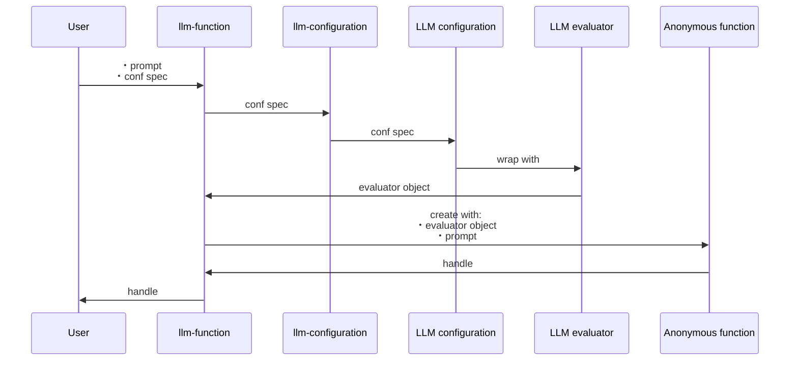
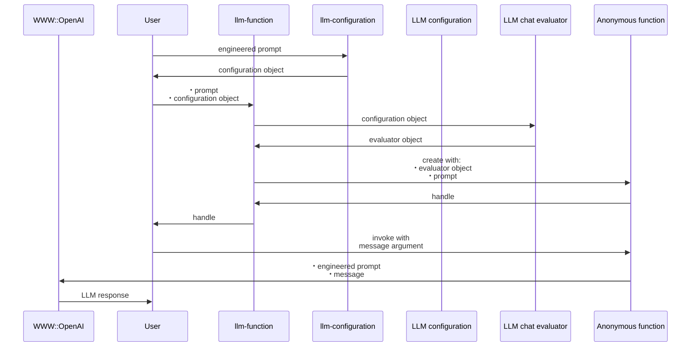

# LLM::Functions 

[](https://github.com/antononcube/Raku-LLM-Functions/actions/workflows/macos.yml)
[](https://github.com/antononcube/Raku-LLM-Functions/actions/workflows/linux.yml)
[](https://github.com/antononcube/Raku-LLM-Functions/actions/workflows/windows.yml)
[](https://raku.land/zef:antononcube/LLM::Functions)

## Introduction

This Raku package provides functions and function objects to access, interact, and utilize 
Large Language Models (LLMs), like 
[OpenAI](https://platform.openai.com),
[Gemini](https://ai.google.dev/gemini-api/docs/models),
[MistralAI](https://docs.mistral.ai),
and
[Ollama](https://ollama.com/search).

For more details how the concrete LLMs are accessed see the packages
["WWW::OpenAI"](https://raku.land/zef:antononcube/WWW::OpenAI), [AAp2],
["WWW::MistralAI"](https://raku.land/zef:antononcube/WWW::MistralAI), [AAp9],
["WWW::Gemini"](https://raku.land/zef:antononcube/WWW::Gemini), [AAp11], and
["WWW::Ollama"](https://raku.land/zef:antononcube/WWW::Ollama), [AAp12].

The LLM functions built by this package can have evaluators that use "sub-parsers" -- see 
["Text::SubParsers"](https://raku.land/zef:antononcube/Text::SubParsers), [AAp4].

The primary motivation to have handy, configurable functions for utilizing LLMs
came from my work on the packages
["ML::FindTextualAnswer"](https://raku.land/zef:antononcube/ML::FindTextualAnswer), [AAp6], and
["ML::NLPTemplateEngine"](https://raku.land/zef:antononcube/ML::NLPTemplateEngine), [AAp7].

A very similar system of functionalities is developed by Wolfram Research Inc.;
see the paclet
["LLMFunctions"](https://resources.wolframcloud.com/PacletRepository/resources/Wolfram/LLMFunctions/), [WRIp1].

For well curated and instructive examples of LLM prompts see the
[Wolfram Prompt Repository](https://resources.wolframcloud.com/PromptRepository/).
Many of those prompts (more than 220) are available in Raku and Python --
see ["LLM::Prompts"](https://raku.land/zef:antononcube/LLM::Prompts), [AAp8], and
["LLMPrompts"](https://pypi.org/project/LLMPrompts/), [AAp10], respectively.

The article
["Generating documents via templates and LLMs"](https://rakuforprediction.wordpress.com/2023/07/11/generating-documents-via-templates-and-llms/), [AA1],
shows an alternative way of streamlining LLMs usage. (Via Markdown, Org-mode, or Pod6 templates.)

-----

## Installation

Package installations from both sources use [zef installer](https://github.com/ugexe/zef)
(which should be bundled with the "standard" Rakudo installation file.)

To install the package from [Zef ecosystem](https://raku.land/) use the shell command:

```
zef install LLM::Functions
```

To install the package from the GitHub repository use the shell command:

```
zef install https://github.com/antononcube/Raku-LLM-Functions.git
```

------

## Design

"Out of the box"
["LLM::Functions"](https://raku.land/zef:antononcube/LLM::Functions) uses
["WWW::OpenAI"](https://raku.land/zef:antononcube/WWW::OpenAI), [AAp2],
["WWW::MistralAI"](https://raku.land/zef:antononcube/WWW::MistralAI), [AAp9],
["WWW::Gemini"](https://raku.land/zef:antononcube/WWW::Gemini), [AAp11], and
["WWW::Ollama"](https://raku.land/zef:antononcube/WWW::Ollama), [AAp12],
Other LLM access packages can be utilized via appropriate LLM configurations.

Configurations:
- Are instances of the class `LLM::Functions::Configuration`
- Are used by instances of the class `LLM::Functions::Evaluator`
- Can be converted to Hash objects (i.e. have a `.Hash` method)

New LLM functions are constructed with the function `llm-function`.

The function `llm-function`:

- Has the option "llm-evaluator" that takes evaluators, configurations, or string shorthands as values
- Returns anonymous functions (that access LLMs via evaluators/configurations.)
- Gives result functions that can be applied to different types of arguments depending on the first argument
- Can take a (sub-)parser argument for post-processing of LLM results
- Takes as a first argument a prompt that can be a:
    - String
    - Function with positional arguments
    - Function with named arguments

Here is a sequence diagram that follows the steps of a typical creation procedure of 
LLM configuration- and evaluator objects, and the corresponding LLM-function that utilizes them:



Here is a sequence diagram for making a LLM configuration with a global (engineered) prompt,
and using that configuration to generate a chat message response:



------

## Configurations

### OpenAI-based

Here is the default, OpenAI-based configuration:

```raku
use LLM::Functions;
llm-configuration('OpenAI');
```
```
# LLM::Configuration(:name("openai"), :model("gpt-3.5-turbo-instruct"), :module("WWW::OpenAI"), :max-tokens(2048))
```

Here is the ChatGPT-based configuration:

```raku
llm-configuration('ChatGPT')
```
```
# LLM::Configuration(:name("chatgpt"), :model("gpt-4.1-mini"), :module("WWW::OpenAI"), :max-tokens(2048))
```

**Remark:** `llm-configuration(Whatever)` is equivalent to `llm-configuration('OpenAI')`.

**Remark:** Both the "OpenAI" and "ChatGPT" configuration use functions of the package "WWW::OpenAI", [AAp2].
The "OpenAI" configuration is for text-completions;
the "ChatGPT" configuration is for chat-completions. 

### Gemini-based

Here is the default Gemini configuration:

```raku
llm-configuration('Gemini')
```
```
# LLM::Configuration(:name("gemini"), :model("gemini-2.0-flash-lite"), :module("WWW::Gemini"), :max-tokens(4096))
```

-----

## Basic usage of LLM functions

### Textual prompts

Here we make a LLM function with a simple (short, textual) prompt:

```raku
my &func = llm-function('Show a recipe for:');
```
```
# LLM::Function(-> $text = "", *%args { #`(Block|2351777762416) ... }, 'chatgpt')
```

Here we evaluate over a message: 

```raku
say &func('greek salad');
```
```
# Certainly! Here's a classic recipe for a Greek Salad:
# 
# ### Greek Salad Recipe
# 
# **Ingredients:**
# - 3 large tomatoes, chopped
# - 1 cucumber, peeled and sliced
# - 1 green bell pepper, sliced
# - 1 small red onion, thinly sliced
# - 1/2 cup Kalamata olives
# - 200g (about 7 oz) feta cheese, cut into cubes or crumbled
# - 2 tablespoons extra virgin olive oil
# - 1 tablespoon red wine vinegar or lemon juice
# - 1 teaspoon dried oregano
# - Salt and freshly ground black pepper, to taste
# 
# **Optional:**
# - 1 tablespoon capers
# - Fresh parsley or mint for garnish
# 
# ---
# 
# **Instructions:**
# 
# 1. **Prepare the vegetables:** Wash and chop the tomatoes into bite-sized pieces. Peel and slice the cucumber. Slice the green bell pepper and red onion thinly.
# 
# 2. **Combine:** In a large salad bowl, combine tomatoes, cucumber, green pepper, red onion, and Kalamata olives.
# 
# 3. **Add feta:** Add the feta cheese on top of the salad. You can either cube it or crumble it according to your preference.
# 
# 4. **Make the dressing:** In a small bowl, whisk together the olive oil, red wine vinegar (or lemon juice), oregano, salt, and pepper.
# 
# 5. **Dress the salad:** Pour the dressing over the salad and gently toss to combine all ingredients well.
# 
# 6. **Garnish and serve:** Optionally, sprinkle with capers and fresh herbs like parsley or mint. Serve immediately.
# 
# ---
# 
# Enjoy your fresh and flavorful Greek salad!
```

### Positional arguments

Here we make a LLM function with a function-prompt composed with a dedicated LLM numbers-only prompt and a numeric interpreter of the result:

```raku
use LLM::Prompts;

my &func2 = llm-function(
        {"How many $^a can fit inside one $^b?" ~ llm-prompt('NumericOnly')},
        form => Numeric,
        llm-evaluator => 'chatgpt');
```
```
# LLM::Function(-> **@args, *%args { #`(Block|2351796069520) ... }, 'chatgpt')
```

Here were we apply the function:

```raku
my $res2 = &func2("tennis balls", "toyota corolla 2010");
```
```
# 540000
```

Here we show that we got a number:

```raku
$res2 ~~ Numeric
```
```
# False
```


### Named arguments

Here the first argument is a template with two named arguments: 

```raku
my &func3 = llm-function(-> :$dish, :$cuisine {"Give a recipe for $dish in the $cuisine cuisine."}, llm-evaluator => 'chatgpt');
```
```
# LLM::Function(-> **@args, *%args { #`(Block|2351796123616) ... }, 'chatgpt')
```

Here is an invocation:

```raku
&func3(dish => 'salad', cuisine => 'Russian', max-tokens => 300);
```
```
# Certainly! Here's a classic Russian salad recipe: **Olivier Salad**, also known as Russian Potato Salad. It's very popular in Russia, especially during holidays.
# 
# ### Olivier Salad (Russian Potato Salad)
# 
# #### Ingredients:
# - 4 medium potatoes
# - 3 medium carrots
# - 4 eggs
# - 200 grams (about 7 oz) cooked chicken breast or bologna sausage (optional)
# - 1 cup canned peas (drained)
# - 3-4 pickled cucumbers (or fresh cucumbers if pickles are not available)
# - 1 small onion (optional)
# - 1 cup mayonnaise
# - Salt and black pepper to taste
# 
# #### Instructions:
# 1. **Boil the vegetables and eggs:**
#    - Place potatoes and carrots in a pot of water and boil until tender (about 20-25 minutes). Let them cool, then peel.
#    - Hard boil the eggs (about 10 minutes), then peel and cool.
# 
# 2. **Chop ingredients:**
#    - Dice potatoes, carrots, eggs, chicken or sausage, and pickled cucumbers into small cubes.
#    - Finely chop the onion if using.
# 
# 3. **Mix the salad:**
#    - In a large bowl, combine the diced ingredients and canned peas.
#    - Add mayonnaise, salt, and pepper to taste.
#    - Mix gently until everything is well coated.
# 
# 4. **Chill and serve:**
#    - Cover the salad and refrigerate for at least
```

--------

## LLM example functions

The function `llm-example-function` can be given a training set of examples in order 
to generating results according to the "laws" implied by that training set.  

Here a LLM is asked to produce a generalization:

```raku
llm-example-function([ 'finger' => 'hand', 'hand' => 'arm' ])('foot')
```
```
# Output: leg
```

Here is an array of training pairs is used:

```raku
'Oppenheimer' ==> (["Einstein" => "14 March 1879", "Pauli" => "April 25, 1900"] ==> llm-example-function)()
```
```
# Output: April 22, 1904
```

Here is defined a LLM function for translating WL associations into Python dictionaries:

```raku
my &fea = llm-example-function( '<| A->3, 4->K1 |>' => '{ A:3, 4:K1 }');
&fea('<| 23->3, G->33, T -> R5|>');
```
```
# Output: { 23:3, G:33, T:R5 }
```

The function `llm-example-function` takes as a first argument:
- Single `Pair` object of two scalars
- Single `Pair` object of two `Positional` objects with the same length
- A `Hash`
- A `Positional` object of pairs

**Remark:** The function `llm-example-function` is implemented with `llm-function` and suitable prompt.

Here is an example of using hints:

```raku
my &fec = llm-example-function(
        ["crocodile" => "grasshopper", "fox" => "cardinal"],
        hint => 'animal colors');

say &fec('raccoon');
```
```
# Input: raccoon  
# Output: skunk
```

--------

## Using predefined prompts

Using predefined prompts of the package ["LLM::Prompts"](https://raku.land/zef:antononcube/LLM::Prompts), [AAp8],
can be very convenient in certain (many) cases.

Here is an example using "Fixed That For You" synthesis:

```raku
use LLM::Prompts;

llm-synthesize([llm-prompt('FTFY'), 'Wha is ther population?'])
```
```
# What is the population?
```

--------

## Using chat-global prompts

The configuration objects can be given prompts that influence the LLM responses 
"globally" throughout the whole chat. (See the second sequence diagram above.)

For detailed examples see the documents:

- ["Using engineered prompts"](./docs/Using-engineered-prompts_woven.md)
- ["Expand tests into documentation examples"](./docs/Expand-tests-into-doc-examples_woven.md)

--------

## Chat objects

Here we create chat object that uses OpenAI's ChatGPT:

```raku
my $prompt = 'You are a gem expert and you give concise answers.';
my $chat = llm-chat(chat-id => 'gem-expert-talk', conf => 'ChatGPT', :$prompt);
```
```
# LLM::Functions::Chat(chat-id = gem-expert-talk, llm-evaluator.conf.name = chatgpt, messages.elems = 0)
```

```raku
$chat.eval('What is the most transparent gem?');
```
```
# The most transparent gemstone is typically **diamond**, known for its exceptional clarity and brilliance.
```

```raku
$chat.eval('Ok. What are the second and third most transparent gems?');
```
```
# After diamond, the second most transparent gem is **white sapphire**, and the third is **white topaz**. Both are known for good clarity and light transmission.
```

Here are the prompt(s) and all messages of the chat object:

```raku
$chat.say
```
```
# Chat: gem-expert-talk
# ⸺⸺⸺⸺⸺⸺⸺⸺⸺⸺⸺⸺⸺⸺⸺⸺⸺⸺⸺⸺⸺⸺⸺⸺⸺⸺⸺⸺⸺⸺⸺⸺⸺⸺⸺⸺⸺⸺⸺⸺⸺⸺⸺⸺⸺⸺⸺⸺⸺⸺⸺⸺⸺⸺⸺⸺⸺⸺⸺⸺
# Prompts: You are a gem expert and you give concise answers.
# ⸺⸺⸺⸺⸺⸺⸺⸺⸺⸺⸺⸺⸺⸺⸺⸺⸺⸺⸺⸺⸺⸺⸺⸺⸺⸺⸺⸺⸺⸺⸺⸺⸺⸺⸺⸺⸺⸺⸺⸺⸺⸺⸺⸺⸺⸺⸺⸺⸺⸺⸺⸺⸺⸺⸺⸺⸺⸺⸺⸺
# role : user
# content : What is the most transparent gem?
# timestamp : 2026-02-06T14:44:54.006446-05:00
# ⸺⸺⸺⸺⸺⸺⸺⸺⸺⸺⸺⸺⸺⸺⸺⸺⸺⸺⸺⸺⸺⸺⸺⸺⸺⸺⸺⸺⸺⸺⸺⸺⸺⸺⸺⸺⸺⸺⸺⸺⸺⸺⸺⸺⸺⸺⸺⸺⸺⸺⸺⸺⸺⸺⸺⸺⸺⸺⸺⸺
# role : assistant
# content : The most transparent gemstone is typically **diamond**, known for its exceptional clarity and brilliance.
# timestamp : 2026-02-06T14:44:54.978670-05:00
# ⸺⸺⸺⸺⸺⸺⸺⸺⸺⸺⸺⸺⸺⸺⸺⸺⸺⸺⸺⸺⸺⸺⸺⸺⸺⸺⸺⸺⸺⸺⸺⸺⸺⸺⸺⸺⸺⸺⸺⸺⸺⸺⸺⸺⸺⸺⸺⸺⸺⸺⸺⸺⸺⸺⸺⸺⸺⸺⸺⸺
# role : user
# content : Ok. What are the second and third most transparent gems?
# timestamp : 2026-02-06T14:44:54.996726-05:00
# ⸺⸺⸺⸺⸺⸺⸺⸺⸺⸺⸺⸺⸺⸺⸺⸺⸺⸺⸺⸺⸺⸺⸺⸺⸺⸺⸺⸺⸺⸺⸺⸺⸺⸺⸺⸺⸺⸺⸺⸺⸺⸺⸺⸺⸺⸺⸺⸺⸺⸺⸺⸺⸺⸺⸺⸺⸺⸺⸺⸺
# role : assistant
# content : After diamond, the second most transparent gem is **white sapphire**, and the third is **white topaz**. Both are known for good clarity and light transmission.
# timestamp : 2026-02-06T14:44:55.999924-05:00
```

--------

## AI-vision functions

Consider [this image](https://raw.githubusercontent.com/antononcube/MathematicaForPrediction/master/MarkdownDocuments/Diagrams/AI-vision-via-WL/0iyello2xfyfo.png):


Here we import the image (as a Base64 string):

```raku
use Image::Markup::Utilities;
my $url = 'https://raw.githubusercontent.com/antononcube/MathematicaForPrediction/master/MarkdownDocuments/Diagrams/AI-vision-via-WL/0iyello2xfyfo.png';
my $img = image-import($url);
$img.substr(^100)
```
```
#  over the ***URL of the image***:

```raku
llm-vision-synthesize('Describe the image.', $url);
```
```
# The image is a bar chart titled "Cyber Week Spending Set to Hit New Highs in 2023." It shows estimated online spending in the United States during Thanksgiving weekend for the years 2019 to 2023. 
# 
# - **Thanksgiving Day**: Spending increases each year, with 2023 forecasted to be the highest.
# - **Black Friday**: Spending remains relatively stable from 2019 to 2022, with a slight increase in 2023.
# - **Cyber Monday**: Spending consistently rises each year, with 2023 projected to reach the highest level.
# 
# The chart uses different shades of blue for 2019 to 2022 and yellow for the 2023 forecast. The source is Adobe Analytics.
```


**Remark:** Currently, Gemini works with (Base64) images only (and does not with URLs.) OpenAI's vision works with both URLs and images.


The function `llm-vision-function` uses the same evaluators (configurations, models) as `llm-vision-synthesize`.

--------

## Potential problems

With Gemini with certain wrong configuration we get the error:

```
error => {code => 400, message => Messages must alternate between authors., status => INVALID_ARGUMENT}
```

--------

## TODO

- [X] DONE Resources
  - See ["LLM::Prompts"](https://github.com/antononcube/Raku-LLM-Prompts)
  - [X] DONE Gather prompts
  - [X] DONE Process prompts into a suitable database
    - Using JSON.
- [ ] TODO Implementation
  - [X] DONE Processing and array of prompts as a first argument
  - [X] DONE Prompt class / object / record
    - Again, see ["LLM::Prompts"](https://github.com/antononcube/Raku-LLM-Prompts)
    - For retrieval and management of prompts.
      - [X] DONE Prompts can be both plain strings or templates / functions.
      - [X] DONE Each prompt has associated metadata:
        - Type: persona, function, modifier
        - Tool/parser
        - Keywords
        - Contributor?
        - Topics: "Advisor bot", "AI Guidance", "For Fun", ...
          - See: https://resources.wolframcloud.com/PromptRepository/
    - [X] DONE Most likely, there would be a separate package "LLM::Prompts", [AAp8].
  - [X] CANCELED Random selection of LLM-evaluator
    - Currently, the LLM-evaluator of the LLM-functions and LLM-chats is static, assigned at creation.
    - This is easily implemented at "top-level." 
  - [X] DONE Chat class / object
    - For long conversations
  - [X] DONE Include LLaMA 
    - Just using a different `:$base-url` for "ChatGPT" for the configurations.
  - [X] DONE Include Gemini
    - [X] DONE Separate configuration
    - [X] DONE Its own evaluator class
  - [X] DONE LLM example function
    - [X] DONE First version with the signatures:
      - [X] `@pairs`
      - [X] `@input => @output`
      - [X] Hint option
    - [X] DONE Verify works with OpenAI 
    - [X] DONE Verify works with PaLM
      - Removed in version 0.5.5 since PaLM is obsoleted. 
    - [X] DONE Verify works with Gemini
    - [X] DONE Verify works with Ollama
  - [X] DONE Interpreter argument for `llm-function`
    - See the `formatron` attribute of `LLM::Functions::Evaluator`.
  - [X] DONE Adding `form` option to chat objects evaluator
  - [X] DONE Implement `llm-embedding` function
    - Generic, universal function for accessing the embeddings of different providers/models. 
  - [X] DONE Implement LLM-functor class `LLM::Function`
    - [X] DONE Class design & implementation
    - [X] DONE Make `&llm-function` return functors
      - And Block-functions based on the option `:$type`.
  - [X] DONE Implement LLM-tooling infrastructure
  - [ ] TODO Hook-up LLM-tooling for/in: 
    - [ ] TODO `&llm-synthesize`
    - [ ] TODO `&llm-function`
- [ ] TODO CLI
  - [ ] TODO Based on Chat objects
  - [ ] TODO Storage and retrieval of chats
  - [ ] TODO Has as parameters all attributes of the LLM-configuration objects.
- [ ] TODO Documentation  
  - [ ] TODO Detailed parameters description
    - [ ] TODO Configuration
    - [ ] TODO Evaluator
    - [ ] TODO Chat
  - [X] DONE Using engineered prompts
  - [X] DONE Expand tests in documentation examples
  - [X] DONE Conversion of a test file tests into Gherkin specs
  - [X] DONE Number game programming
    - [X] DONE Man vs Machine
    - [X] DONE Machine vs Machine
  - [X] DONE Using retrieved prompts
  - [ ] TODO Longer conversations / chats

--------

## References

### Articles

[AA1] Anton Antonov,
["Generating documents via templates and LLMs"](https://rakuforprediction.wordpress.com/2023/07/11/generating-documents-via-templates-and-llms/),
(2023),
[RakuForPrediction at WordPress](https://rakuforprediction.wordpress.com).

[ZG1] Zoubin Ghahramani,
["Introducing PaLM 2"](https://blog.google/technology/ai/google-palm-2-ai-large-language-model/),
(2023),
[Google Official Blog on AI](https://blog.google/technology/ai/).

### Repositories, sites

[MAI1] MistralAI team, [MistralAI platform](https://docs.mistral.ai).

[OAI1] OpenAI team, [OpenAI platform](https://platform.openai.com/).

[WRIr1] Wolfram Research, Inc.
[Wolfram Prompt Repository](https://resources.wolframcloud.com/PromptRepository/).

### Packages, paclets

[AAp1] Anton Antonov,
[LLM::Functions, Raku package](https://github.com/antononcube/Raku-LLM-Functions),
(2023),
[GitHub/antononcube](https://github.com/antononcube).

[AAp2] Anton Antonov,
[WWW::OpenAI, Raku package](https://github.com/antononcube/Raku-WWW-OpenAI),
(2023),
[GitHub/antononcube](https://github.com/antononcube).

[AAp3] Anton Antonov,
[WWW::PaLM, Raku package](https://github.com/antononcube/Raku-WWW-PaLM),
(2023),
[GitHub/antononcube](https://github.com/antononcube).

[AAp4] Anton Antonov,
[Text::SubParsers, Raku package](https://github.com/antononcube/Raku-Text-SubParsers),
(2023),
[GitHub/antononcube](https://github.com/antononcube).

[AAp5] Anton Antonov,
[Text::CodeProcessing, Raku package](https://github.com/antononcube/Raku-Text-CodeProcessing),
(2021),
[GitHub/antononcube](https://github.com/antononcube).

[AAp6] Anton Antonov,
[ML::FindTextualAnswer, Raku package](https://github.com/antononcube/Raku-ML-FindTextualAnswer),
(2023),
[GitHub/antononcube](https://github.com/antononcube).

[AAp7] Anton Antonov,
[ML::NLPTemplateEngine, Raku package](https://github.com/antononcube/Raku-ML-NLPTemplateEngine),
(2023),
[GitHub/antononcube](https://github.com/antononcube).

[AAp8] Anton Antonov,
[LLM::Prompts, Raku package](https://github.com/antononcube/Raku-LLM-Prompts),
(2023),
[GitHub/antononcube](https://github.com/antononcube).

[AAp9] Anton Antonov,
[WWW::MistralAI, Raku package](https://github.com/antononcube/Raku-WWW-MistralAI),
(2023),
[GitHub/antononcube](https://github.com/antononcube).

[AAp10] Anton Antonov,
[LLMPrompts, Python package](https://pypi.org/project/LLMPrompts/),
(2023),
[PyPI.org/antononcube](https://pypi.org/user/antononcube/).

[AAp11] Anton Antonov,
[WWW::Gemini, Raku package](https://github.com/antononcube/Raku-WWW-Gemini),
(2024),
[GitHub/antononcube](https://github.com/antononcube).

[AAp12] Anton Antonov,
[WWW::Ollama, Raku package](https://github.com/antononcube/Raku-WWW-Ollama),
(2026),
[GitHub/antononcube](https://github.com/antononcube).

[WRIp1] Wolfram Research, Inc.
[LLMFunctions paclet](https://resources.wolframcloud.com/PacletRepository/resources/Wolfram/LLMFunctions/),
(2023),
[Wolfram Language Paclet Repository](https://resources.wolframcloud.com/PacletRepository/).
