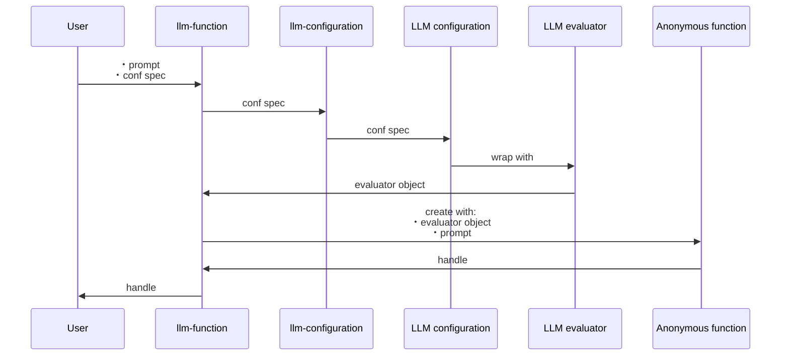
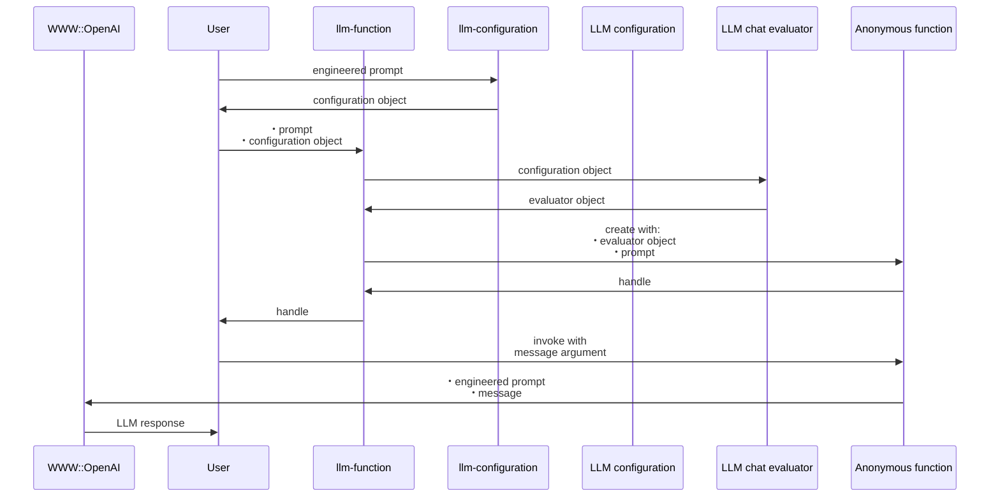

# LLM::Functions 

[](https://github.com/antononcube/Raku-LLM-Functions/actions/workflows/macos.yml)
[](https://github.com/antononcube/Raku-LLM-Functions/actions/workflows/linux.yml)
[](https://github.com/antononcube/Raku-LLM-Functions/actions/workflows/windows.yml)
[](https://raku.land/zef:antononcube/LLM::Functions)

## In brief

This Raku package provides functions and function objects to access, interact, and utilize 
Large Language Models (LLMs), like 
[OpenAI](https://platform.openai.com), [OAI1],
[PaLM](https://developers.generativeai.google/products/palm), [ZG1],
and
[MistralAI](https://docs.mistral.ai), [MAI1].

For more details how the concrete LLMs are accessed see the packages
["WWW::OpenAI"](https://raku.land/zef:antononcube/WWW::OpenAI), [AAp2],
["WWW::PaLM"](https://raku.land/zef:antononcube/WWW::PaLM), [AAp3],
["WWW::MistralAI"](https://raku.land/zef:antononcube/WWW::MistralAI), [AAp9], and
["WWW::Gemini"](https://raku.land/zef:antononcube/WWW::Gemini), [AAp11].

The LLM functions built by this package can have evaluators that use "sub-parsers" -- see 
["Text::SubParsers"](https://raku.land/zef:antononcube/Text::SubParsers), [AAp4].

The primary motivation to have handy, configurable functions for utilizing LLMs
came from my work on the packages
["ML::FindTextualAnswer"](https://raku.land/zef:antononcube/ML::FindTextualAnswer), [AAp6], and
["ML::NLPTemplateEngine"](https://raku.land/zef:antononcube/ML::NLPTemplateEngine), [AAp7].

A very similar system of functionalities is developed by Wolfram Research Inc.;
see the paclet
["LLMFunctions"](https://resources.wolframcloud.com/PacletRepository/resources/Wolfram/LLMFunctions/), [WRIp1].

For well curated and instructive examples of LLM prompts see the
[Wolfram Prompt Repository](https://resources.wolframcloud.com/PromptRepository/).
Many of those prompts (≈220) are available in Raku and Python --
see ["LLM::Prompts"](https://raku.land/zef:antononcube/LLM::Prompts), [AAp8], and
["LLMPrompts"](https://pypi.org/project/LLMPrompts/), [AAp10], respectively.

The article
["Generating documents via templates and LLMs"](https://rakuforprediction.wordpress.com/2023/07/11/generating-documents-via-templates-and-llms/), [AA1],
shows an alternative way of streamlining LLMs usage. (Via Markdown, Org-mode, or Pod6 templates.)

-----

## Installation

Package installations from both sources use [zef installer](https://github.com/ugexe/zef)
(which should be bundled with the "standard" Rakudo installation file.)

To install the package from [Zef ecosystem](https://raku.land/) use the shell command:

```
zef install LLM::Functions
```

To install the package from the GitHub repository use the shell command:

```
zef install https://github.com/antononcube/Raku-LLM-Functions.git
```

------

## Design

"Out of the box"
["LLM::Functions"](https://raku.land/zef:antononcube/LLM::Functions) uses
["WWW::OpenAI"](https://raku.land/zef:antononcube/WWW::OpenAI), [AAp2],
["WWW::PaLM"](https://raku.land/zef:antononcube/WWW::PaLM), [AAp3], and
["WWW::MistralAI"](https://raku.land/zef:antononcube/WWW::MistralAI), [AAp9].
Other LLM access packages can be utilized via appropriate LLM configurations.

Configurations:
- Are instances of the class `LLM::Functions::Configuration`
- Are used by instances of the class `LLM::Functions::Evaluator`
- Can be converted to Hash objects (i.e. have a `.Hash` method)

New LLM functions are constructed with the function `llm-function`.

The function `llm-function`:

- Has the option "llm-evaluator" that takes evaluators, configurations, or string shorthands as values
- Returns anonymous functions (that access LLMs via evaluators/configurations.)
- Gives result functions that can be applied to different types of arguments depending on the first argument
- Can take a (sub-)parser argument for post-processing of LLM results
- Takes as a first argument a prompt that can be a:
    - String
    - Function with positional arguments
    - Function with named arguments

Here is a sequence diagram that follows the steps of a typical creation procedure of 
LLM configuration- and evaluator objects, and the corresponding LLM-function that utilizes them:



Here is a sequence diagram for making a LLM configuration with a global (engineered) prompt,
and using that configuration to generate a chat message response:



------

## Configurations

### OpenAI-based

Here is the default, OpenAI-based configuration:

```perl6
use LLM::Functions;
.raku.say for llm-configuration('OpenAI').Hash;
```
```
# :tool-request-parser(WhateverCode)
# :tool-prompt("")
# :evaluator(Whatever)
# :max-tokens(2048)
# :stop-tokens($[])
# :base-url("https://api.openai.com/v1")
# :tools($[])
# :format("values")
# :total-probability-cutoff(0.03)
# :name("openai")
# :examples($[])
# :images($[])
# :embedding-model("text-embedding-3-small")
# :prompts($[])
# :module("WWW::OpenAI")
# :api-user-id("user:371724609582")
# :argument-renames(${:api-key("auth-key"), :stop-tokens("stop")})
# :api-key(Whatever)
# :model("gpt-3.5-turbo-instruct")
# :tool-response-insertion-function(WhateverCode)
# :prompt-delimiter(" ")
# :temperature(0.8)
# :function(proto sub OpenAITextCompletion ($prompt is copy, :$model is copy = Whatever, :$suffix is copy = Whatever, :$max-tokens is copy = Whatever, :$temperature is copy = Whatever, Numeric :$top-p = 1, Int :$n where { ... } = 1, Bool :$stream = Bool::False, Bool :$echo = Bool::False, :$stop = Whatever, Numeric :$presence-penalty = 0, Numeric :$frequency-penalty = 0, :$best-of is copy = Whatever, :api-key(:$auth-key) is copy = Whatever, Int :$timeout where { ... } = 10, :$format is copy = Whatever, Str :$method = "tiny", Str :$base-url = "https://api.openai.com/v1") {*})
# :embedding-function(proto sub OpenAIEmbeddings ($prompt, :$model = Whatever, :$encoding-format = Whatever, :api-key(:$auth-key) is copy = Whatever, Int :$timeout where { ... } = 10, :$format is copy = Whatever, Str :$method = "tiny", Str :$base-url = "https://api.openai.com/v1") {*})
```

Here is the ChatGPT-based configuration:

```perl6
.say for llm-configuration('ChatGPT').Hash;
```
```
# prompt-delimiter =>  
# embedding-model => text-embedding-3-small
# name => chatgpt
# embedding-function => &OpenAIEmbeddings
# tools => []
# tool-response-insertion-function => (WhateverCode)
# evaluator => (my \LLM::Functions::EvaluatorChat_5624267951272 = LLM::Functions::EvaluatorChat.new(context => "", examples => Whatever, user-role => "user", assistant-role => "assistant", system-role => "system", conf => LLM::Functions::Configuration.new(name => "chatgpt", api-key => Whatever, api-user-id => "user:434846167946", module => "WWW::OpenAI", base-url => "https://api.openai.com/v1", model => "gpt-4.1-mini", function => proto sub OpenAIChatCompletion ($prompt is copy, :$role is copy = Whatever, :$model is copy = Whatever, :$temperature is copy = Whatever, :$max-tokens is copy = Whatever, Numeric :$top-p = 1, Int :$n where { ... } = 1, Bool :$stream = Bool::False, :$stop = Whatever, Numeric :$presence-penalty = 0, Numeric :$frequency-penalty = 0, :@images is copy = Empty, :$reasoning-effort = Whatever, :$verbosity = Whatever, :@tools = Empty, :api-key(:$auth-key) is copy = Whatever, Int :$timeout where { ... } = 10, :$format is copy = Whatever, Str:D :$method = "tiny", Str:D :$base-url = "https://api.openai.com/v1", Str:D :$path = "chat/completions") {*}, embedding-model => "text-embedding-3-small", embedding-function => proto sub OpenAIEmbeddings ($prompt, :$model = Whatever, :$encoding-format = Whatever, :api-key(:$auth-key) is copy = Whatever, Int :$timeout where { ... } = 10, :$format is copy = Whatever, Str :$method = "tiny", Str :$base-url = "https://api.openai.com/v1") {*}, temperature => 0.8, total-probability-cutoff => 0.03, max-tokens => 2048, format => "values", prompts => [], prompt-delimiter => " ", examples => [], stop-tokens => [], tools => [], tool-config => {}, tool-prompt => "", tool-request-parser => WhateverCode, tool-response-insertion-function => WhateverCode, images => [], argument-renames => {:api-key("auth-key"), :stop-tokens("stop")}, evaluator => LLM::Functions::EvaluatorChat_5624267951272), formatron => "Str"))
# images => []
# max-tokens => 2048
# argument-renames => {api-key => auth-key, stop-tokens => stop}
# prompts => []
# function => &OpenAIChatCompletion
# tool-request-parser => (WhateverCode)
# examples => []
# temperature => 0.8
# tool-prompt => 
# base-url => https://api.openai.com/v1
# format => values
# model => gpt-4.1-mini
# api-key => (Whatever)
# total-probability-cutoff => 0.03
# api-user-id => user:434846167946
# module => WWW::OpenAI
# stop-tokens => []
```

**Remark:** `llm-configuration(Whatever)` is equivalent to `llm-configuration('OpenAI')`.

**Remark:** Both the "OpenAI" and "ChatGPT" configuration use functions of the package "WWW::OpenAI", [AAp2].
The "OpenAI" configuration is for text-completions;
the "ChatGPT" configuration is for chat-completions. 

### PaLM-based

Here is the default PaLM configuration:

```perl6
.say for llm-configuration('PaLM').Hash;
```
```
# format => values
# name => palm
# tool-request-parser => (WhateverCode)
# tool-prompt => 
# embedding-function => &PaLMEmbedText
# model => text-bison-001
# tool-response-insertion-function => (WhateverCode)
# max-tokens => 4096
# base-url => 
# embedding-model => embedding-gecko-001
# prompts => []
# examples => []
# tools => []
# temperature => 0.4
# images => []
# api-user-id => user:850418340811
# prompt-delimiter =>  
# argument-renames => {api-key => auth-key, max-tokens => max-output-tokens, stop-tokens => stop-sequences, tool-config => toolConfig}
# total-probability-cutoff => 0
# stop-tokens => []
# module => WWW::PaLM
# evaluator => (Whatever)
# function => &PaLMGenerateText
# api-key => (Whatever)
```

-----

## Basic usage of LLM functions

### Textual prompts

Here we make a LLM function with a simple (short, textual) prompt:

```perl6
my &func = llm-function('Show a recipe for:');
```
```
# LLM::Function.new(func => -> $text = "", *%args { #`(Block|5624377215256) ... }, llm-evaluator => LLM::Functions::Evaluator.new(conf => (my \LLM::Functions::Configuration_5624474894568 = LLM::Functions::Configuration.new(name => "chatgpt", api-key => Whatever, api-user-id => "user:770424318781", module => "WWW::OpenAI", base-url => "https://api.openai.com/v1", model => "gpt-4.1-mini", function => proto sub OpenAIChatCompletion ($prompt is copy, :$role is copy = Whatever, :$model is copy = Whatever, :$temperature is copy = Whatever, :$max-tokens is copy = Whatever, Numeric :$top-p = 1, Int :$n where { ... } = 1, Bool :$stream = Bool::False, :$stop = Whatever, Numeric :$presence-penalty = 0, Numeric :$frequency-penalty = 0, :@images is copy = Empty, :$reasoning-effort = Whatever, :$verbosity = Whatever, :@tools = Empty, :api-key(:$auth-key) is copy = Whatever, Int :$timeout where { ... } = 10, :$format is copy = Whatever, Str:D :$method = "tiny", Str:D :$base-url = "https://api.openai.com/v1", Str:D :$path = "chat/completions") {*}, embedding-model => "text-embedding-3-small", embedding-function => proto sub OpenAIEmbeddings ($prompt, :$model = Whatever, :$encoding-format = Whatever, :api-key(:$auth-key) is copy = Whatever, Int :$timeout where { ... } = 10, :$format is copy = Whatever, Str :$method = "tiny", Str :$base-url = "https://api.openai.com/v1") {*}, temperature => 0.8, total-probability-cutoff => 0.03, max-tokens => 2048, format => "values", prompts => ["Show a recipe for:"], prompt-delimiter => " ", examples => [], stop-tokens => [], tools => [], tool-config => {}, tool-prompt => "", tool-request-parser => WhateverCode, tool-response-insertion-function => WhateverCode, images => [], argument-renames => {:api-key("auth-key"), :stop-tokens("stop")}, evaluator => LLM::Functions::EvaluatorChat.new(context => "", examples => Whatever, user-role => "user", assistant-role => "assistant", system-role => "system", conf => LLM::Functions::Configuration_5624474894568, formatron => "Str"))), formatron => "Str"), query-func => WhateverCode)
```

Here we evaluate over a message: 

```perl6
say &func('greek salad');
```
```
# Certainly! Here's a classic recipe for a Greek Salad:
# 
# ### Greek Salad Recipe
# 
# **Ingredients:**
# 
# - 4 ripe tomatoes, cut into wedges  
# - 1 cucumber, peeled (optional) and sliced into half-moons  
# - 1 green bell pepper, thinly sliced  
# - 1 small red onion, thinly sliced  
# - 200g (7 oz) feta cheese, cut into cubes or crumbled  
# - A handful of Kalamata olives  
# - 1 tsp dried oregano  
# - Salt and freshly ground black pepper, to taste  
# - 3 tbsp extra virgin olive oil  
# - 1 tbsp red wine vinegar or lemon juice  
# - Optional: fresh parsley or mint for garnish  
# 
# **Instructions:**
# 
# 1. In a large salad bowl, combine the tomatoes, cucumber, green pepper, and red onion.  
# 2. Add the Kalamata olives and feta cheese on top.  
# 3. Sprinkle with dried oregano, salt, and freshly ground black pepper.  
# 4. Drizzle the olive oil and red wine vinegar (or lemon juice) over the salad.  
# 5. Toss gently to combine all ingredients without breaking up the feta too much.  
# 6. Garnish with fresh parsley or mint if desired.  
# 7. Serve immediately with crusty bread or as a side dish.  
# 
# Enjoy your fresh and flavorful Greek salad!
```

### Positional arguments

Here we make a LLM function with a function-prompt and numeric interpreter of the result:

```perl6
my &func2 = llm-function(
        {"How many $^a can fit inside one $^b?"},
        form => Numeric,
        llm-evaluator => 'chatgpt');
```
```
# LLM::Function.new(func => -> **@args, *%args { #`(Block|5624507187920) ... }, llm-evaluator => (my \LLM::Functions::EvaluatorChat_5624366312104 = LLM::Functions::EvaluatorChat.new(context => "", examples => Whatever, user-role => "user", assistant-role => "assistant", system-role => "system", conf => LLM::Functions::Configuration.new(name => "chatgpt", api-key => Whatever, api-user-id => "user:948863042787", module => "WWW::OpenAI", base-url => "https://api.openai.com/v1", model => "gpt-4.1-mini", function => proto sub OpenAIChatCompletion ($prompt is copy, :$role is copy = Whatever, :$model is copy = Whatever, :$temperature is copy = Whatever, :$max-tokens is copy = Whatever, Numeric :$top-p = 1, Int :$n where { ... } = 1, Bool :$stream = Bool::False, :$stop = Whatever, Numeric :$presence-penalty = 0, Numeric :$frequency-penalty = 0, :@images is copy = Empty, :$reasoning-effort = Whatever, :$verbosity = Whatever, :@tools = Empty, :api-key(:$auth-key) is copy = Whatever, Int :$timeout where { ... } = 10, :$format is copy = Whatever, Str:D :$method = "tiny", Str:D :$base-url = "https://api.openai.com/v1", Str:D :$path = "chat/completions") {*}, embedding-model => "text-embedding-3-small", embedding-function => proto sub OpenAIEmbeddings ($prompt, :$model = Whatever, :$encoding-format = Whatever, :api-key(:$auth-key) is copy = Whatever, Int :$timeout where { ... } = 10, :$format is copy = Whatever, Str :$method = "tiny", Str :$base-url = "https://api.openai.com/v1") {*}, temperature => 0.8, total-probability-cutoff => 0.03, max-tokens => 2048, format => "values", prompts => [], prompt-delimiter => " ", examples => [], stop-tokens => [], tools => [], tool-config => {}, tool-prompt => "", tool-request-parser => WhateverCode, tool-response-insertion-function => WhateverCode, images => [], argument-renames => {:api-key("auth-key"), :stop-tokens("stop")}, evaluator => LLM::Functions::EvaluatorChat_5624366312104), formatron => Numeric)), query-func => -> $a, $b { #`(Block|5624507187992) ... })
```

Here were we apply the function:

```perl6
my $res2 = &func2("tennis balls", "toyota corolla 2010");
```
```
# Let's estimate how many tennis balls can fit inside a 2010 Toyota Corolla by approximating the interior volume and the volume of a tennis ball.
# 
# ### Step 1: Estimate the interior volume of the car
# 
# - The 2010 Toyota Corolla's **interior passenger volume** is approximately **97 cubic feet**.
# - To simplify calculations, convert cubic feet to cubic inches:
#   - 1 cubic foot = 12 inches × 12 inches × 12 inches = 1,728 cubic inches
#   - So, 97 cubic feet × 1,728 cubic inches/cubic foot ≈ 167,616 cubic inches
# 
# ### Step 2: Calculate the volume of one tennis ball
# 
# - A standard tennis ball has a diameter of about 2.7 inches.
# - Radius \( r = \frac{2.7}{2} = 1.35 \) inches
# - Volume of sphere: \( V = \frac{4}{3} \pi r^3 \)
#   \[
#   V = \frac{4}{3} \pi (1.35)^3 \approx \frac{4}{3} \times 3.1416 \times 2.46 \approx 10.96 \ \text{cubic inches}
#   \]
# 
# ### Step 3: Account for packing efficiency
# 
# - Spheres can't fill all space perfectly due to gaps.
# - The densest packing of spheres (face-centered cubic or hexagonal close packing) has a packing efficiency of about 74%.
# - Realistically, if you just toss tennis balls in a car, the packing might be less efficient, say 60-65%.
# - We'll use a conservative packing efficiency of 65%.
# 
# ### Step 4: Calculate how many tennis balls fit
# 
# - Usable volume = 167,616 cubic inches × 0.65 ≈ 108,850 cubic inches
# - Number of tennis balls = usable volume / volume of one ball
#   \[
#   \frac{108,850}{10.96} \approx 9,930 \ \text{balls}
#   \]
# 
# ### Final estimate:
# 
# **Approximately 9,900 to 10,000 tennis balls** can fit inside the interior of a 2010 Toyota Corolla.
# 
# ---
# 
# **Note:** This is a rough estimate that assumes the entire interior volume can be filled with tennis balls, ignoring seats, dashboard, and other interior components that take up space. If you consider only the trunk volume (~13 cubic feet) or more realistic space inside the car (removing space occupied by seats and controls), the number will be lower.
```

Here we show that we got a number:

```perl6
$res2 ~~ Numeric
```
```
# False
```


### Named arguments

Here the first argument is a template with two named arguments: 

```perl6
my &func3 = llm-function(-> :$dish, :$cuisine {"Give a recipe for $dish in the $cuisine cuisine."}, llm-evaluator => 'chatgpt');
```
```
# LLM::Function.new(func => -> **@args, *%args { #`(Block|5624429821536) ... }, llm-evaluator => (my \LLM::Functions::EvaluatorChat_5624366315624 = LLM::Functions::EvaluatorChat.new(context => "", examples => Whatever, user-role => "user", assistant-role => "assistant", system-role => "system", conf => LLM::Functions::Configuration.new(name => "chatgpt", api-key => Whatever, api-user-id => "user:755919164890", module => "WWW::OpenAI", base-url => "https://api.openai.com/v1", model => "gpt-4.1-mini", function => proto sub OpenAIChatCompletion ($prompt is copy, :$role is copy = Whatever, :$model is copy = Whatever, :$temperature is copy = Whatever, :$max-tokens is copy = Whatever, Numeric :$top-p = 1, Int :$n where { ... } = 1, Bool :$stream = Bool::False, :$stop = Whatever, Numeric :$presence-penalty = 0, Numeric :$frequency-penalty = 0, :@images is copy = Empty, :$reasoning-effort = Whatever, :$verbosity = Whatever, :@tools = Empty, :api-key(:$auth-key) is copy = Whatever, Int :$timeout where { ... } = 10, :$format is copy = Whatever, Str:D :$method = "tiny", Str:D :$base-url = "https://api.openai.com/v1", Str:D :$path = "chat/completions") {*}, embedding-model => "text-embedding-3-small", embedding-function => proto sub OpenAIEmbeddings ($prompt, :$model = Whatever, :$encoding-format = Whatever, :api-key(:$auth-key) is copy = Whatever, Int :$timeout where { ... } = 10, :$format is copy = Whatever, Str :$method = "tiny", Str :$base-url = "https://api.openai.com/v1") {*}, temperature => 0.8, total-probability-cutoff => 0.03, max-tokens => 2048, format => "values", prompts => [], prompt-delimiter => " ", examples => [], stop-tokens => [], tools => [], tool-config => {}, tool-prompt => "", tool-request-parser => WhateverCode, tool-response-insertion-function => WhateverCode, images => [], argument-renames => {:api-key("auth-key"), :stop-tokens("stop")}, evaluator => LLM::Functions::EvaluatorChat_5624366315624), formatron => "Str")), query-func => -> :$dish, :$cuisine { #`(Block|5624429821608) ... })
```

Here is an invocation:

```perl6
&func3(dish => 'salad', cuisine => 'Russian', max-tokens => 300);
```
```
# Certainly! One classic salad from Russian cuisine is **"Olivier Salad"** (also known as Russian Salad). It's very popular in Russia and often served during celebrations.
# 
# ### Olivier Salad Recipe
# 
# #### Ingredients:
# - 4 medium potatoes
# - 3 medium carrots
# - 4 eggs
# - 200 grams (about 7 oz) cooked chicken breast or boiled bologna (you can also use ham or boiled beef)
# - 1 cup canned peas (drained)
# - 3-4 pickles (dill or sweet, depending on preference)
# - 1 small onion (optional)
# - 1 cup mayonnaise
# - Salt and black pepper to taste
# 
# #### Instructions:
# 1. **Boil the vegetables and eggs**:
#    - Boil potatoes and carrots until tender but firm (about 20-25 minutes). Let them cool.
#    - Hard boil the eggs (about 10 minutes), then cool and peel.
# 
# 2. **Chop ingredients**:
#    - Dice the boiled potatoes, carrots, eggs, and pickles into small cubes.
#    - Cut the cooked chicken or bologna into small cubes as well.
#    - Finely chop the onion if using.
# 
# 3. **Mix the salad**:
#    - In a large bowl, combine the diced potatoes, carrots, eggs, pickles, chicken, peas, and onion.
#    - Add mayonnaise and mix gently but thoroughly until all ingredients are coated.
#    - Season with salt and pepper to taste.
```

--------

## LLM example functions

The function `llm-example-function` can be given a training set of examples in order 
to generating results according to the "laws" implied by that training set.  

Here a LLM is asked to produce a generalization:

```perl6
llm-example-function([ 'finger' => 'hand', 'hand' => 'arm' ])('foot')
```
```
# Output: leg
```

Here is an array of training pairs is used:

```perl6
'Oppenheimer' ==> (["Einstein" => "14 March 1879", "Pauli" => "April 25, 1900"] ==> llm-example-function)()
```
```
# Output: April 22, 1904
```

Here is defined a LLM function for translating WL associations into Python dictionaries:

```perl6
my &fea = llm-example-function( '<| A->3, 4->K1 |>' => '{ A:3, 4:K1 }');
&fea('<| 23->3, G->33, T -> R5|>');
```
```
# Output: { 23:3, G:33, T:R5 }
```

The function `llm-example-function` takes as a first argument:
- Single `Pair` object of two scalars
- Single `Pair` object of two `Positional` objects with the same length
- A `Hash`
- A `Positional` object of pairs

**Remark:** The function `llm-example-function` is implemented with `llm-function` and suitable prompt.

Here is an example of using hints:

```perl6
my &fec = llm-example-function(
        ["crocodile" => "grasshopper", "fox" => "cardinal"],
        hint => 'animal colors');

say &fec('raccoon');
```
```
# Let's analyze the pattern from the examples:
# 
# - Input: crocodile  
#   Output: grasshopper
# 
# - Input: fox  
#   Output: cardinal
# 
# Looking at these, it seems the output is an animal whose primary color is similar to the main color associated with the input animal.
# 
# - Crocodile is typically greenish (green/brown), grasshopper is green.
# - Fox is reddish-orange, cardinal is bright red.
# 
# So the output animal matches the input animal by color.
# 
# Now, given the input:
# 
# - raccoon
# 
# Raccoons have a grayish-black and white coloration.
# 
# We need to find an animal whose color matches raccoon's gray/black/white.
# 
# Animals with similar colors:
# 
# - Skunk (black and white)
# - Penguin (black and white)
# - Orca (black and white)
# - Magpie (black and white)
# 
# Given the pattern, probably an animal with a dominant black/white coloration.
# 
# Among these, "magpie" is a bird with black and white colors, or "skunk".
# 
# Since previous outputs are birds (cardinal is a bird), grasshopper is an insect, maybe either is fine.
# 
# Let's pick "magpie".
# 
# **Output: magpie**
```

--------

## Using predefined prompts

Using predefined prompts of the package ["LLM::Prompts"](https://raku.land/zef:antononcube/LLM::Prompts), [AAp8],
can be very convenient in certain (many) cases.

Here is an example using "Fixed That For You" synthesis:

```perl6
use LLM::Prompts;

llm-synthesize([llm-prompt('FTFY'), 'Wha is ther population?'])
```
```
# What is the population?
```

--------

## Using chat-global prompts

The configuration objects can be given prompts that influence the LLM responses 
"globally" throughout the whole chat. (See the second sequence diagram above.)

For detailed examples see the documents:

- ["Using engineered prompts"](./docs/Using-engineered-prompts_woven.md)
- ["Expand tests into documentation examples"](./docs/Expand-tests-into-doc-examples_woven.md)

--------

## Chat objects

Here we create chat object that uses OpenAI's ChatGPT:

```perl6
my $prompt = 'You are a gem expert and you give concise answers.';
my $chat = llm-chat(chat-id => 'gem-expert-talk', conf => 'ChatGPT', :$prompt);
```
```
# LLM::Functions::Chat(chat-id = gem-expert-talk, llm-evaluator.conf.name = chatgpt, messages.elems = 0)
```

```perl6
$chat.eval('What is the most transparent gem?');
```
```
# The most transparent gem is typically **diamond**, known for its exceptional clarity and brilliance. However, other gems like **white sapphire** and **topaz** can also be highly transparent depending on their quality.
```

```perl6
$chat.eval('Ok. What are the second and third most transparent gems?');
```
```
# After diamond, the second most transparent gem is usually **white sapphire**, followed by **colorless topaz** as third. Both exhibit high clarity and excellent light transmission.
```

Here are the prompt(s) and all messages of the chat object:

```perl6
$chat.say
```
```
# Chat: gem-expert-talk
# ⸺⸺⸺⸺⸺⸺⸺⸺⸺⸺⸺⸺⸺⸺⸺⸺⸺⸺⸺⸺⸺⸺⸺⸺⸺⸺⸺⸺⸺⸺⸺⸺⸺⸺⸺⸺⸺⸺⸺⸺⸺⸺⸺⸺⸺⸺⸺⸺⸺⸺⸺⸺⸺⸺⸺⸺⸺⸺⸺⸺
# Prompts: You are a gem expert and you give concise answers.
# ⸺⸺⸺⸺⸺⸺⸺⸺⸺⸺⸺⸺⸺⸺⸺⸺⸺⸺⸺⸺⸺⸺⸺⸺⸺⸺⸺⸺⸺⸺⸺⸺⸺⸺⸺⸺⸺⸺⸺⸺⸺⸺⸺⸺⸺⸺⸺⸺⸺⸺⸺⸺⸺⸺⸺⸺⸺⸺⸺⸺
# role : user
# content : What is the most transparent gem?
# timestamp : 2025-08-18T12:49:42.245950-04:00
# ⸺⸺⸺⸺⸺⸺⸺⸺⸺⸺⸺⸺⸺⸺⸺⸺⸺⸺⸺⸺⸺⸺⸺⸺⸺⸺⸺⸺⸺⸺⸺⸺⸺⸺⸺⸺⸺⸺⸺⸺⸺⸺⸺⸺⸺⸺⸺⸺⸺⸺⸺⸺⸺⸺⸺⸺⸺⸺⸺⸺
# role : assistant
# content : The most transparent gem is typically **diamond**, known for its exceptional clarity and brilliance. However, other gems like **white sapphire** and **topaz** can also be highly transparent depending on their quality.
# timestamp : 2025-08-18T12:49:43.244139-04:00
# ⸺⸺⸺⸺⸺⸺⸺⸺⸺⸺⸺⸺⸺⸺⸺⸺⸺⸺⸺⸺⸺⸺⸺⸺⸺⸺⸺⸺⸺⸺⸺⸺⸺⸺⸺⸺⸺⸺⸺⸺⸺⸺⸺⸺⸺⸺⸺⸺⸺⸺⸺⸺⸺⸺⸺⸺⸺⸺⸺⸺
# role : user
# content : Ok. What are the second and third most transparent gems?
# timestamp : 2025-08-18T12:49:43.255854-04:00
# ⸺⸺⸺⸺⸺⸺⸺⸺⸺⸺⸺⸺⸺⸺⸺⸺⸺⸺⸺⸺⸺⸺⸺⸺⸺⸺⸺⸺⸺⸺⸺⸺⸺⸺⸺⸺⸺⸺⸺⸺⸺⸺⸺⸺⸺⸺⸺⸺⸺⸺⸺⸺⸺⸺⸺⸺⸺⸺⸺⸺
# role : assistant
# content : After diamond, the second most transparent gem is usually **white sapphire**, followed by **colorless topaz** as third. Both exhibit high clarity and excellent light transmission.
# timestamp : 2025-08-18T12:49:44.263353-04:00
```

--------

## AI-vision functions

Consider [this image](https://raw.githubusercontent.com/antononcube/MathematicaForPrediction/master/MarkdownDocuments/Diagrams/AI-vision-via-WL/0iyello2xfyfo.png):


Here we import the image (as a Base64 string):

```perl6
use Image::Markup::Utilities;
my $url = 'https://raw.githubusercontent.com/antononcube/MathematicaForPrediction/master/MarkdownDocuments/Diagrams/AI-vision-via-WL/0iyello2xfyfo.png';
my $img = image-import($url);
$img.substr(^100)
```
```
#  over the ***URL of the image***:

```perl6
llm-vision-synthesize('Describe the image.', $url);
```
```
# The image is a bar chart titled "Cyber Week Spending Set to Hit New Highs in 2023," showing estimated online spending on Thanksgiving weekend in the United States. It compares spending from 2019 to 2023 across three days: Thanksgiving Day, Black Friday, and Cyber Monday.
# 
# - **Thanksgiving Day**: Spending increases gradually each year, with 2023 showing the highest at around $6 billion.
# - **Black Friday**: Spending is relatively stable from 2019 to 2022, with a noticeable increase in 2023 to about $10 billion.
# - **Cyber Monday**: Spending consistently rises each year, reaching approximately $12 billion in 2023.
# 
# The data source is Adobe Analytics, and the 2023 figures are forecasts. The bars are color-coded by year: 2019 (light blue), 2020 (medium blue), 2021 (dark blue), 2022 (navy blue), and 2023 (yellow).
```

**Remark:** Currently, Gemini works with (Base64) images only (and does not with URLs.) OpenAI's vision works with both URLs and images.


The function `llm-vision-function` uses the same evaluators (configurations, models) as `llm-vision-synthesize`.

--------

## Potential problems

With PaLM with certain wrong configuration we get the error:

```
error => {code => 400, message => Messages must alternate between authors., status => INVALID_ARGUMENT}
```

--------

## TODO

- [X] DONE Resources
  - See ["LLM::Prompts"](https://github.com/antononcube/Raku-LLM-Prompts)
  - [X] DONE Gather prompts
  - [X] DONE Process prompts into a suitable database
    - Using JSON.
- [ ] TODO Implementation
  - [X] DONE Processing and array of prompts as a first argument
  - [X] DONE Prompt class / object / record
    - Again, see ["LLM::Prompts"](https://github.com/antononcube/Raku-LLM-Prompts)
    - For retrieval and management of prompts.
      - [X] DONE Prompts can be both plain strings or templates / functions.
      - [X] DONE Each prompt has associated metadata:
        - Type: persona, function, modifier
        - Tool/parser
        - Keywords
        - Contributor?
        - Topics: "Advisor bot", "AI Guidance", "For Fun", ...
          - See: https://resources.wolframcloud.com/PromptRepository/
    - [X] DONE Most likely, there would be a separate package "LLM::Prompts", [AAp8].
  - [X] CANCELED Random selection of LLM-evaluator
    - Currently, the LLM-evaluator of the LLM-functions and LLM-chats is static, assigned at creation.
    - This is easily implemented at "top-level." 
  - [X] DONE Chat class / object
    - For long conversations
  - [X] DONE Include LLaMA 
    - Just using a different `:$base-url` for "ChatGPT" for the configurations.
  - [X] DONE Include Gemini
    - [X] DONE Separate configuration
    - [X] DONE Its own evaluator class
  - [X] DONE LLM example function
    - [X] DONE First version with the signatures:
      - [X] `@pairs`
      - [X] `@input => @output`
      - [X] Hint option
    - [X] DONE Verify works with OpenAI 
    - [X] DONE Verify works with PaLM
    - [X] DONE Verify works with Gemini
  - [X] DONE Interpreter argument for `llm-function`
    - See the `formatron` attribute of `LLM::Functions::Evaluator`.
  - [X] DONE Adding `form` option to chat objects evaluator
  - [X] DONE Implement `llm-embedding` function
    - Generic, universal function for accessing the embeddings of different providers/models. 
  - [X] DONE Implement LLM-functor class `LLM::Function`
    - [X] DONE Class design & implementation
    - [X] DONE Make `&llm-function` return functors
      - And Block-functions based on the option `:$type`.
  - [X] DONE Implement LLM-tooling infrastructure
  - [ ] TODO Hook-up LLM-tooling for/in: 
    - [ ] TODO `&llm-synthesize`
    - [ ] TODO `&llm-function`
- [ ] TODO CLI
  - [ ] TODO Based on Chat objects
  - [ ] TODO Storage and retrieval of chats
  - [ ] TODO Has as parameters all attributes of the LLM-configuration objects.
- [ ] TODO Documentation  
  - [ ] TODO Detailed parameters description
    - [ ] TODO Configuration
    - [ ] TODO Evaluator
    - [ ] TODO Chat
  - [X] DONE Using engineered prompts
  - [X] DONE Expand tests in documentation examples
  - [X] DONE Conversion of a test file tests into Gherkin specs
  - [X] DONE Number game programming
    - [X] DONE Man vs Machine
    - [X] DONE Machine vs Machine
  - [X] DONE Using retrieved prompts
  - [ ] TODO Longer conversations / chats

--------

## References

### Articles

[AA1] Anton Antonov,
["Generating documents via templates and LLMs"](https://rakuforprediction.wordpress.com/2023/07/11/generating-documents-via-templates-and-llms/),
(2023),
[RakuForPrediction at WordPress](https://rakuforprediction.wordpress.com).

[ZG1] Zoubin Ghahramani,
["Introducing PaLM 2"](https://blog.google/technology/ai/google-palm-2-ai-large-language-model/),
(2023),
[Google Official Blog on AI](https://blog.google/technology/ai/).

### Repositories, sites

[MAI1] MistralAI team, [MistralAI platform](https://docs.mistral.ai).

[OAI1] OpenAI team, [OpenAI platform](https://platform.openai.com/).

[WRIr1] Wolfram Research, Inc.
[Wolfram Prompt Repository](https://resources.wolframcloud.com/PromptRepository/).

### Packages, paclets

[AAp1] Anton Antonov,
[LLM::Functions Raku package](https://github.com/antononcube/Raku-LLM-Functions),
(2023),
[GitHub/antononcube](https://github.com/antononcube).

[AAp2] Anton Antonov,
[WWW::OpenAI Raku package](https://github.com/antononcube/Raku-WWW-OpenAI),
(2023),
[GitHub/antononcube](https://github.com/antononcube).

[AAp3] Anton Antonov,
[WWW::PaLM Raku package](https://github.com/antononcube/Raku-WWW-PaLM),
(2023),
[GitHub/antononcube](https://github.com/antononcube).

[AAp4] Anton Antonov,
[Text::SubParsers Raku package](https://github.com/antononcube/Raku-Text-SubParsers),
(2023),
[GitHub/antononcube](https://github.com/antononcube).

[AAp5] Anton Antonov,
[Text::CodeProcessing Raku package](https://github.com/antononcube/Raku-Text-CodeProcessing),
(2021),
[GitHub/antononcube](https://github.com/antononcube).

[AAp6] Anton Antonov,
[ML::FindTextualAnswer Raku package](https://github.com/antononcube/Raku-ML-FindTextualAnswer),
(2023),
[GitHub/antononcube](https://github.com/antononcube).

[AAp7] Anton Antonov,
[ML::NLPTemplateEngine Raku package](https://github.com/antononcube/Raku-ML-NLPTemplateEngine),
(2023),
[GitHub/antononcube](https://github.com/antononcube).

[AAp8] Anton Antonov,
[LLM::Prompts Raku package](https://github.com/antononcube/Raku-LLM-Prompts),
(2023),
[GitHub/antononcube](https://github.com/antononcube).

[AAp9] Anton Antonov,
[WWW::MistralAI Raku package](https://github.com/antononcube/Raku-WWW-MistralAI),
(2023),
[GitHub/antononcube](https://github.com/antononcube).

[AAp10] Anton Antonov,
[LLMPrompts Python package](https://pypi.org/project/LLMPrompts/),
(2023),
[PyPI.org/antononcube](https://pypi.org/user/antononcube/).

[AAp11] Anton Antonov,
[WWW::Gemini Raku package](https://github.com/antononcube/Raku-WWW-Gemini),
(2024),
[GitHub/antononcube](https://github.com/antononcube).

[WRIp1] Wolfram Research, Inc.
[LLMFunctions paclet](https://resources.wolframcloud.com/PacletRepository/resources/Wolfram/LLMFunctions/),
(2023),
[Wolfram Language Paclet Repository](https://resources.wolframcloud.com/PacletRepository/).
