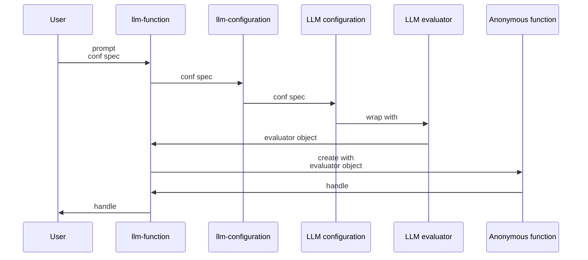
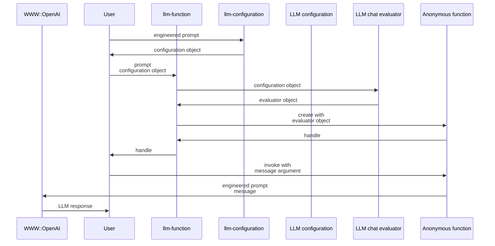

# LLM::Functions 

## In brief

Thi Raku package provides functions and function objects to access, interact, and utilize 
Large Language Mondels (LLMs), like 
[OpenAI](https://platform.openai.com), [OAI1], and 
[PaLM](https://developers.generativeai.google/products/palm), [ZG1].

For more details how the concrete LLMs are accessed see the packages
["WWW::OpenAI"](https://raku.land/zef:antononcube/WWW::OpenAI), [AAp2], and
["WWW::PaLM"](https://raku.land/zef:antononcube/WWW::PaLM), [AAp3].

-----

## Installation

Package installations from both sources use [zef installer](https://github.com/ugexe/zef)
(which should be bundled with the "standard" Rakudo installation file.)

To install the package from [Zef ecosystem](https://raku.land/) use the shell command:

```
zef install LLM::Functions
```

To install the package from the GitHub repository use the shell command:

```
zef install https://github.com/antononcube/Raku-LLM-Functions.git
```

------

## Design

"Out of the box"
["LLM::Functions"](https://raku.land/zef:antononcube/LLM::Functions) uses
["WWW::OpenAI"](https://raku.land/zef:antononcube/WWW::OpenAI), [AAp2], and
["WWW::PaLM"](https://raku.land/zef:antononcube/WWW::PaLM), [AAp3].
Other LLM access packages can utilized via appropriate LLM configurations.

The configurations are instances of the class `LLM::Functions::Configuration`.
The configurations are used by instances of the class `LLM::Functions::Evaluator`.

New LLM functions are constructed with the function `llm-function`.

The function `llm-function`:

- Has the option "llm-evaluator" that takes evaluators, configurations, or string shorthands as values
- Returns anonymous functions (that access LLMs via evaluators/configurations.)
- Gives result functions that can be applied to different types of arguments depending on the first argument
- Takes as a first argument a prompt that can be a:
    - String
    - Function with positional arguments
    - Function with named arguments


Here is a sequence diagram that corresponds to typical creation procedure of LLM configuration and evaluator objects,
and corresponding LLM-functions are created:



Here is a sequence diagram for making a LLM configuration with a global (engineered) prompt,
and using that configuration to complete a chat message:



------

## Configurations

### OpenAI-based

Here is a default, OpenAI-based configuration:

```perl6
use LLM::Functions;
.raku.say for llm-configuration(Whatever).Hash;
```
```
# :tool-response-insertion-function(WhateverCode)
# :temperature(0.8)
# :evaluator(Whatever)
# :prompts($[])
# :api-key(Whatever)
# :function(proto sub OpenAITextCompletion ($prompt is copy, :$model is copy = Whatever, :$suffix is copy = Whatever, :$max-tokens is copy = Whatever, :$temperature is copy = Whatever, Numeric :$top-p = 1, Int :$n where { ... } = 1, Bool :$stream = Bool::False, Bool :$echo = Bool::False, :$stop = Whatever, Numeric :$presence-penalty = 0, Numeric :$frequency-penalty = 0, :$best-of is copy = Whatever, :$auth-key is copy = Whatever, Int :$timeout where { ... } = 10, :$format is copy = Whatever, Str :$method = "tiny") {*})
# :tools($[])
# :module("WWW::OpenAI")
# :tool-prompt("")
# :api-user-id("user:183005068822")
# :max-tokens(300)
# :model("text-davinci-003")
# :prompt-delimiter(" ")
# :stop-tokens($[".", "?", "!"])
# :tool-request-parser(WhateverCode)
# :total-probability-cutoff(0.03)
# :name("openai")
# :format("values")
```

Here is the ChatGPT-based configuration:

```perl6
.say for llm-configuration('ChatGPT').Hash;
```
```
# model => gpt-3.5-turbo
# function => &OpenAIChatCompletion
# prompt-delimiter =>  
# max-tokens => 300
# evaluator => (my \LLM::Functions::ChatEvaluator_6106598118632 = LLM::Functions::ChatEvaluator.new(conf => LLM::Functions::Configuration.new(name => "openai", api-key => Whatever, api-user-id => "user:247021064397", module => "WWW::OpenAI", model => "gpt-3.5-turbo", function => proto sub OpenAIChatCompletion ($prompt is copy, :$type is copy = Whatever, :$role is copy = Whatever, :$model is copy = Whatever, :$temperature is copy = Whatever, :$max-tokens is copy = Whatever, Numeric :$top-p = 1, Int :$n where { ... } = 1, Bool :$stream = Bool::False, :$stop = Whatever, Numeric :$presence-penalty = 0, Numeric :$frequency-penalty = 0, :$auth-key is copy = Whatever, Int :$timeout where { ... } = 10, :$format is copy = Whatever, Str :$method = "tiny") {*}, temperature => 0.8, total-probability-cutoff => 0.03, max-tokens => 300, format => "values", prompts => [], prompt-delimiter => " ", stop-tokens => [".", "?", "!"], tools => [], tool-prompt => "", tool-request-parser => WhateverCode, tool-response-insertion-function => WhateverCode, argument-renames => {:api-key("auth-key")}, evaluator => LLM::Functions::ChatEvaluator_6106598118632)))
# tool-prompt => 
# format => values
# temperature => 0.8
# name => openai
# stop-tokens => [. ? !]
# total-probability-cutoff => 0.03
# module => WWW::OpenAI
# tools => []
# api-user-id => user:247021064397
# prompts => []
# tool-request-parser => (WhateverCode)
# tool-response-insertion-function => (WhateverCode)
# api-key => (Whatever)
```

**Remark:** Both the "OpenAI" and "ChatGPT" configuration use the "WWW::OpenAI" package.
The "OpenAI" configuration is for text-completions;
the "ChatGPT" configuration is for chat-completions. 

### PaLM-based

Here is the PaLM configuration

```perl6
.say for llm-configuration('PaLM').Hash;
```
```
# temperature => 0.4
# function => &PaLMGenerateText
# module => WWW::PaLM
# tool-response-insertion-function => (WhateverCode)
# prompts => []
# evaluator => (Whatever)
# model => text-bison-001
# stop-tokens => [. ? !]
# format => values
# prompt-delimiter =>  
# name => palm
# api-user-id => user:606350256430
# tool-request-parser => (WhateverCode)
# api-key => (Whatever)
# tool-prompt => 
# tools => []
# max-tokens => 300
# total-probability-cutoff => 0
```

-----

## Basic usage of LLM functions

### Textual prompts

Here we make a LLM function with simple (short textual) prompt:

```perl6
my &func = llm-function('Show a recipe for:');
```
```
# -> $text, *%args { #`(Block|6106627229520) ... }
```

Here we evaluate over a message: 

```perl6
say &func('greek salad');
```
```
# Ingredients:
# 
# - 2-3 cucumbers, peeled and diced
# - 2-3 tomatoes, diced
# - ½ red onion, diced
# - ½ cup sliced Kalamata olives
# - ¼ cup crumbled feta cheese
# - 2 tbsp fresh oregano, chopped
# - 2 tbsp red wine vinegar
# - 2 tsp olive oil
# - Salt and pepper to taste
# 
# Instructions:
# 
# 1. In a large bowl, combine the cucumbers, tomatoes, red onion, and olives.
# 
# 2. Add the feta cheese, oregano, red wine vinegar, and olive oil.
# 
# 3. Season with salt and pepper, to taste.
# 
# 4. Gently toss everything together until combined.
# 
# 5. Serve or store in the fridge for up to 3 days. Enjoy!
```

### Positional arguments

Here we make a LLM function with function-prompt:

```perl6
my &func2 = llm-function({"How many $^a can fit inside one $^b?"}, llm-evaluator => 'palm');
```
```
# -> **@args, *%args { #`(Block|6106707188352) ... }
```

Here were we apply the function:

```perl6
&func2("tenis balls", "toyota corolla 2010");
```
```
# (400)
```

### Named arguments

Here the first argument is a template with two named arguments: 

```perl6
my &func3 = llm-function(-> :$dish, :$cuisine {"Given a recipe for $dish in the $cuisine cuisine."}, llm-evaluator => 'palm');
```
```
# -> **@args, *%args { #`(Block|6106641879480) ... }
```

Here is an invocation:

```perl6
&func3(dish => 'salad', cuisine => 'Russion', max-tokens => 300);
```
```
# (**Russian Salad**
# 
# Ingredients:
# 
# * 1 pound (450g) red potatoes, peeled and cubed
# * 1 pound (450g) carrots, peeled and cubed
# * 1/2 cup (110g) green peas, thawed
# * 1/2 cup (110g) chopped red onion
# * 1/2 cup (110g) chopped celery
# * 1/2 cup (110g) chopped dill
# * 1/2 cup (110g) mayonnaise
# * 1/4 cup (60ml) sour cream
# * 1 tablespoon (15ml) apple cider vinegar
# * Salt and pepper to taste
# 
# Instructions:
# 
# 1. In a large bowl, combine the potatoes, carrots, peas, onion, celery, and dill.
# 2. In a small bowl, whisk together the mayonnaise, sour cream, vinegar, salt, and pepper.
# 3. Pour the dressing over the salad and toss to coat.
# 4. Serve immediately or chill for later.
# 
# **Tips:**
# 
# * To make the potatoes and carrots more flavorful, roast them in the oven at 400 degrees Fahrenheit for 20-25 minutes before adding them to the salad.
# * Feel free to add other vegetables to the salad, such as cucumbers, radishes)
```

--------

## Using chat-global prompts

The configuration objects can be given prompts that influence the LLM responses 
"globally" throughout the whole chat.

For detailed examples see the documents:

- ["Using engineered prompts"](./docs/Using-engineered-prompts.md)
- ["Expand tests into documentation examples"](./docs/Expand-tests-into-doc-examples.md)

--------

## References

### Articles

[ZG1] Zoubin Ghahramani,
["Introducing PaLM 2"](https://blog.google/technology/ai/google-palm-2-ai-large-language-model/),
(2023),
[Google Official Blog on AI](https://blog.google/technology/ai/).

### Packages, repositories, sites

[AAp1] Anton Antonov,
[LLM::Functions Raku package](https://github.com/antononcube/Raku-LLM-Functions),
(2023),
[GitHub/antononcube](https://github.com/antononcube).

[AAp2] Anton Antonov,
[WWW::OpenAI Raku package](https://github.com/antononcube/Raku-WWW-OpenAI),
(2023),
[GitHub/antononcube](https://github.com/antononcube).

[AAp3] Anton Antonov,
[WWW::PaLM Raku package](https://github.com/antononcube/Raku-WWW-PaLM),
(2023),
[GitHub/antononcube](https://github.com/antononcube).

[AAp4] Anton Antonov,
[Text::CodeProcessing Raku package](https://github.com/antononcube/Raku-Text-CodeProcessing),
(2021),
[GitHub/antononcube](https://github.com/antononcube).

[OAI1] OpenAI Platform, [OpenAI platform](https://platform.openai.com/).

