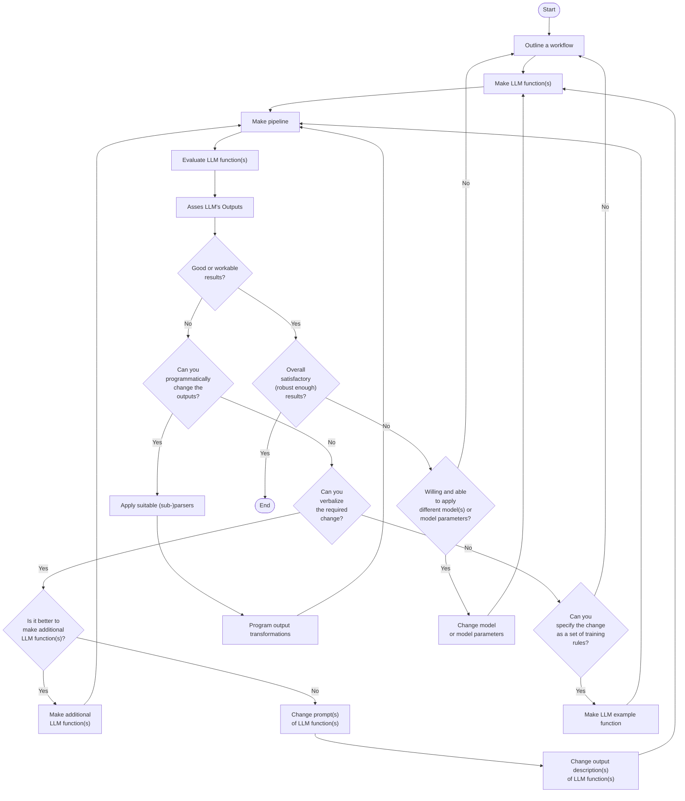

## General structure of LLM-based workflows

All systematic approaches of unfolding and refining workflows based on LLM functions,
will include several decision points and iterations to ensure satisfactory results.

This flowchart outlines such a systematic approach:

