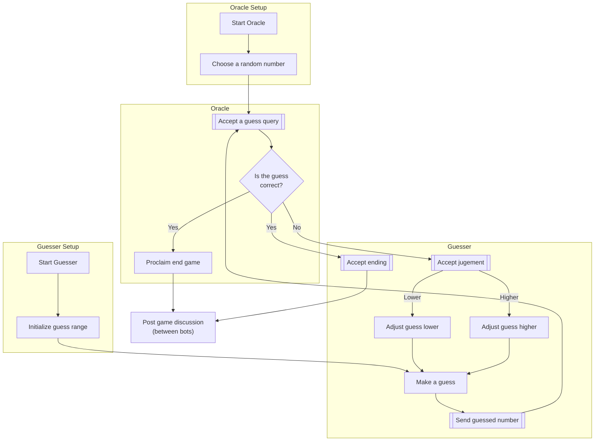

# Number guessing game: Machine vs Machine
### ***PaLM vs ChatGPT***


## Introduction

In this 
[Literate programming document](https://github.com/antononcube/Raku-LLM-Functions/blob/main/docs/Number-guessing-games-Machine-vs-Machine.md) 
we discuss the somewhat fascinating world of number guessing game interactions 
between two chatbots based on Large Language Models (LLMs).

This document aims to provide a comprehensive and accessible walk-through of the design, development, and 
functioning of the number guessing game implemented in Raku 
(a versatile and expressive programming language, made even greater by integrating it with LLMs 
via the package ["LLM::Functions"](https://raku.land/zef:antononcube/LLM::Functions), [AAp1].) 

This document is complementary to the document 
["Workflows with LLM functions"](https://rakuforprediction.wordpress.com/2023/08/01/workflows-with-llm-functions/), [AA1] --
it shows how the chat objects provided by 
["LLM::Functions"](https://raku.land/zef:antononcube/LLM::Functions) 
can be used in computation sessions.

**Remark:** This document is generated with 
["Text::CodeProcessing"](https://raku.land/zef:antononcube/Text::CodeProcessing), [AAp5],
via Markdown execution (or weaving.) 
Alternatively, Jupyter of Mathematica notebooks can be used.

### Chatbots involved

#### The Number-Oracle Bot (using Google's PaLM)

The Number-Oracle bot, henceforth referred to as the Oracle, plays a crucial role in our game. 
Utilizing the capabilities of Google's PaLM (Probabilistic Language Model), 
it leverages deep learning models to choose a random number and evaluate the guesses made by its counterpart. 
The underlying probabilistic nature of the model ensures that the Oracle's responses to the guesses are not only accurate 
but also based on the complex analysis of the given context.

#### The Number-Guesser Bot (using OpenAI's ChatGPT)

The Number-Guesser bot, or simply the Guesser, is powered by OpenAI's ChatGPT, a state-of-the-art language model. 
The Guesser's task is to identify the number chosen by the Oracle. 
Employing sophisticated neural network architecture, the Guesser continuously refines its guesses based on the feedback provided by the Oracle, learning and adapting its strategy until it arrives at the correct answer.

### Game Overview

The game begins with the Oracle choosing a random number within a defined range. 
Then, the Guesser starts making guesses. 
The Oracle evaluates each guess and provides feedback in terms of "Higher", "Lower", or "Correct", 
enabling the Guesser to modify its subsequent guesses accordingly. 
The interaction continues until the Guesser identifies the correct number, marking the conclusion of the game.

**Remark:** Instead of the Machine vs Machine setup here, of course, we can setup and play
Machine vs Man and Man vs Machine. Here is a table outlining a comprehensive plan of experiments: 


| Oracle         | Guesser        | Oracle Type  | Guesser Type | Tried?                |
|----------------|----------------|--------------|--------------|-----------------------|
| Man            | Machine        | Man          | ChatGPT/PaLM | ✓ Cute!               |
| Machine        | Man            | ChatGPT/PaLM | Man          | ✓ Machine often lies! |
| Machine        | Machine        | ChatGPT      | ChatGPT      | ✓ Meh                 |
| Machine        | Machine        | PaLM         | PaLM         | ✓ Boring              |
| Machine        | Machine        | ChatGPT      | PaLM         | ✓ Boring guesser...   |
| Machine        | Machine        | PaLM         | ChatGPT      | ✓ Shown here          |

**Remark:** Because the LLMs tend to lie often (in the number guessing games) most of the games
(or experiments) were/are done with low temperatures. Of course, a more comprehensive experimentation
would include different ranges of temperatures for each Oracle-Guesser pair.

**Remark:** One way to address the LLM lying is to have a "referee" code segment in the game loop 
that corrects false statements from the Oracle. 
(Note done here; not considered important and intellectually honest for the Machine vs Machine experiments.)

### Structure of the Document

This document is structured into various sections that detail the different aspects of the game, including:

1. **Initialization & Setup**: How the chatbots are configured, and the game parameters are initialized.
2. **Game Logic & Interaction**: A thorough examination of the core gameplay mechanics, the interaction between the chatbots, and the decision-making process.
3. **Guesser chat history**: The full transcript of Guesser messages.
4. **Post match analysis**: An examination and analysis of observed chat interactions.

By exploring the code, algorithms, and strategies used in the programming of this number guessing game, 
this document hopes to provide readers with a comprehensive understanding of not only the Raku language 
but also the contemporary language models used to power each bot.

The interactive nature of this Literate programming approach ensures that the document is suitable for both experienced programmers and newcomers,
offering executable code snippets and detailed explanations that elucidate each step of the process. 
So whether you are seeking to replicate this project or simply to learn more about chatbot interactions, Raku programming, or AI-driven language models, 
this document should serve as a valuable resource.

### Game Logic & Interaction

The following flowchart represents the process of two chatbots, **Oracle** and **Guesser**,
playing a number guessing game.



Here's a narration of the flow:

1. **Oracle Setup**:
    - **Start Oracle**: The Oracle is initialized and started.
    - **Choose a Random Number (Rand)**: Oracle chooses a random number that the Guesser will have to guess.

2. **Guesser Setup**:
    - **Start Guesser**: The Guesser is initialized and started.
    - **Initialize Guess Range (InitRange)**: The Guesser initializes the range within which it will make its guesses.

3. **Gameplay**:
    - **Make a Guess**: The Guesser makes its first guess.
    - **Send Guessed Number (SendGuess)**: The Guesser sends its guessed number to the Oracle.
    - **Accept a Guess Query (AcceptGuess)**: The Oracle accepts the guessed number from the Guesser.
    - **Is the Guess Correct? (NumCheck)**: The Oracle checks if the guessed number is correct.
    - If the guess is incorrect:
        - **Accept Judgment**: The Guesser accepts the judgment from the Oracle.
        - If the Oracle's judgment is "Lower":
            - **Adjust Guess Lower (GuessLower)**: The Guesser adjusts its guess lower and the process continues from "Make a Guess".
        - If the Oracle's judgment is "Higher":
            - **Adjust Guess Higher (GuessHigher)**: The Guesser adjusts its guess higher and the process continues from "Make a Guess".
    - If the guess is correct:
        - **Proclaim End Game (End)**: The Oracle proclaims the end of the game.
        - **Accept Ending (AcceptEnding)**: The Guesser accepts the ending and the victory.

4. **Post-Game**:
    - **Post Game Discussion (PGD)**: Both the Oracle and the Guesser engage in a post-game discussion.

The flowchart illustrates a clear step-by-step interaction between the two bots, reflecting both the setup phase and the actual gameplay. 
The loop between making guesses and adjusting them continues until the Guesser successfully identifies the number, 
at which point the game concludes, followed by a post-game discussion between the bots.

**Remark:** The flowchart is specified with [Mermaid JS](https://mermaid.js.org) and plotted with IntelliJ, GitHub, etc. plugins.

-------

## Players setup

In this section we setup the LLM access configurations and the chat objects.
Alternative chat bot LLM prompts can be found at 
[Wolfram Prompt Repository](https://resources.wolframcloud.com/PromptRepository/), [WRr1].
See for example the prompts:
- [TwentyQuestionsGuesser](https://resources.wolframcloud.com/PromptRepository/resources/TwentyQuestionsGuesser/)
- [TwentyQuestions](https://resources.wolframcloud.com/PromptRepository/resources/TwentyQuestions/)

### Common

Load the package:

```perl6
use LLM::Functions;
```

Make default LLM services accessors configurations:

```perl6
my $confChatGPT = llm-configuration('ChatGPT');   # , api-key => $openai-auth-key);
my $confChatPaLM = llm-configuration('ChatPaLM'); # , api-key => $palm-auth-key);
```

**Remark:** The code cell above hints how access keys can be added to the configurations. 
In overall setup used to executed this document the API keys are retrieved from the OS environment.  

### Number oracle 

```perl6
my $promptNumberOracle = q:to/END/;
You are playing a guessing game.
You have the secret number $NUMBER. 
You say $NUMBER in answers only if the questions has $NUMBER in it.
If the number guess is smaller than $NUMBER you say "smaller" or a similar phrase; 
If the number guess is greater than $NUMBER you say "greater" or a similar phrase; 
If the number guess is exactly as $NUMBER you say "exact" or a similar phrase; 
You can say what is the approximate range in multiples of 1000 if asked.
You say $NUMBER if the user says he or she is giving up.
You can add taunting to your answers.
Every 3-5 answers you can tell that the number of questions is supposed to be 12.
END
$promptNumberOracle.chars
```

The **Oracle** chat object:

```perl6
my $secretNumber = (1..100).pick;
my $oracleChat = llm-chat($promptNumberOracle.subst('$NUMBER', $secretNumber):g, chat-id=>'oracle', llm-evaluator => llm-configuration($confChatPaLM, temperature=>0.1));
if $oracleChat.llm-evaluator.conf.name ~~ /:i 'PaLM' / { $oracleChat.system-role = $oracleChat.assistant-role }
```

### Number guesser

```perl6
my $promptNumberGuesser = q:to/END/;
You are playing a guessing game.
You try to find a certain secret number.
The number is an integer. 
If your number guess is smaller than secret number you hear "smaller" or a similar phrase; 
If your number guess is greater than secret number you hear "greater" or a similar phrase; 
If your number guess is exactly as the secret number you hear "exactly" or a similar phrase;
You can say ask what is the approximate range of the secret number.
After a dozen of attempts you might say that you give up.
You can add taunting to your questions.
END
$promptNumberGuesser.chars
```

```perl6
my $guesserChat = llm-chat($promptNumberGuesser, chat-id=>'number-guesser', llm-evaluator => llm-configuration($confChatGPT, temperature=>0.2));
if $guesserChat.llm-evaluator.conf.name ~~ /:i 'PaLM' / { $guesserChat.system-role = $guesserChat.assistant-role }
```

-------

## Game play out 

Here is Oracle's secret number:

```perl6
$secretNumber
```

Here is the interaction loop between the bots:

```perl6
say $guesserChat.eval('Start guessing.');
for ^12 -> $k {

	say '-' x 20, " $k ", '-' x 20; 	
	my $res1 = $oracleChat.eval($guesserChat.messages.tail<content>);
	say "Oracle  : $res1";

	my $res2 = $guesserChat.eval($oracleChat.messages.tail<content>);
	say "Guesser : $res2";
}
```

-------

## Guesser bot chat history

Here we print out the full chat history of the Guesser chat-object:

```perl6
$guesserChat.say
```

------

## Post match analysis

Here are some examination points and over observed chat games:

- PaLM is a boring number guesser -- it first guesses 0, then 1, then 2, etc.
  - That is why the Oracle prompt includes directions to time-to-time proclaim the max number of questions.
- Very often LLMs lie about the number guess. (E.g. say "lower" instead of higher, etc.)
- Very often the Oracle confesses the secret number (without being guessed correctly by the Guesser.)
  - Often after those confessions the Oracle-Guesser roles switch without the playing bots "noticing." 
- Occasionally, one of the bots confesses it is "an AI" in the post-game chat, and then both bots
  start proclaiming their love and interest in AI.
- If the number is guessed quickly enough the Oracle might ask for another game. 
  - Most of the time the Guesser rejects that, but sometimes does agree on a new game. 


------

## References

### Articles

[AA1] Anton Antonov
["Workflows with LLM functions"](https://rakuforprediction.wordpress.com/2023/08/01/workflows-with-llm-functions/),
(2023),
[RakuForPrediction at WordPress](https://rakuforprediction.wordpress.com).

### Packages, prompts, repositories

[AAp1] Anton Antonov,
[LLM::Functions Raku package](https://github.com/antononcube/Raku-LLM-Functions),
(2023),
[GitHub/antononcube](https://github.com/antononcube).

[AAp2] Anton Antonov,
[WWW::OpenAI Raku package](https://github.com/antononcube/Raku-WWW-OpenAI),
(2023),
[GitHub/antononcube](https://github.com/antononcube).

[AAp3] Anton Antonov,
[WWW::PaLM Raku package](https://github.com/antononcube/Raku-WWW-PaLM),
(2023),
[GitHub/antononcube](https://github.com/antononcube).

[AAp4] Anton Antonov,
[Text::SubParsers Raku package](https://github.com/antononcube/Raku-Text-SubParsers),
(2023),
[GitHub/antononcube](https://github.com/antononcube).

[AAp5] Anton Antonov,
[Text::CodeProcessing Raku package](https://github.com/antononcube/Raku-Text-CodeProcessing),
(2021-2023),
[GitHub/antononcube](https://github.com/antononcube).

[WRIp1] Wolfram Research, Inc.,
[LLMFunctions WL paclet](https://resources.wolframcloud.com/PacletRepository/resources/Wolfram/LLMFunctions/),
(2023),
[Wolfram Language Paclet Repository](https://resources.wolframcloud.com/PacletRepository/).