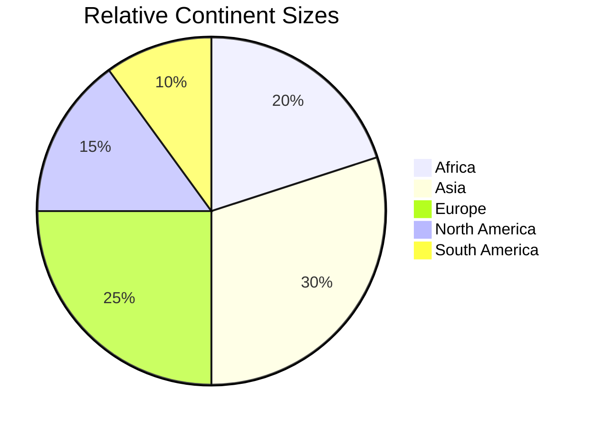
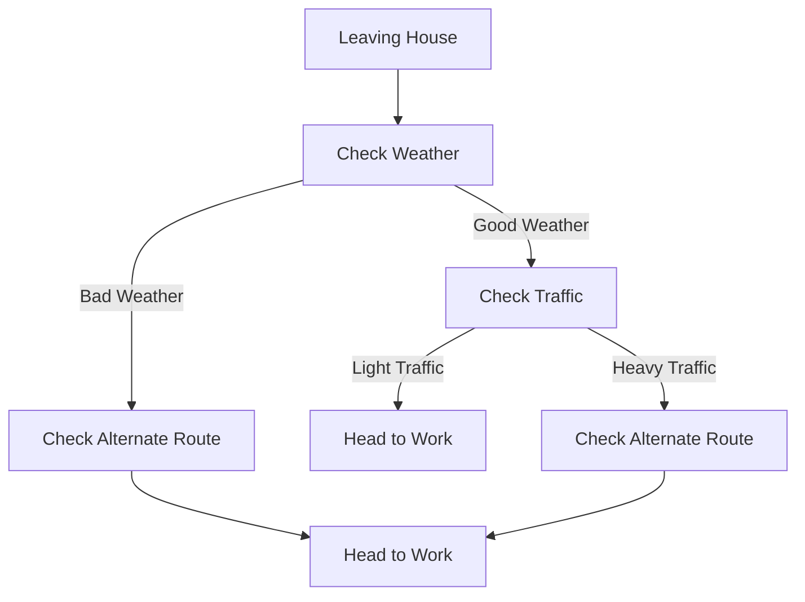

# Workflows with LLM functions

## Introduction

In this computational Markdown document we discuss and demonstrate the inclusion, integration of 
LLM functions into different types of Raku workflows. 

The following Raku packages used below:

```perl6, output=FALSE
use LLM::Functions;
use Text::SubParsers;

use Data::Reshapers;
use Data::Generators;
use Data::Summarizers;
use Data::ExampleDatasets;

use Text::Plot;

use Physics::Unit;

use Chemistry::Stoichiometry;
```
```
# (Any)
```

**Remark:** The Markdown document in executed (or "weaved") with the CLI script of the package
["Text::CodeProcessing"](https://raku.land/zef:antononcube/Text::CodeProcessing), [AA5].

------

## Plot data

**Workflow:** Consider a workflow with the following steps:
1. Request a LLM to produce in JSON format a dictionary of certain numerical quantity during a certain year
2. The corresponding LLM function converts the JSON text into Raku data structure.
3. Print or summarize data in tabular form 
4. A plot is made with the obtained data structure.

Here is a general quantities finder LLM function:

```perl6
my &qf3 = llm-function(
        {"What are the $^a of $^b in $^c? Give the result as name-number dictionary in JSON format."}, 
        llm-evaluator => llm-configuration('openai', temperature => 0.2), 
        form => sub-parser('JSON'));
```
```
# -> **@args, *%args { #`(Block|3788505624152) ... }
```

### Countries GDP

Consider finding and plotting the GDP of top 10 largest countries:

```perl6
my $gdp1 = &qf3('GDP', 'top 10 largest countries', '2022')
```
```
# {Brazil => 2.7 trillion, China => 17.2 trillion, France => 2.9 trillion, Germany => 3.9 trillion, India => 7.2 trillion, Italy => 2.2 trillion, Japan => 5.2 trillion, Russia => 2.4 trillion, United Kingdom => 3.2 trillion, United States => 25.3 trillion}
```

Here is a corresponding table:

```perl6
to-pretty-table($gdp1)
```
```
# +----------------+---------------+
# |      Key       |     Value     |
# +----------------+---------------+
# |     Italy      |  2.2 trillion |
# |     France     |  2.9 trillion |
# |     China      | 17.2 trillion |
# |     Japan      |  5.2 trillion |
# |     Russia     |  2.4 trillion |
# |     India      |  7.2 trillion |
# | United Kingdom |  3.2 trillion |
# | United States  | 25.3 trillion |
# |     Brazil     |  2.7 trillion |
# |    Germany     |  3.9 trillion |
# +----------------+---------------+
```

Here is a plot attempt:

```perl6
text-list-plot($gdp1.values)
```
```
#ERROR: The second argument is expected to be a Positional with Numeric objects.
# Nil
```

Here is another one based on the most frequent "non-compliant" output form:

```perl6
text-list-plot($gdp1.values.map({ sub-parser(Numeric).subparse($_).first }))
```
```
# +---+----------+-----------+----------+-----------+--------+       
# |                                                          |       
# +                                           *              +  25.00
# |                                                          |       
# +                                                          +  20.00
# |              *                                           |       
# +                                                          +  15.00
# |                                                          |       
# |                                                          |       
# +                                                          +  10.00
# |                               *                          |       
# +                    *                                     +   5.00
# |   *    *                 *          *           *    *   |       
# +                                                          +   0.00
# +---+----------+-----------+----------+-----------+--------+       
#     0.00       2.00        4.00       6.00        8.00
```


Here we the GDP for all countries and make the corresponding Pareto principle plot:

```perl6, eval=FALSE
my $gdp2 = &qf3('GDP', 'top 30 countries', '2018')
```

Here is a plot attempt:

```perl6, eval=FALSE
text-pareto-principle-plot($gdp2.values)
```

Here is another one based on the most frequent "non-compliant" output form:

```perl6, eval=FALSE
text-pareto-principle-plot($gdp2.rotor(2)>>.[1])
```

### Gold medals

```perl6
my $gmd = &qf3("counts of Olymipic gold medals", "countries", "the last decade");
```
```
# {Australia => 33, China => 70, France => 32, Germany => 41, Great Britain => 48, Italy => 22, Japan => 28, Russia => 56, South Korea => 24, United States => 110}
```

Here is a corresponding table:

```perl6
to-pretty-table($gmd)
```
```
# +---------------+-------+
# |      Key      | Value |
# +---------------+-------+
# | Great Britain |   48  |
# |    Germany    |   41  |
# |   Australia   |   33  |
# |  South Korea  |   24  |
# |     Russia    |   56  |
# | United States |  110  |
# |     France    |   32  |
# |     China     |   70  |
# |     Italy     |   22  |
# |     Japan     |   28  |
# +---------------+-------+
```

Here is a plot attempt:

```perl6
text-list-plot($gmd.values)
```
```
# +---+----------+-----------+----------+-----------+--------+        
# |                                                          |        
# |                               *                          |        
# +                                                          +  100.00
# |                                                          |        
# +                                                          +   80.00
# |                                                          |        
# |                                           *              |        
# +                          *                               +   60.00
# |   *                                                      |        
# +        *                                                 +   40.00
# |              *                      *                    |        
# |                    *                            *    *   |        
# +                                                          +   20.00
# +---+----------+-----------+----------+-----------+--------+        
#     0.00       2.00        4.00       6.00        8.00
```

-------

## Normalizing outputs

**Workflow:** We want to remove some pesky symbols and strings from LLM results.

The following *LLM example* function "normalizes" outputs that that have numerical values with certain number localization or currency units:

```perl6
my &num-norm = llm-example-function(['1,034' => '1_034', '13,003,553' => '13_003_553', '9,323,003,553' => '9_323_003_553',
                                    '43 thousand USD' => '23E3', '3.9 thousand' => '3.9E3',
                                    '23 million USD' => '23E6', '2.3 million' => '2.3E6',
                                    '3.2343 trillion USD' => '3.2343E12', '0.3 trillion' => '0.3E12']);
```
```
# -> **@args, *%args { #`(Block|3788554425408) ... }
```

This LLM function can be useful to transform outputs of other LLM functions (before utilizing those outputs further.)

Here is an example of normalizing the top 10 countries GDP query output above:

```perl6
&num-norm($gdp1.join(' '))
```
```
# Italy	2.2E12 France	2.9E12 China	17.2E12 Japan	5.2E12 Russia	2.4E12 India	7.2E12 United Kingdom	3.2E12 United States	25.3E12 Brazil	2.7E12 Germany	3.9E12
```

------

## Conversion to Raku objects 

**Workflow:** We want to retrieve different physical quantities and make corresponding Raku objects. 
(For further scientific computations with them.) 

The following LLM example function transforms different kinds of physical quantity specs into Raku code
for the module ["Physics::Units"](https://raku.land/zef:librasteve/Physics::Unit):

```perl6
my &pu = llm-example-function(
        ['11,042 m/s' => 'GetUnit("11_042 m/s")', 
         '4,380,042 J' => 'GetUnit("4_380_042 J")',
         '304.342 m/s^2' => 'GetUnit("304.342 m/s^2")'], 
        llm-evaluator => 'PaLM');
```
```
# -> **@args, *%args { #`(Block|3788554441640) ... }
```


Here is an example of speed query function:

```perl6
my &fs = llm-function({"What is the average speed of $^a in the units of $^b?"}, llm-evaluator => 'PaLM');
```
```
# -> **@args, *%args { #`(Block|3788554442072) ... }
```

Here is a concrete query:

```perl6
my $rs1 = &fs('rocket leaving Earth', 'meters per second');
```
```
# 11,200 m/s
```

Here we convert the LLM output into Raku code for making a unit object:

```perl6
my $rs2 = &pu($rs1);
```
```
# GetUnit("11_200 m/s")
```

Here we evaluate the Raku code (into an object):

```perl6
use MONKEY-SEE-NO-EVAL;
my  $uObj = EVAL($rs2);

$uObj.raku;
```
```
# Unit.new( factor => 11200, offset => 0, defn => '11_200 m/s', type => Speed,
#   dims => [1,0,-1,0,0,0,0,0], dmix => ("s"=>-1,"m"=>1).MixHash, names => ['11_200 m/s'] );
```

Of course, the steps above can be combined into one function.
In general, though, care should be taken handle or prevent the situations in which function inputs and outputs
do not agree with each other.

------

## Chemical formulas

**Workflow:** Assume that we want to:
- Obtain a list of Stoichiometry equations according to some criteria
- Find the molecular masses of the components for each equation 
- Tabulate the formulas and found component molecular masses

Here we define LLM functions for retrieving chemical formulas with specified species:

```perl6
my &cf = llm-function({"Give a chemical formula that includes $^a."}, llm-evaluator => 'OpenAI');
my &cfn = llm-function({"Give $^a chemical stoichiometry formulas that includes $^b. Give the result as a JSON list."}, llm-evaluator => 'OpenAI', form => sub-parser('JSON'));
```
```
# -> **@args, *%args { #`(Block|3788511973888) ... }
```

Here is a query:

```perl6
my $chemRes1 = &cfn(3, 'sulfur');
```
```
# [S + O2 → SO2 2H2S + 3O2 → 2SO2 + 2H2O C6H5OH + 7O2 → 6CO2 + 5H2O + SO2]
```

Here we define a regex that parse chemical components:

```perl6
sub chem-component(Str $x) { with Chemistry::Stoichiometry::Grammar.parse($x, rule => 'molecule') { $_.Str => molecular-mass($_.Str) } }
```
```
# &chem-component
```

Here for each formula we extract the chemical components and find the corresponding molecular masses:

```perl6
my @chemData = $chemRes1.map({ [formula => $_, |sub-parser(&chem-component).subparse($_).grep({ $_ ~~ Pair })].Hash });
```
```
# [{O2 => 31.998, S => 32.06, SO2 => 64.058, formula => S + O2 → SO2} {H2O => 18.015, H2S => 34.076, O2 => 31.998, SO2 => 64.058, formula => 2H2S + 3O2 → 2SO2 + 2H2O} {C6H5OH => 94.113, CO2 => 44.009, H2O => 18.015, O2 => 31.998, SO2 => 64.058, formula => C6H5OH + 7O2 → 6CO2 + 5H2O + SO2}]
```

Here we all unique column names (keys) in the obtained dataset:

```perl6
my @colnames = @chemData>>.keys.flat.unique.sort
```
```
# [C6H5OH CO2 H2O H2S O2 S SO2 formula]
```

Here we tabulate the result:

```perl6
to-pretty-table(@chemData, align => 'l', field-names => @colnames)
```
```
# +-----------+-----------+-----------+-----------+-----------+-----------+-----------+----------------------------------+
# | C6H5OH    | CO2       | H2O       | H2S       | O2        | S         | SO2       | formula                          |
# +-----------+-----------+-----------+-----------+-----------+-----------+-----------+----------------------------------+
# |           |           |           |           | 31.998000 | 32.060000 | 64.058000 | S + O2 → SO2                     |
# |           |           | 18.015000 | 34.076000 | 31.998000 |           | 64.058000 | 2H2S + 3O2 → 2SO2 + 2H2O         |
# | 94.113000 | 44.009000 | 18.015000 |           | 31.998000 |           | 64.058000 | C6H5OH + 7O2 → 6CO2 + 5H2O + SO2 |
# +-----------+-----------+-----------+-----------+-----------+-----------+-----------+----------------------------------+
```

------

## Making (embedded) Mermaid diagrams

**Workflow:** We to get "quick start" 
[Mermaid-JS](https://mermaid.js.org) 
code for certain type of diagrams.

Here is a LLM function for generating a Mermaid JS spec:

```perl6
my &fmmd = llm-function({"Generate the Mermaid-JS code of $^a for $^b?"})
```
```
# -> **@args, *%args { #`(Block|3788512074992) ... }
```

Here we request to get the code of pie chart for the continent sizes:

```perl6, results=asis
my $mmdRes = &fmmd("pie chart", "relative continent sizes")
```


Here, "just in case", we normalize the numbers of the result and "dump" the code as Markdown code cell:

```perl6, output.prompt=NONE, output.lang=mermaid
$mmdRes.subst(:g, '%', '').subst(:g, ',', '').subst("{'`' x 3}mermaid", '').subst("{'`' x 3}", '')
```


Here is a flow chart request:

```perl6, results=asis
&fmmd("flow chart", "going to work in the morning avoiding traffic jams and reacting to weather")
```



------

## References

[AAp1] Anton Antonov,
[LLM::Functions Raku package](https://github.com/antononcube/Raku-LLM-Functions),
(2023),
[GitHub/antononcube](https://github.com/antononcube).

[AAp2] Anton Antonov,
[WWW::OpenAI Raku package](https://github.com/antononcube/Raku-WWW-OpenAI),
(2023),
[GitHub/antononcube](https://github.com/antononcube).

[AAp3] Anton Antonov,
[WWW::PaLM Raku package](https://github.com/antononcube/Raku-WWW-PaLM),
(2023),
[GitHub/antononcube](https://github.com/antononcube).

[AAp4] Anton Antonov,
[Text::SubParsers Raku package](https://github.com/antononcube/Raku-Text-SubParsers),
(2023),
[GitHub/antononcube](https://github.com/antononcube).

[AAp5] Anton Antonov,
[Text::CodeProcessing Raku package](https://github.com/antononcube/Raku-Text-CodeProcessing),
(2021),
[GitHub/antononcube](https://github.com/antononcube).