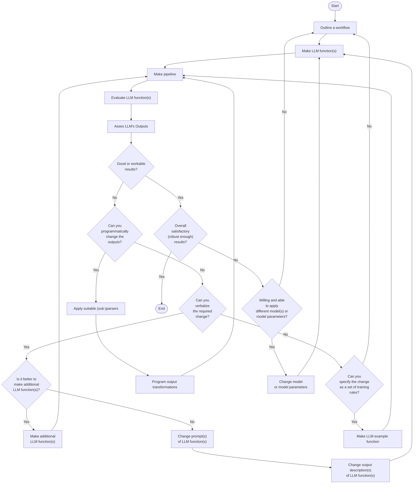
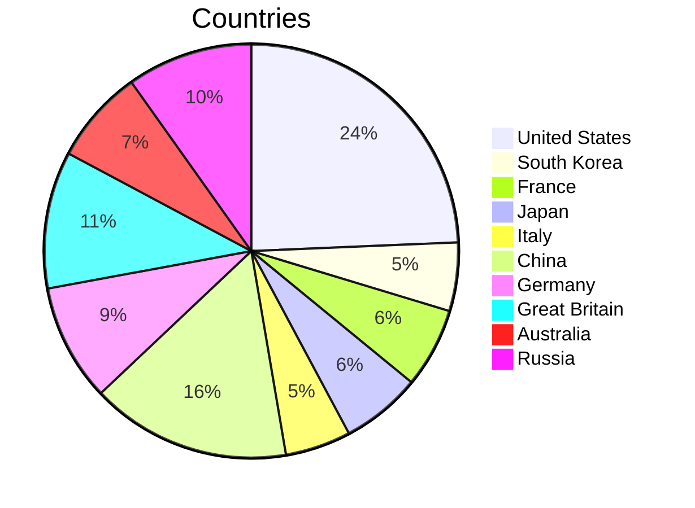
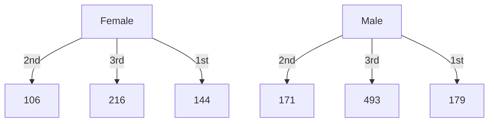
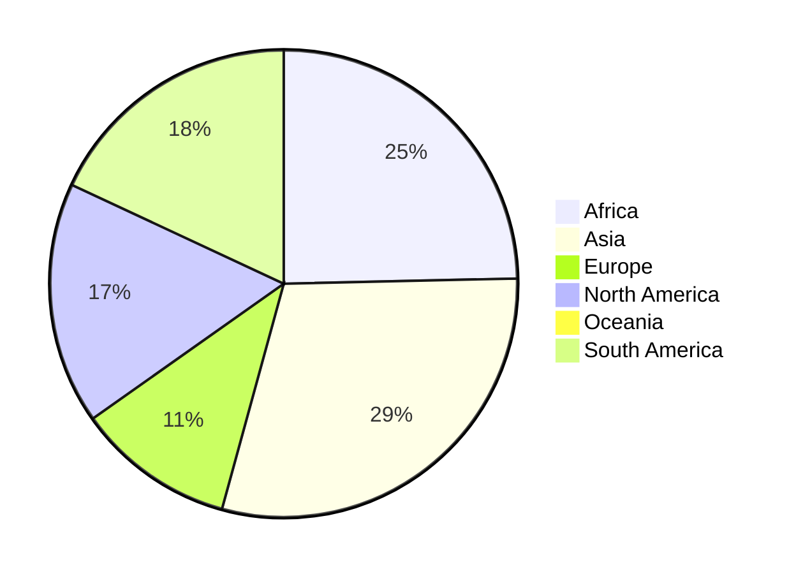
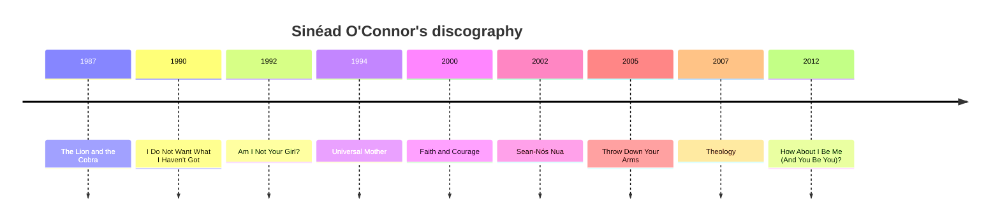

# Workflows with LLM functions

## Introduction

In this computational Markdown document we discuss and demonstrate the inclusion and integration of
Large Language Model (LLM) functions into different types of Raku workflows.

Since LLMs hallucinate results, it becomes necessary to manipulate their inputs, the outputs, or both. 
Therefore, having a system for managing, coordinating, and streamlining LLM requests, 
along with methods for incorporating these requests into the "playgrounds" of a certain programming language, 
would be highly beneficial.

This is what the package 
["LLM::Functions"](https://raku.land/zef:antononcube/LLM::Functions), [AAp1],
aims to do in Raku and Raku's ecosystem. 

### Dynamic duo

LLMs are celebrated for producing good to great results, but they have a few big issues. 
The content they generate can be inconsistent, prone to hallucination, and sometimes biased, making it unreliable.
The form, or stylistic structure, may also vary widely, with a lack of determinism and sensitivity 
to hyperparameters contributing to challenges in reproducibility. 
Moreover, customization and debugging can be complex due to these inconsistencies. 

The lack of reliability and reproducibility in both content and form underscore
the need for streamlining, managing, and transforming LLM inquiries and results.

Raku, with its unique approach to text manipulation, not surprisingly complements LLMs nicely. 
While Raku might not be everyone's favorite language and has certain intricacies that take some getting used to, 
its strengths in handling text patterns are hard to ignore. ***Creating well-crafted pairings of Raku with LLMs 
can broaden Raku's adoption and utilization.***

"LLM::Functions" establishes a (functional programming) connection between Raku's capabilities and the vast potential of LLMs. 
Ideally that promising LLM-Raku pairing is further strengthened and enriched into something that some might call a "dynamic duo."

**Remark:** For an example of a mature effort with the same mission (and naming, and design) see [SW1] and [WRIp1].

**Remark:** And yes, for Mathematica or Wolfram Language (WL) it can be also said:
*Creating well-crafted pairings of WL with LLMs can broaden WL's adoption and utilization.*
WL, though, is much better positioned for integrating with multi-modal LLMs because of WL's
ability to create and manipulate symbolic representation of different types of objects 
(audio, images, and video included), and WL's very advanced notebook technology.

### Standard enhancements

To enhance the pairing of Raku with LLMs, it is *also* essential to have:
- LLM prompt repository with many well documented prompts
- Polyglot parsing of dates, numbers, regular expressions, data formats, grammar specs, etc.  

For an example of the former see the Wolfram Prompt Repository, [WRIr1].
For examples of the latter see [AAp4], [MSp1, MSp2].

**Remark:** I like the idea of having ready to apply "power" tokens like `<local-number>`
provided by "Intl::Token::Number", [MSp1].

**Remark:** For some reason the developer of 
"Intl::Token::Number", [MSp1], and "Polyglot::Regexen", [MSp2], prefers to make 
[Brainfuck](https://en.wikipedia.org/wiki/Brainfuck) 
[parsers](https://github.com/alabamenhu/PolyglotBrainfuck) and 
travel to Canada to [talk about it](https://www.youtube.com/watch?v=LSnkFfE7vPg)
than making those packages ready to be used by "LLM::Functions", [AAp1], and "Text::SubParsers", [AAp4].

### Interactivity is needed

Generally speaking, using LLM functions in Raku (or Mathematica, or Python, or R) requires 
good tools for [Read Eval Print Loop (REPL)](https://en.wikipedia.org/wiki/Read–eval–print_loop).

Notebooks are best for LLM utilization because notebooks offer an interactive environment where
LLM whisperers, LLM tamers, neural net navigators, and bot wranglers can write code, run it, see the results, 
and tweak the code -- all in one place.

Raku currently has (at least) two notebook solutions: 
1. ["Jupyter::Kernel"](https://raku.land/cpan:BDUGGAN/Jupyter::Kernel) with the [Jupyter framework](https://jupyter.org)
2. ["Text::CodeProcessing"](https://raku.land/?q=Text%3A%3ACodeProcessing) 
and ["RakuMode" for Mathematica](https://resources.wolframcloud.com/PacletRepository/resources/AntonAntonov/RakuMode/), [AA2].

Raku second best LLM-REPL solutions are those like 
[Comma's REPL](https://commaide.com/features) and 
[Emacs Raku Mode](https://github.com/Raku/raku-mode). 

"Just" using scripts is an option, but since LLM queries have certain time lag and usage expenses, it is not a good one:
- We cannot see the intermediate results and adjust accordingly
- Multiple (slow) executions would be needed to get desired results

**Remark:** The very first version of this article was made with "Text::CodeProcessing" via Markdown execution (or weaving.)
Then Comma's REPL was used, for extending and refining the examples. "Jupyter::Kernel" was also used
for a few of the sections.


### Article structure

Here are sections of the article:

- **General structure of LLM-based workflows**   
  ... Formulating and visualizing the overall process used in all LLM workflow examples.
- **Plot data**   
  ... Plotting LLM-retrieved data.
- **Normalizing outputs**   
  ... Examples of how LLM-function outputs can be "normalized" using other LLM functions.
- **Conversion to Raku objects**   
  ... Conversion of LLM-outputs in Raku physical units objects.
- **Chemical formulas**   
  ... Retrieving chemical formulas and investigating them.
- **Making (embedded) Mermaid diagrams**   
  ... Straightforward application of LLM abilities and literate programming tools.
- **Named entity recognition**  
  ... How to obtain music album names and release dates and tabulate or plot them.
- **Statistics of output data types**   
  ... Illustration why programmers need streamlining solutions for LLMs.
- **Other workflows**   
  ... Outline of other workflows using LLM chat objects. (Also provided by "LLM::Functions".)

**Remark:** Most of the sections have a sub-section titled "Exercise questions". 
The reader is the secondary target audience for those. The primary target are LLMs to respond to them.
(Another article is going to discuss the staging and evaluating of those LLM answers.) 

### Packages and LLM access

The following Raku packages used below:

```perl6 , results=hide
use LLM::Functions;
use Text::SubParsers;

use Data::Reshapers;
use Data::TypeSystem;
use Data::Generators;
use Data::Summarizers;
use Data::ExampleDatasets;

use Text::Plot;
use JavaScript::D3;

use Physics::Unit;

use Chemistry::Stoichiometry;

use JSON::Fast;
use HTTP::Tiny;
```

"Out of the box"
["LLM::Functions"](https://raku.land/zef:antononcube/LLM::Functions) uses
["WWW::OpenAI"](https://raku.land/zef:antononcube/WWW::OpenAI), [AAp2], and
["WWW::PaLM"](https://raku.land/zef:antononcube/WWW::PaLM), [AAp3].
Other LLM access packages can utilized via appropriate LLM configurations.

The LLM functions below use the LLM authorization tokens that are kept
in the OS environment. See [AAp2] and [AAp3] for details how to setup LLM access.

The Markdown document is executed (or "woven") with the CLI script of the package
["Text::CodeProcessing"](https://raku.land/zef:antononcube/Text::CodeProcessing), [AA5].
"Text::CodeProcessing" has features that allow the woven documents to have render-ready 
Markdown cells, like, tables, Mermaid-JS diagrams, or JavaScript plots.


----

## General structure of LLM-based workflows

All systematic approaches of unfolding and refining workflows based on LLM functions, 
will include several decision points and iterations to ensure satisfactory results.

This flowchart outlines such a systematic approach:



Here is a corresponding description:

- **Start**: The beginning of the process.
- **Outline a workflow**: The stage where a human outlines a general workflow for the process.
- **Make LLM function(s)**: Creation of specific LLM function(s).
- **Make pipeline**: Construction of a pipeline to integrate the LLM function(s).
- **Evaluate LLM function(s)**: Evaluation of the created LLM function(s).
- **Asses LLM's Outputs**: A human assesses the outputs from the LLM.
- **Good or workable results?**: A decision point to check whether the results are good or workable.
- **Can you programmatically change the outputs?**: If not satisfactory, a decision point to check if the outputs can be changed programmatically.
  - *The human acts like a real programmer.*
- **Can you verbalize the required change?**: If not programmable, a decision point to check if the changes can be verbalized.
  - *The human programming is delegated to the LLM.*
- **Can you specify the change as a set of training rules?**: If not verbalizable, a decision point to check if the change can be specified as training rules.
  - *The human cannot program or verbalize the required changes, but can provide examples of those changes.*
- **Is it better to make additional LLM function(s)?**: If changes can be verbalized, a decision point to check whether it is better to make additional LLM function(s), or it is better to change prompts or output descriptions. 
- **Make additional LLM function(s)**: Make additional LLM function(s) (since it is considered to be the better option.)  
- **Change prompts of LLM function(s)**: Change prompts of already created LLM function(s).
- **Change output description(s) of LLM function(s)**: Change output description(s) of already created LLM function(s).
- **Apply suitable (sub-)parsers**: If changes can be programmed, choose, or program, and apply suitable parser(s) or sub-parser(s) for LLM's outputs.
- **Program output transformations**: Transform the outputs of the (sub-)parser(s) programmatically.
- **Overall satisfactory (robust enough) results?**: A decision point to assess whether the results are overall satisfactory.
  - *This should include evaluation or estimate how robust and reproducible the results are.*
- **Willing and able to apply different model(s) or model parameters?**: A decision point should the LLM functions pipeline should evaluated or tested with different LLM model or model parameters.
  - *In view of robustness and reproducibility, systematic change of LLM models and LLM functions pipeline inputs should be considered.* 
- **Change model or model parameters**: If willing to change models or model parameters then do so.
  - *Different models can have different adherence to prompt specs, evaluation speeds, and evaluation prices.*
- **Make LLM example function**: If changes can be specified as training rules, make an example function for the LLM.
- **End**: The end of the process.

To summarise:
- We work within an iterative process for refining the results of LLM function(s) pipeline.
- If the overall results are not satisfactory, we loop back to the outlining workflow stage.
- If additional LLM functions are made, we return to the pipeline creation stage.
- If prompts or output descriptions are changed, we return the LLM function(s) creation stage. 
- Our (human) inability or unwillingness to program transformations has a few decision steps for delegation to LLMs.

**Remark:** We leave as exercises to the reader to see how the workflows programmed below fit the flowchart above.

**Remark:** The mapping of the workflow code below onto the flowchart can be made using LLMs. 

------

## Plot data

**Workflow:** Consider a workflow with the following steps:

1. Request an LLM to produce in JSON format a dictionary of a certain numerical quantity during a certain year.
2. The corresponding LLM function converts the JSON text into Raku data structure.
3. Print or summarize obtained data in tabular form.
4. A plot is made with the obtained data.

Here is a general quantities finder LLM function:

```perl6 
my &qf3 = llm-function(
        { "What are the $^a of $^b in $^c? Give the result as name-number dictionary in JSON format." },
        llm-evaluator => llm-configuration('openai', temperature => 0.2),
        form => sub-parser('JSON'));
```
```
# -> **@args, *%args { #`(Block|6266912567184) ... }
```

### Countries GDP

Consider finding and plotting the GDP of top 10 largest countries:

```perl6 
my $gdp1 = &qf3('GDP', 'top 10 largest countries', '2022')
```
```
# {Brazil => 2.6 trillion, China => 17.3 trillion, France => 2.7 trillion, Germany => 3.9 trillion, India => 8.2 trillion, Japan => 5.3 trillion, Mexico => 1.9 trillion, Russia => 2.2 trillion, United Kingdom => 3.2 trillion, United States => 25.2 trillion}
```

Here is a corresponding table:

```perl6 
to-pretty-table($gdp1)
```
```
# +---------------+----------------+
# |     Value     |      Key       |
# +---------------+----------------+
# |  2.2 trillion |     Russia     |
# |  1.9 trillion |     Mexico     |
# |  5.3 trillion |     Japan      |
# |  3.2 trillion | United Kingdom |
# | 25.2 trillion | United States  |
# | 17.3 trillion |     China      |
# |  8.2 trillion |     India      |
# |  2.6 trillion |     Brazil     |
# |  2.7 trillion |     France     |
# |  3.9 trillion |    Germany     |
# +---------------+----------------+
```

Here is a plot attempt:

```perl6 
text-list-plot($gdp1.values)
```
```
#ERROR: The second argument is expected to be a Positional with Numeric objects.
# Nil
```

Here is another one based on the most frequent "non-compliant" output form:

```perl6 
text-list-plot($gdp1.values.map({ sub-parser(Numeric).subparse($_).first }))
```
```
# +---+----------+-----------+----------+-----------+--------+       
# |                                                          |       
# +                          *                               +  25.00
# |                                                          |       
# +                                                          +  20.00
# |                               *                          |       
# +                                                          +  15.00
# |                                                          |       
# |                                                          |       
# +                                                          +  10.00
# |                                     *                    |       
# +              *                                           +   5.00
# |   *    *           *                      *     *    *   |       
# +                                                          +   0.00
# +---+----------+-----------+----------+-----------+--------+       
#     0.00       2.00        4.00       6.00        8.00
```

Here we obtain the GDP for all countries and make the corresponding Pareto principle plot:

```perl6 , eval=FALSE
my $gdp2 = &qf3('GDP', 'top 30 countries', '2018')
```

Here is a plot attempt:

```perl6 , eval=FALSE
text-pareto-principle-plot($gdp2.values)
```

Here is another one based on the most frequent "non-compliant" output form:

```perl6 , eval=FALSE
text-pareto-principle-plot($gdp2.grep(* ~~ Numeric).List)
```

### Gold medals

Here we retrieve data for gold Olympic medal counts:

```perl6 
my $gmd = &qf3("counts of Olymipic gold medals", "countries", "the last decade");
```
```
# {Australia => 33, China => 70, France => 28, Germany => 41, Great Britain => 48, Italy => 23, Japan => 28, Russia => 44, South Korea => 24, United States => 109}
```

Here is a corresponding table:

```perl6 
to-pretty-table($gmd)
```
```
# +-------+---------------+
# | Value |      Key      |
# +-------+---------------+
# |  109  | United States |
# |   24  |  South Korea  |
# |   28  |     France    |
# |   28  |     Japan     |
# |   23  |     Italy     |
# |   70  |     China     |
# |   41  |    Germany    |
# |   48  | Great Britain |
# |   33  |   Australia   |
# |   44  |     Russia    |
# +-------+---------------+
```

Here is a plot attempt:

```perl6 
text-list-plot($gmd.values)
```
```
# +---+----------+-----------+----------+-----------+--------+        
# |                                                          |        
# |   *                                                      |        
# +                                                          +  100.00
# |                                                          |        
# +                                                          +   80.00
# |                                                          |        
# |                               *                          |        
# +                                                          +   60.00
# |                                           *              |        
# +                                     *                *   +   40.00
# |                                                 *        |        
# |        *     *     *     *                               |        
# +                                                          +   20.00
# +---+----------+-----------+----------+-----------+--------+        
#     0.00       2.00        4.00       6.00        8.00
```

### Exercise questions

- How does the code in this section maps on the flowchart in the section "General structure of LLM-based workflows"?
- Come up with other argument values for the three slots of `&qf3` and execute the workflow. 

-------

## Refining and adapting outputs

**Workflow:** We want to transform text into a specific format that is both expected and ready for immediate processing.
For example:

- Remove certain pesky symbols and strings from LLM results
- Put a Raku (or JSON) dataset into a tabular data format suitable for immediate rendering
- Convert a dataset into a plotting language spec

### Normalizing numerical outputs

The following *LLM example* function "normalizes" outputs that have numerical values with certain number
localization or currency units:

```perl6 
my &num-norm = llm-example-function(['1,034' => '1_034', '13,003,553' => '13_003_553', '9,323,003,553' => '9_323_003_553',
                                     '43 thousand USD' => '23E3', '3.9 thousand' => '3.9E3',
                                     '23 million USD' => '23E6', '2.3 million' => '2.3E6',
                                     '3.2343 trillion USD' => '3.2343E12', '0.3 trillion' => '0.3E12']);
```
```
# -> **@args, *%args { #`(Block|6266929738016) ... }
```

This LLM function can be useful to transform outputs of other LLM functions (before utilizing those outputs further.)

Here is an example of normalizing the top 10 countries GDP query output above:

```perl6 
&num-norm($gdp1.join(' '))
```
```
# Russia:	2.2E12 Mexico:	1.9E12 Japan:	5.3E12 United Kingdom:	3.2E12 United States:	25.2E12 China:	17.3E12 India:	8.2E12 Brazil:	2.6E12 France:	2.7E12 Germany:	3.9E12
```

### Dataset into tabular format

Here is an LLM function that transforms the plain text data above into a GitHub Markdown table:

```perl6 
my &fgt = llm-function({ "Transform the plain-text table $_ into a GitHub table." })
```
```
# -> **@args, *%args { #`(Block|6266929752776) ... }
```

Here is an example application:

```perl6 , results=asis
&fgt(to-pretty-table($gdp1))
```
| Value        | Key           |
| ------------ | ------------- |
| 2.2 trillion | Russia        |
| 1.9 trillion | Mexico        |
| 5.3 trillion | Japan         |
| 3.2 trillion | United Kingdom|
| 25.2 trillion| United States |
| 17.3 trillion| China         |
| 8.2 trillion | India         |
| 2.6 trillion | Brazil        |
| 2.7 trillion | France        |
| 3.9 trillion | Germany       |


Let us define a function that translates the dataset by converting to JSON format first,
and then converting into a GitHub Markdown table:

```perl6 
my &fjgt = llm-function({ "Transform the JSON data $_ into a GitHub table." })
```
```
# -> **@args, *%args { #`(Block|6266929735104) ... }
```

Here is an example application:

```perl6 , results=asis
&fjgt(to-json($gdp1))
```
Country | GDP
------ | -----
Russia | 2.2 trillion
Mexico | 1.9 trillion
Japan | 5.3 trillion
United Kingdom | 3.2 trillion
United States | 25.2 trillion
China | 17.3 trillion
India | 8.2 trillion
Brazil | 2.6 trillion
France | 2.7 trillion
Germany | 3.9 trillion


### Dataset into diagrams

Here we define a reformatting function that translates JSON data into Mermaid diagrams:

```perl6 
my &fjmmd = llm-function({ "Transform the JSON data $^a into a Mermaid $^b spec." })
```
```
# -> **@args, *%args { #`(Block|6266929775776) ... }
```

Here we convert the gold medals data into a pie chart:

```perl6 , output.prompt=NONE, output.lang=mermaid
&fjmmd(to-json($gmd), 'pie chart')
```


Here is a more "data creative" example:

1. First we get a dataset and cross-tabulate it
2. Then we ask an LLM make the corresponding flow chart, or class-, or state diagram for it

Here is a cross-tabulation of the Titanic dataset (over the sex and class variables):

```perl6 
my %ct = cross-tabulate(get-titanic-dataset(), 'passengerSex', 'passengerClass')
```
```
# {female => {1st => 144, 2nd => 106, 3rd => 216}, male => {1st => 179, 2nd => 171, 3rd => 493}}
```

Here we convert the contingency matrix into a flow chart:

```perl6 , output.prompt=NONE, output.lang=mermaid
&fjmmd(to-json(%ct), 'flow chart')
```


Here we convert the contingency matrix into a state diagram :

```perl6 , output.prompt=NONE, output.lang=mermaid
&fjmmd(to-json(%ct), 'state diagram')
```
```mermaid
stateDiagram
  female --> "2nd: 106"
  female --> "3rd: 216"
  female --> "1st: 144"
  male --> "2nd: 171"
  male --> "3rd: 493"
  male --> "1st: 179"
```

### Exercise questions

- To which parts of the flowchart above the workflow in this section corresponds to?
- What is preferable: one LLM-function with complicated prompt and argument specs, 
  or several LLM-functions with simply structured prompts and arguments? 

------

## Conversion to Raku objects

**Workflow:** We want to retrieve different physical quantities and make corresponding Raku objects.
(For further scientific computations with them.)

The following LLM example function transforms different kinds of physical quantity specs into Raku code
for the module ["Physics::Units"](https://raku.land/zef:librasteve/Physics::Unit), [SR1]:

```perl6 
my &pu = llm-example-function(
        ['11,042 m/s' => 'GetUnit("11_042 m/s")',
         '4,380,042 J' => 'GetUnit("4_380_042 J")',
         '304.342 m/s^2' => 'GetUnit("304.342 m/s^2")'],
        llm-evaluator => 'PaLM');
```
```
# -> **@args, *%args { #`(Block|6266937716760) ... }
```

Here is an example of speed query function:

```perl6 
my &fs = llm-function({ "What is the average speed of $^a in the units of $^b?" }, llm-evaluator => 'PaLM');
```
```
# -> **@args, *%args { #`(Block|6266937717192) ... }
```

Here is a concrete query:

```perl6 
my $rs1 = &fs('rocket leaving Earth', 'meters per second');
```
```
# 11,186 m/s
```

Here we convert the LLM output into Raku code for making a unit object:

```perl6 
my $rs2 = &pu($rs1);
```
```
# GetUnit("11_186 m/s")
```

Here we evaluate the Raku code (into an object):

```perl6 
use MONKEY-SEE-NO-EVAL;
my  $uObj = EVAL($rs2);

$uObj.raku;
```
```
# Unit.new( factor => 11186, offset => 0, defn => '11_186 m/s', type => Speed,
#   dims => [1,0,-1,0,0,0,0,0], dmix => ("m"=>1,"s"=>-1).MixHash, names => ['11_186 m/s'] );
```

Of course, the steps above can be combined into one function.
In general, though, care should be taken to handle or prevent situations in which function inputs and outputs
do not agree with each other.

### Exercise questions

- Can you write a Raku function that combines the LLM-functions mentioned above?
- What kind of computations involve the discussed unit objects?

------

## Chemical formulas

**Workflow:** Assume that we want to:

- Obtain a list of Stoichiometry equations according to some criteria
- Evaluate the consistency of the equations
- Find the molecular masses of the components for each equation
- Tabulate the formulas and found component molecular masses

Here we define LLM functions for retrieving chemical formulas with specified species:

```perl6 
my &cfn = llm-function(
        { "Give $^a chemical stoichiometry formulas that includes $^b. Give the result as a JSON list." },
        llm-evaluator => 'OpenAI', form => sub-parser('JSON'));
```
```
# -> **@args, *%args { #`(Block|6266929494848) ... }
```

Here is a query:

```perl6 
my $chemRes1 = &cfn(3, 'sulfur');
```
```
# [2S + 3O2 → 2SO3 2S + 3H2O → H2S + 2H2SO4 2S2O3 → 2S + 3O2]
```

Let us convince ourselves that we got a list of strings:

```perl6
deduce-type($chemRes1)
```
```
# Vector(Atom((Str)), 3)
```

Let us see do we have consistent reaction equations by checking that 
the molecular masses on Left Hand Sides (LHSs) and Right Hand Side (RHSs) are the same:

```perl6
to-pretty-table(transpose( %(formula => $chemRes1.Array, balancing => molecular-mass($chemRes1)>>.gist ) ))
```
```
# +--------------------+--------------------------+
# |     balancing      |         formula          |
# +--------------------+--------------------------+
# | 160.114 => 160.114 |     2S + 3O2 → 2SO3      |
# | 118.165 => 230.22  | 2S + 3H2O → H2S + 2H2SO4 |
# | 224.234 => 160.114 |     2S2O3 → 2S + 3O2     |
# +--------------------+--------------------------+
```

**Remark:** If the column "balancing" shows two different numbers separated by "=>" that 
means the LLM hallucinated an inconsistent chemical reaction equation.
(Because the LLM does not know, or disregarded for some reason, the 
[law of conservation of mass](https://en.wikipedia.org/wiki/Conservation_of_mass).) 

Here we define a regex that parses chemical components:

```perl6 
sub chem-component(Str $x) {
  with Chemistry::Stoichiometry::Grammar.parse($x, rule => 'mult-molecule') {
    return $_.Str.subst(/^ \d+/, '') => molecular-mass($_.Str);
  }
  return Nil;
}
```
```
# &chem-component
```

Here for each formula we extract the chemical components and find the corresponding molecular masses:

```perl6 
my @chemData = $chemRes1.map({ [formula => $_, |sub-parser(&chem-component).subparse($_).grep({ $_ ~~ Pair })].Hash });
```
```
# [{O2 => 95.994, S => 64.12, SO3 => 160.114, formula => 2S + 3O2 → 2SO3} {H2O => 54.045, H2S => 34.076, H2SO4 => 196.144, S => 64.12, formula => 2S + 3H2O → H2S + 2H2SO4} {O2 => 95.994, S => 64.12, S2O3 => 224.234, formula => 2S2O3 → 2S + 3O2}]
```

Here we find all unique column names (keys) in the obtained dataset:

```perl6 
my @colnames = @chemData>>.keys.flat.unique.sort
```
```
# [H2O H2S H2SO4 O2 S S2O3 SO3 formula]
```

Here we tabulate the result:

```perl6 
to-pretty-table(@chemData, align => 'l', field-names => @colnames)
```
```
# +-----------+-----------+------------+-----------+-----------+------------+------------+--------------------------+
# | H2O       | H2S       | H2SO4      | O2        | S         | S2O3       | SO3        | formula                  |
# +-----------+-----------+------------+-----------+-----------+------------+------------+--------------------------+
# |           |           |            | 95.994000 | 64.120000 |            | 160.114000 | 2S + 3O2 → 2SO3          |
# | 54.045000 | 34.076000 | 196.144000 |           | 64.120000 |            |            | 2S + 3H2O → H2S + 2H2SO4 |
# |           |           |            | 95.994000 | 64.120000 | 224.234000 |            | 2S2O3 → 2S + 3O2         |
# +-----------+-----------+------------+-----------+-----------+------------+------------+--------------------------+
```

### Alternative workflow and solution

Assume that we only wanted to extract the chemical components together with their molecular masses
from the LLM generated equations.

Then we:
- Use the function `chem-component` defined above as a sub-parser in the retrieval LLM-function
- Pick `Pair` objects from the LLM function result 

Here is the LLM function:

```perl6 
my &cfnp = llm-function(
        { "Give $^a chemical stoichiometry formulas that includes $^b." },
        llm-evaluator => 'OpenAI', form => sub-parser(&chem-component));
```
```
# -> **@args, *%args { #`(Block|6266929579144) ... }
```

Here is an invocation:

```perl6
my $chemRes2 = &cfnp(4, 'sulfur and hydrogen');
```
```
# [
# 
# 1.  SO2 => 64.058  +  H2 => 4.032  →  S => 32.06  +  H2O => 36.03  
# 2.  H2S => 34.076  +  O2 => 63.996  →  SO2 => 64.058  +  H2O => 36.03  
# 3.  H2S => 34.076  +  O2 => 95.994  →  SO3 => 80.057  +  H2O => 36.03  
# 4.  H2S => 68.152  +  O2 => 95.994  →  SO2 => 128.116  +  H2O => 36.03]
```

Here we filter result's elements:

```perl6
$chemRes2.grep(* ~~ Pair)
```
```
# (SO2 => 64.058 H2 => 4.032 S => 32.06 H2O => 36.03 H2S => 34.076 O2 => 63.996 SO2 => 64.058 H2O => 36.03 H2S => 34.076 O2 => 95.994 SO3 => 80.057 H2O => 36.03 H2S => 68.152 O2 => 95.994 SO2 => 128.116 H2O => 36.03)
```

### Exercise questions

- What is a good approach to evaluate the ability of LLMs to respect the conservation of mass law?
- Is it better for that evaluation to use predominantly Raku code or mostly LLM-functions?

------

## Making (embedded) Mermaid diagrams

**Workflow:** We want to quickly initiate
[Mermaid-JS](https://mermaid.js.org)
code for specific types of diagrams.

Here is an LLM function for generating a Mermaid JS spec:

```perl6 
my &fmmd = llm-function({ "Generate the Mermaid-JS code of a $^a for $^b." })
```
```
# -> **@args, *%args { #`(Block|6266929632128) ... }
```

Here we request to get the code of pie chart for the continent sizes:

```perl6 , results=asis
my $mmdRes = &fmmd("pie chart", "relative continent sizes")
```
pie 
    "Africa" : 24.3,
    "Asia" : 29.2,
    "Europe" : 10.8,
    "North America" : 16.5,
    "Oceania" : 0.4,
    "South America" : 17.8


Here, "just in case", we normalize the numbers of the result and "dump" the code as Markdown code cell:

```perl6 , output.prompt=NONE, output.lang=mermaid
$mmdRes.subst(:g, '%', '').subst(:g, ',', '').subst("{'`' x 3}mermaid", '').subst("{'`' x 3}", '')
```


Here is a flow chart request:

```perl6 , results=asis
&fmmd("flow chart", "going to work in the morning avoiding traffic jams and reacting to weather")
```
```mermaid
graph TD
A[Check Traffic & Weather] --> B[Leave Early?]
B --> |Yes| C[Check Alternate Route]
B --> |No| D[Go Normal Route]
C --> |No Traffic Jams| E[Leave]
C --> |Traffic Jams| F[Check Other Routes]
F --> |No Traffic Jams| E
F --> |Traffic Jams| G[Leave at Later Time]
G --> |Weather Permitting| E
G --> |Bad Weather| H[Look for Other Options]


### Exercise questions

- What changes of the code in this section should be made in order to produce Plant-UML specs?

------

## Named entity recognition

**Workflow:** We want to download text from the Web, extract the names of certain types of entities from it,
and visualize relationships between them.

For example, we might want to extract all album names and their release dates from
a biographical web page of a certain music artist, and make a timeline plot.


```raku
my &fner = llm-function({"Extract $^a from the text: $^b . Give the result in a JSON format"},                     
                        llm-evaluator => 'PaLM', 
                        form => sub-parser('JSON'))
```
```
# -> **@args, *%args { #`(Block|6266929673952) ... }
```

Here is a way to get a biography and discography text data of a music artist from Wikipedia:

```raku, eval=FALSE
my $url = 'https://en.wikipedia.org/wiki/Sinéad_O%27Connor';
my $response = HTTP::Tiny.new.get: $url;            

die "Failed!\n" unless $response<success>;
say "response status: $response<status> $response<reason>";

my $text = $response<content>.decode;
say "text size: {$text.chars}";
```

But now we have to convert the HTML code into plain text, *and* the text is too large
to process all at once with LLMs. (Currently LLMs have ≈ 4096 ± 2048 input tokens limits.)

**Remark:** A more completely worked out workflow would have included 
the breaking up of the text into suitably sized chunks, and combining the LLM processed results.

Instead, we are going to ask an LLM to produce artist's bio and discography and then 
we going to pretend we got it from some repository or encyclopedia.

Here we get the text:

```raku
my $text = llm-function(llm-evaluator => llm-configuration('PaLM', max-tokens=> 500))("What is Sinéad O'Connor's bio and discography?")
```
```
# Sinéad O'Connor (born Sinéad Marie Bernadette O'Connor on 8 December 1966) is an Irish singer-songwriter. She rose to fame in the late 1980s with her debut album The Lion and the Cobra (1987), which was followed by I Do Not Want What I Haven't Got (1990), which sold over 10 million copies worldwide. O'Connor's music has been described as "eclectic", and she has been praised for her powerful vocals and her outspoken personality.
# 
# O'Connor has released 10 studio albums, four live albums, and four compilation albums. Her most recent album, I'm Not Bossy, I'm the Boss, was released in 2014. O'Connor has also won two Grammy Awards, two MTV Video Music Awards, and an Ivor Novello Award.
# 
# In addition to her music career, O'Connor has also been involved in activism. She has spoken out about human rights issues, including the rights of women and children, and has campaigned against war and poverty. O'Connor has also been outspoken about her own mental health struggles, and has been a vocal advocate for mental health awareness.
# 
# O'Connor has been married four times and has four children. She currently lives in Dublin, Ireland.
# 
# **Sinéad O'Connor's discography**
# 
# * The Lion and the Cobra (1987)
# * I Do Not Want What I Haven't Got (1990)
# * Am I Not Your Girl? (1992)
# * Universal Mother (1994)
# * Faith and Courage (2000)
# * Sean-Nós Nua (2002)
# * Throw Down Your Arms (2005)
# * Theology (2007)
# * How About I Be Me (And You Be You)? (2012)
# * I'm Not Bossy, I'm the Boss (2014)
```

Here we do Named Entity Recognition (NER) via the LLM function defined above:

```perl6
my $albRes = &fner('album names and years', $text);
```
```
# [```json
# { albums : [ year => 1987 name => The Lion and the Cobra year => 1990 name => I Do Not Want What I Haven't Got year => 1992 name => Am I Not Your Girl? name => Universal Mother year => 1994 year => 2000 name => Faith and Courage year => 2002 name => Sean-Nós Nua name => Throw Down Your Arms year => 2005 year => 2007 name => Theology year => 2012 name => How About I Be Me (And You Be You)? ,
#     { name : "I'm Not Boss]
```

LLMs can produce NER data in several different structures. 
Using the function `deduce-type` from 
["Data::TypeSystem"](https://raku.land/zef:antononcube/Data::TypeSystem), [AAp6],
can help required post-processing:

```perl6
deduce-type($albRes);
```
```
# Vector((Any), 24)
```

Here are a few data type results based in multiple executions of `&fner` 
(more comprehensive study is given in the next section):

```
# Vector((Any), 24)
# Tuple([Atom((Str)), Pair(Atom((Str)), Vector(Struct([name, year], [Str, Int]), 7)), Atom((Str))])
```

Based in our study of the result data type signatures, 
in this workflow we process result of `&fner` with this code:

```perl6
my $albRes2 = $albRes.grep({ $_ ~~ Pair }).rotor(2)>>.Hash; 
if not so $albRes2 { $albRes2 = $albRes.grep(* ~~ Pair).Hash<albums> }

say $albRes2;
```
```
# ({name => The Lion and the Cobra, year => 1987} {name => I Do Not Want What I Haven't Got, year => 1990} {name => Am I Not Your Girl?, year => 1992} {name => Universal Mother, year => 1994} {name => Faith and Courage, year => 2000} {name => Sean-Nós Nua, year => 2002} {name => Throw Down Your Arms, year => 2005} {name => Theology, year => 2007} {name => How About I Be Me (And You Be You)?, year => 2012})
```

Here we tabulate the result:

```perl6
to-pretty-table($albRes2)
```
```
# +------+-------------------------------------+
# | year |                 name                |
# +------+-------------------------------------+
# | 1987 |        The Lion and the Cobra       |
# | 1990 |   I Do Not Want What I Haven't Got  |
# | 1992 |         Am I Not Your Girl?         |
# | 1994 |           Universal Mother          |
# | 2000 |          Faith and Courage          |
# | 2002 |             Sean-Nós Nua            |
# | 2005 |         Throw Down Your Arms        |
# | 2007 |               Theology              |
# | 2012 | How About I Be Me (And You Be You)? |
# +------+-------------------------------------+
```

Here we make a Mermaid-JS timeline plot (after we have figured out the structure of LLM's function output):

```perl6, output.lang=mermaid, output.prompt=NONE
my @timeline = ['timeline', "title Sinéad O'Connor's discography"];
for |$albRes2 -> %record {
    @timeline.append( "{%record<year>} : {%record<name>}");
}
@timeline.join("\n\t");
```


### Exercise questions

- How the LLM-functions pipeline above should be changed in order to produce timeline plots of different wars?
- How the Raku code should be changed in order to produce timeline plots with Python? (Instead of Mermaid-JS.) 

------

## Statistics of output data types

**Workflow:** We want to see and evaluate the distribution of data types of LLM-function results:
1. Make a pipeline of LLM-functions
2. Create a list of random inputs "expected" by the pipeline
   - Or use the same input multiple times.
3. Deduce the data type of each output
4. Compute descriptive statistics

**Remark:** These kind of statistical workflows can be slow and expensive.
(With the current line-up of LLM services.)

Let us reuse the workflow from the previous section and enhance it with 
data type outputs finding. More precisely we:
1. Generate random music artist names (using an LLM query)
2. Retrieve short biography and discography for each music artist
3. Extract album-and-release-date data for each artist (with NER-by-LLM)
4. Deduce the type for each output, using several different type representations

The data types are investigated with the functions `deduce-type` and `record-types` of 
["Data::TypeSystem"](https://raku.land/zef:antononcube/Data::TypeSystem), [AAp6],
and `tally` and `records-summary` of
["Data::Summarizers"](https://raku.land/zef:antononcube/Data::Summarizers), [AAp7].

Here we define a data retrieval function:

```perl6
my &fdb = llm-function({"What is the short biography and discography of the artist $_?"}, llm-evaluator => llm-configuration('PaLM', max-tokens=> 500));
```
```
# -> **@args, *%args { #`(Block|6266906460480) ... }
```

Here we define (again) the NER function:

```perl6
my &fner = llm-function({"Extract $^a from the text: $^b . Give the result in a JSON format"},                     
                        llm-evaluator => 'PaLM', 
                        form => sub-parser('JSON'))
```
```
# -> **@args, *%args { #`(Block|6266906460912) ... }
```

Here we find 10 random music artists:

```perl6
my @artistNames = |llm-function(llm-evaluator=>'PaLM')("Give 10 random music artist names in a list in JSON format.",
                                  form => sub-parser('JSON'))
```
```
# [```json
# [ image => https://upload.wikimedia.org/wikipedia/commons/thumb/a/a4/Taylor_Swift_2019.jpg/220px-Taylor_Swift_2019.jpg name => Taylor Swift genre => Pop image => https://upload.wikimedia.org/wikipedia/commons/thumb/c/c4/Ed_Sheeran_in_2017.jpg/220px-Ed_Sheeran_in_2017.jpg name => Ed Sheeran genre => Pop genre => Pop name => Adele image => https://upload.wikimedia.org/wikipedia/commons/thumb/c/c2/Adele_at_the_2016_Brit_Awards.jpg/220px-Adele_at_the_2016_Brit_Awards.jpg ,
#   { name Justin Bieber genre Pop image : "https://upload.wikimedia.org/wikipedia/commons/thumb/ 5 59 /Justin_Bieber]
```

Here is a loop that generates the biographies and does NER over them:

```perl6
my @dbRes = do for @artistNames -> $a {
    #say '=' x 6, " $a " , '=' x 6; 
    my $text = &fdb($a);
    #say $text;
    #say '-' x 12;
    my $recs = &fner('album names and release dates', $text);    
    #say $recs;
    $recs
}
```
```
# [[```json albums => [{name => Healing Is Difficult, release_date => 2001} {name => Some People Have Real Problems, release_date => 2004} {name => Colour the Small One, release_date => 2004} {name => We Are Born, release_date => 2010} {name => 1000 Forms of Fear, release_date => 2014} {name => This Is Acting, release_date => 2016} {name => Everyday Is Christmas, release_date => 2017} {name => Music – Songs from and Inspired by the Motion Picture, release_date => 2021}] ```] [```json albums => [{name => Taylor Swift, release_date => 2006} {name => Fearless, release_date => 2008} {name => Speak Now, release_date => 2010} {name => Red, release_date => 2012} {name => 1989, release_date => 2014} {name => Reputation, release_date => 2017} {name => Lover, release_date => 2019}] ```] [```json albums => [{name => Taylor Swift, release_date => 2006} {name => Fearless, release_date => 2008} {name => Speak Now, release_date => 2010} {name => Red, release_date => 2012} {name => 1989, release_date => 2014} {name => Reputation, release_date => 2017}] ```] [```json albums => [{name => Thriller, release_date => 1982} {name => Sgt. Pepper's Lonely Hearts Club Band, release_date => 1967} {name => Like a Virgin, release_date => 1984} {name => 1989, release_date => 2014} {name => 21, release_date => 2011}] ```] [```json albums => [{name => +, release_date => 2011} {name => ×, release_date => 2014} {name => ÷, release_date => 2017} {name => No.6 Collaborations Project, release_date => 2019}] ```] [``` {name => +, release_date => 2011} {name => ×, release_date => 2017} {name => ÷, release_date => 2017} {name => No. 6 Collaborations Project, release_date => 2019} ```] [```json albums => [{name => Taylor Swift, release_date => 2006} {name => Fearless, release_date => 2008} {name => Speak Now, release_date => 2010} {name => Red, release_date => 2012} {name => 1989, release_date => 2014} {name => Reputation, release_date => 2017} {name => Lover, release_date => 2019} {name => Folklore, release_date => 2020} {name => Evermore, release_date => 2020}] ```] [``` albums => [{name => Elvis Presley, release_date => 1956} {name => Please Please Me, release_date => 1963} {name => Thriller, release_date => 1982} {name => Like a Virgin, release_date => 1984} {name => 1989, release_date => 2014}] ```] [```json albums => [{name => 19, release_date => 2008} {name => 21, release_date => 2011} {name => 25, release_date => 2015} {name => 30, release_date => 2021}] ```] [``` albums => [{name => 19, release_date => 2008} {name => 21, release_date => 2011} {name => 25, release_date => 2015} {name => 30, release_date => 2021}] ```] [```
# [ album => The Singles release_date => 1984 release_date => 1986 album => The Remixes release_date => 1990 album => The Greatest Hits release_date => 1991 album => The Remixes II album => The Singles 1984-1993 release_date => 1993 release_date => 1994 album => The Remixes III release_date => 1997 album => The Very Best of album => The Singles 1984-2004 release_date => 2004 album => The Remixes IV release_date => 2005 ,
#   { album The Best of ,] [```json
# { albums : [ name => John Lennon/Plastic Ono Band release_date => 1970 name => Imagine release_date => 1971 release_date => 1973 name => Mind Games release_date => 1974 name => Walls and Bridges name => Rock 'n' Roll release_date => 1975 release_date => 1980 name => Double Fantasy name => Live Peace in Toronto 1969 release_date => 1969 name => The Concert for Bangladesh release_date => 1971 ,
#     { name Live in New York City release_date 1972] [```json
# { albums : [ release_date => 2009-11-23 name => My World name => My World 2.0 release_date => 2010-03-12 name => Under the Mistletoe release_date => 2011-11-01 name => Believe release_date => 2012-06-19 release_date => 2015-11-13 name => Purpose name => Never Say Never: The Remixes release_date => 2011-11-15 release_date => 2013-11-13 name => Journals ,
#     { name My Worlds Acoustic release_date : " 2010 -] [```json albums => [{name => Generations, release_date => 2005} {name => From Paris to Berlin, release_date => 2007} {name => Mystère, release_date => 2009} {name => Pomme, release_date => 2011} {name => L'Amour, release_date => 2013}] ```] [```json
# { albums : [ release_date => 1992 name => Pop release_date => 1994 name => Die Zweite Haut name => Pop 3 release_date => 1996 release_date => 1998 name => Pop 4 name => Pop 5 release_date => 2000 name => Pop 6 release_date => 2002 name => Pop 7 release_date => 2004 name => Pop 8 release_date => 2006 release_date => 2008 name => Pop 9 ,
#     { name : "Pop] [```json
# { Black Sabbath : [ Black Sabbath 1970 ), Paranoid 1970 ), Master of Reality 1971 ), Vol. 4 1972 ), Sabbath Bloody Sabbath 1973 ), Sabotage 1975 ), Technical Ecstasy 1976 ), Never Say Die! 1978 )
#   ], Solo : [ Blizzard of Ozz 1980 ), Diary of a Madman 1981 ), Bark at the Moon 1983 ), The Ultimate Sin 1986 ), No Rest for the Wicked 1988 ), Just Say Ozzy 1990 ), Ozzmosis 1995 ), Down to Earth 2001 ), Under Cover 2005 ), Black Rain 2007 ), Scream 2010 ), Ordinary Man 2020 )
#   ]
# }
# ```] [```json albums => [{name => The Dark Side of the Moon, release_date => 1973-03-01} {name => Wish You Were Here, release_date => 1975-09-15} {name => Animals, release_date => 1977-01-23} {name => The Wall, release_date => 1979-11-30} {name => A Momentary Lapse of Reason, release_date => 1987-09-12} {name => The Division Bell, release_date => 1994-09-28} {name => The Endless River, release_date => 2014-11-10}] ```] [``` 5ive => {5ive => {release_date => 1998-06-08}, 5ive: The Final Chapter => {release_date => 2007-06-25}, Invincible => {release_date => 2001-05-21}, Kingsize => {release_date => 2002-05-13}, The Greatest Hits => {release_date => 2004-10-18}} ```] [```json albums => [{name => 59, release_date => 2015}] ```] [```json albums => [{name => My World (EP), release_date => 2009-11-17} {name => My World 2.0, release_date => 2010-03-12} {name => Under the Mistletoe, release_date => 2011-11-01} {name => Believe, release_date => 2012-06-19} {name => Purpose, release_date => 2015-11-13} {name => Changes, release_date => 2020-02-14}] ```]]
```

Here we call `deduce-type` on each LLM output:

```perl6
.say for @dbRes.map({ deduce-type($_) })
```
```
# Tuple([Atom((Str)), Pair(Atom((Str)), Vector(Assoc(Atom((Str)), Atom((Str)), 2), 8)), Atom((Str))])
# Tuple([Atom((Str)), Pair(Atom((Str)), Vector(Assoc(Atom((Str)), Atom((Str)), 2), 7)), Atom((Str))])
# Tuple([Atom((Str)), Pair(Atom((Str)), Vector(Assoc(Atom((Str)), Atom((Str)), 2), 6)), Atom((Str))])
# Tuple([Atom((Str)), Pair(Atom((Str)), Vector(Assoc(Atom((Str)), Atom((Str)), 2), 5)), Atom((Str))])
# Tuple([Atom((Str)), Pair(Atom((Str)), Vector(Assoc(Atom((Str)), Atom((Str)), 2), 4)), Atom((Str))])
# Tuple([Atom((Str)), Assoc(Atom((Str)), Atom((Str)), 2), Assoc(Atom((Str)), Atom((Str)), 2), Assoc(Atom((Str)), Atom((Str)), 2), Assoc(Atom((Str)), Atom((Str)), 2), Atom((Str))])
# Tuple([Atom((Str)), Pair(Atom((Str)), Vector(Assoc(Atom((Str)), Atom((Str)), 2), 9)), Atom((Str))])
# Tuple([Atom((Str)), Pair(Atom((Str)), Vector(Assoc(Atom((Str)), Atom((Str)), 2), 5)), Atom((Str))])
# Tuple([Atom((Str)), Pair(Atom((Str)), Vector(Assoc(Atom((Str)), Atom((Str)), 2), 4)), Atom((Str))])
# Tuple([Atom((Str)), Pair(Atom((Str)), Vector(Assoc(Atom((Str)), Atom((Str)), 2), 4)), Atom((Str))])
# Vector((Any), 23)
# Vector((Any), 24)
# Vector((Any), 24)
# Tuple([Atom((Str)), Pair(Atom((Str)), Vector(Assoc(Atom((Str)), Atom((Str)), 2), 5)), Atom((Str))])
# Vector((Any), 24)
# Vector((Any), 65)
# Tuple([Atom((Str)), Pair(Atom((Str)), Vector(Assoc(Atom((Str)), Atom((Str)), 2), 7)), Atom((Str))])
# Tuple([Atom((Str)), Pair(Atom((Str)), Assoc(Atom((Str)), Assoc(Atom((Str)), Atom((Str)), 1), 5)), Atom((Str))])
# Tuple([Atom((Str)), Pair(Atom((Str)), Vector(Assoc(Atom((Str)), Atom((Str)), 2), 1)), Atom((Str))])
# Tuple([Atom((Str)), Pair(Atom((Str)), Vector(Assoc(Atom((Str)), Atom((Str)), 2), 6)), Atom((Str))])
```

Here we redo the type deduction using the adverb `:tally`:

```perl6
.say for @dbRes.map({ deduce-type($_):tally })
```
```
# Tuple([Atom((Str)) => 2, Pair(Atom((Str)), Vector(Assoc(Atom((Str)), Atom((Str)), 2), 8)) => 1], 3)
# Tuple([Atom((Str)) => 2, Pair(Atom((Str)), Vector(Assoc(Atom((Str)), Atom((Str)), 2), 7)) => 1], 3)
# Tuple([Atom((Str)) => 2, Pair(Atom((Str)), Vector(Assoc(Atom((Str)), Atom((Str)), 2), 6)) => 1], 3)
# Tuple([Atom((Str)) => 2, Pair(Atom((Str)), Vector(Assoc(Atom((Str)), Atom((Str)), 2), 5)) => 1], 3)
# Tuple([Atom((Str)) => 2, Pair(Atom((Str)), Vector(Assoc(Atom((Str)), Atom((Str)), 2), 4)) => 1], 3)
# Tuple([Assoc(Atom((Str)), Atom((Str)), 2) => 4, Atom((Str)) => 2], 6)
# Tuple([Atom((Str)) => 2, Pair(Atom((Str)), Vector(Assoc(Atom((Str)), Atom((Str)), 2), 9)) => 1], 3)
# Tuple([Atom((Str)) => 2, Pair(Atom((Str)), Vector(Assoc(Atom((Str)), Atom((Str)), 2), 5)) => 1], 3)
# Tuple([Atom((Str)) => 2, Pair(Atom((Str)), Vector(Assoc(Atom((Str)), Atom((Str)), 2), 4)) => 1], 3)
# Tuple([Atom((Str)) => 2, Pair(Atom((Str)), Vector(Assoc(Atom((Str)), Atom((Str)), 2), 4)) => 1], 3)
# Tuple([Atom((Str)) => 5, Pair(Atom((Str)), Atom((Str))) => 18], 23)
# Tuple([Atom((Str)) => 8, Pair(Atom((Str)), Atom((Str))) => 16], 24)
# Tuple([Atom((Int)) => 1, Atom((Str)) => 9, Pair(Atom((Str)), Atom((Str))) => 14], 24)
# Tuple([Atom((Str)) => 2, Pair(Atom((Str)), Vector(Assoc(Atom((Str)), Atom((Str)), 2), 5)) => 1], 3)
# Tuple([Atom((Str)) => 6, Pair(Atom((Str)), Atom((Str))) => 18], 24)
# Tuple([Atom((Int)) => 20, Atom((Str)) => 45], 65)
# Tuple([Atom((Str)) => 2, Pair(Atom((Str)), Vector(Assoc(Atom((Str)), Atom((Str)), 2), 7)) => 1], 3)
# Tuple([Atom((Str)) => 2, Pair(Atom((Str)), Assoc(Atom((Str)), Assoc(Atom((Str)), Atom((Str)), 1), 5)) => 1], 3)
# Tuple([Atom((Str)) => 2, Pair(Atom((Str)), Vector(Assoc(Atom((Str)), Atom((Str)), 2), 1)) => 1], 3)
# Tuple([Atom((Str)) => 2, Pair(Atom((Str)), Vector(Assoc(Atom((Str)), Atom((Str)), 2), 6)) => 1], 3)
```

We see that the LLM outputs produce lists of `Pair` objects "surrounded" by strings:

```perl6
.say for @dbRes.map({record-types($_)})
```
```
# ((Str) (Pair) (Str))
# ((Str) (Pair) (Str))
# ((Str) (Pair) (Str))
# ((Str) (Pair) (Str))
# ((Str) (Pair) (Str))
# ((Str) (Pair) (Pair) (Pair) (Pair) (Str))
# ((Str) (Pair) (Str))
# ((Str) (Pair) (Str))
# ((Str) (Pair) (Str))
# ((Str) (Pair) (Str))
# ((Str) (Pair) (Pair) (Pair) (Pair) (Pair) (Pair) (Pair) (Pair) (Pair) (Pair) (Pair) (Pair) (Pair) (Pair) (Pair) (Pair) (Pair) (Pair) (Str) (Str) (Str) (Str))
# ((Str) (Str) (Str) (Pair) (Pair) (Pair) (Pair) (Pair) (Pair) (Pair) (Pair) (Pair) (Pair) (Pair) (Pair) (Pair) (Pair) (Pair) (Pair) (Str) (Str) (Str) (Str) (Str))
# ((Str) (Str) (Str) (Pair) (Pair) (Pair) (Pair) (Pair) (Pair) (Pair) (Pair) (Pair) (Pair) (Pair) (Pair) (Pair) (Pair) (Str) (Str) (Str) (Str) (Str) (Int) (Str))
# ((Str) (Pair) (Str))
# ((Str) (Str) (Str) (Pair) (Pair) (Pair) (Pair) (Pair) (Pair) (Pair) (Pair) (Pair) (Pair) (Pair) (Pair) (Pair) (Pair) (Pair) (Pair) (Pair) (Pair) (Str) (Str) (Str))
# ((Str) (Str) (Str) (Str) (Int) (Str) (Str) (Int) (Str) (Str) (Int) (Str) (Str) (Int) (Str) (Str) (Int) (Str) (Str) (Int) (Str) (Str) (Int) (Str) (Str) (Int) (Str) (Str) (Str) (Str) (Int) (Str) (Str) (Int) (Str) (Str) (Int) (Str) (Str) (Int) (Str) (Str) (Int) (Str) (Str) (Int) (Str) (Str) (Int) (Str) (Str) (Int) (Str) (Str) (Int) (Str) (Str) (Int) (Str) (Str) (Int) (Str) (Str) (Int) (Str))
# ((Str) (Pair) (Str))
# ((Str) (Pair) (Str))
# ((Str) (Pair) (Str))
# ((Str) (Pair) (Str))
```

Another tallying call:

```perl6
.say for @dbRes.map({record-types($_).map(*.^name).&tally})
```
```
# {Pair => 1, Str => 2}
# {Pair => 1, Str => 2}
# {Pair => 1, Str => 2}
# {Pair => 1, Str => 2}
# {Pair => 1, Str => 2}
# {Pair => 4, Str => 2}
# {Pair => 1, Str => 2}
# {Pair => 1, Str => 2}
# {Pair => 1, Str => 2}
# {Pair => 1, Str => 2}
# {Pair => 18, Str => 5}
# {Pair => 16, Str => 8}
# {Int => 1, Pair => 14, Str => 9}
# {Pair => 1, Str => 2}
# {Pair => 18, Str => 6}
# {Int => 20, Str => 45}
# {Pair => 1, Str => 2}
# {Pair => 1, Str => 2}
# {Pair => 1, Str => 2}
# {Pair => 1, Str => 2}
````

The statistics show that most likely the output we get from the execution of the LLM-functions pipeline
is a list of a few strings and 4-12 `Pair` objects. Hence, we might decide to use the transformation
`.grep({ $_ ~~ Pair }).rotor(2)` (as in the previous section.)

------

## Other workflows

In the future other workflows are going to be described:

- Interactive building of grammars
- Using LLM-based code writing assistants
- Test suite generation via Gherkin specifications
  - Here is a [teaser](https://github.com/antononcube/Raku-LLM-Functions/blob/main/docs/Convert-tests-into-Gherkin-specs_woven.md).
- (Reliable) code generation from help pages

Most likely all of the listed workflow would use chat objects and engineered prompts.


------

## References

### Articles

[AA1] Anton Antonov,
["Generating documents via templates and LLMs"](https://rakuforprediction.wordpress.com/2023/07/11/generating-documents-via-templates-and-llms/),
(2023),
[RakuForPrediction at WordPress](https://rakuforprediction.wordpress.com).

[AA2] Anton Antonov,
["Connecting Mathematica and Raku"](https://rakuforprediction.wordpress.com/2021/12/30/connecting-mathematica-and-raku/),
(2021),
[RakuForPrediction at WordPress](https://rakuforprediction.wordpress.com).

[SW1] Stephen Wolfram,
["The New World of LLM Functions: Integrating LLM Technology into the Wolfram Language"](https://writings.stephenwolfram.com/2023/05/the-new-world-of-llm-functions-integrating-llm-technology-into-the-wolfram-language/),
(2023),
[Stephen Wolfram Writings](https://writings.stephenwolfram.com).

### Repositories, sites

[WRIr1] Wolfram Research, Inc.
[Wolfram Prompt Repository](https://resources.wolframcloud.com/PromptRepository/).

### Packages, paclets

[AAp1] Anton Antonov,
[LLM::Functions Raku package](https://github.com/antononcube/Raku-LLM-Functions),
(2023),
[GitHub/antononcube](https://github.com/antononcube).

[AAp2] Anton Antonov,
[WWW::OpenAI Raku package](https://github.com/antononcube/Raku-WWW-OpenAI),
(2023),
[GitHub/antononcube](https://github.com/antononcube).

[AAp3] Anton Antonov,
[WWW::PaLM Raku package](https://github.com/antononcube/Raku-WWW-PaLM),
(2023),
[GitHub/antononcube](https://github.com/antononcube).

[AAp4] Anton Antonov,
[Text::SubParsers Raku package](https://github.com/antononcube/Raku-Text-SubParsers),
(2023),
[GitHub/antononcube](https://github.com/antononcube).

[AAp5] Anton Antonov,
[Text::CodeProcessing Raku package](https://github.com/antononcube/Raku-Text-CodeProcessing),
(2021),
[GitHub/antononcube](https://github.com/antononcube).

[AAp6] Anton Antonov,
[Data::TypeSystem Raku package](https://github.com/antononcube/Raku-Data-TypeSystem),
(2023),
[GitHub/antononcube](https://github.com/antononcube).

[AAp7] Anton Antonov,
[Data::Summarizers Raku package](https://github.com/antononcube/Raku-Data-Summarizers),
(2021-2023),
[GitHub/antononcube](https://github.com/antononcube).

[MSp1] Matthew Stuckwisch,
[Intl::Token::Number Raku package](https://github.com/alabamenhu/IntlTokenNumber),
(2021),
[GitHub/alabamenhu](https://github.com/alabamenhu).

[MSp2] Matthew Stuckwisch,
[Polyglot::Regexen Raku package](https://github.com/alabamenhu/PolyglotRegexen),
(2022),
[GitHub/alabamenhu](https://github.com/alabamenhu).

[SR1] Steve Roe,
[Physics::Unit Raku package](https://github.com/librasteve/raku-Physics-Unit),
(2020-2023),
[GitHub/librasteve](https://github.com/librasteve).

[WRIp1] Wolfram Research, Inc.,
[LLMFunctions WL paclet](https://resources.wolframcloud.com/PacletRepository/resources/Wolfram/LLMFunctions/),
(2023),
[Wolfram Language Paclet Repository](https://resources.wolframcloud.com/PacletRepository/).