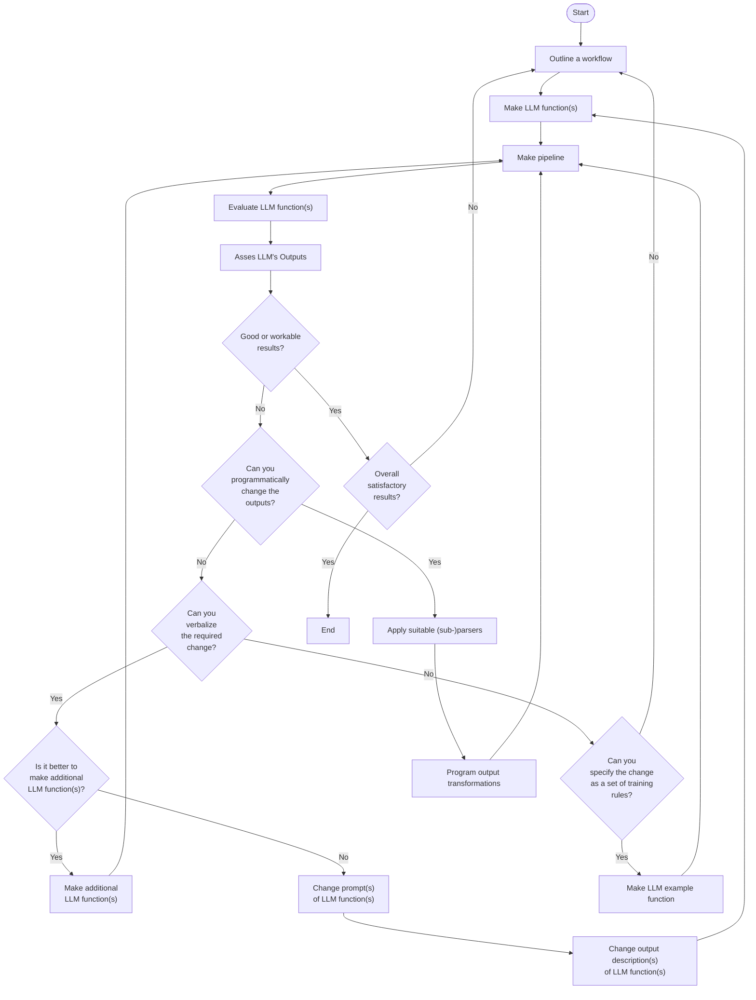
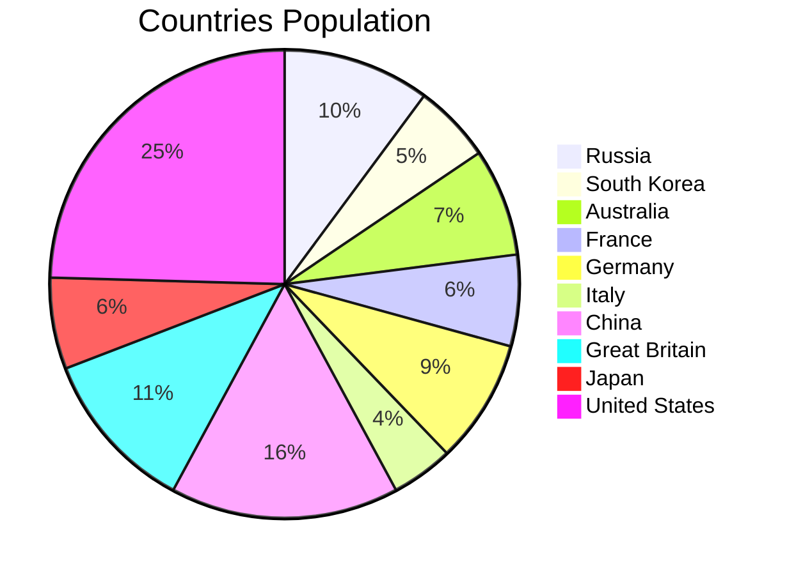
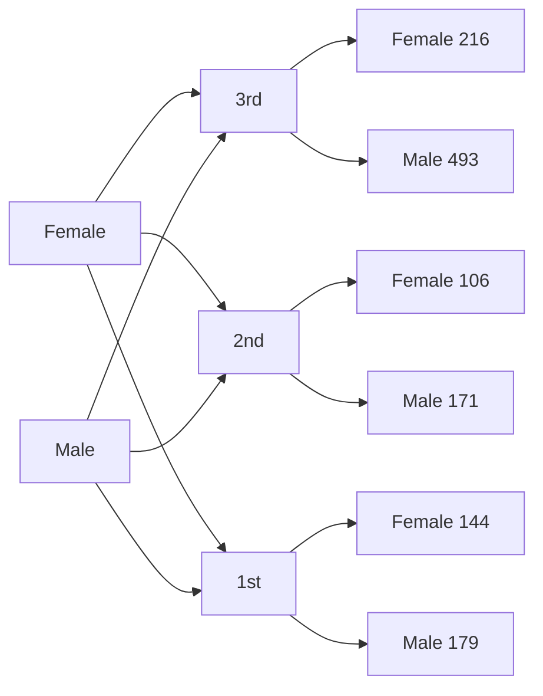
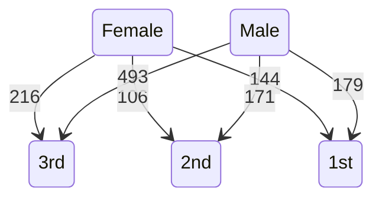
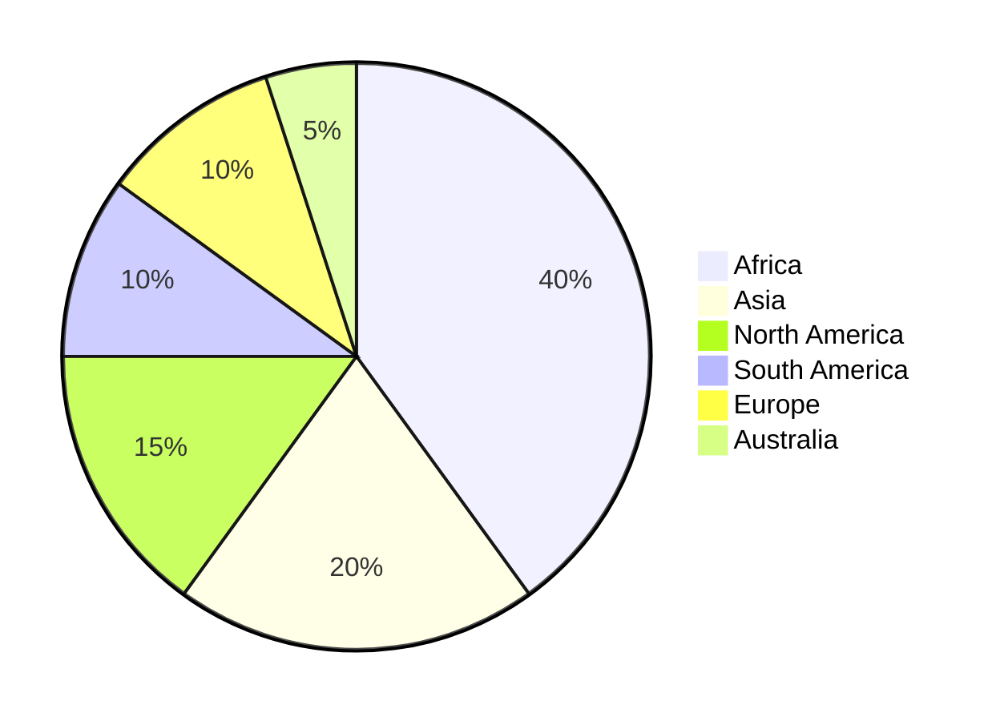
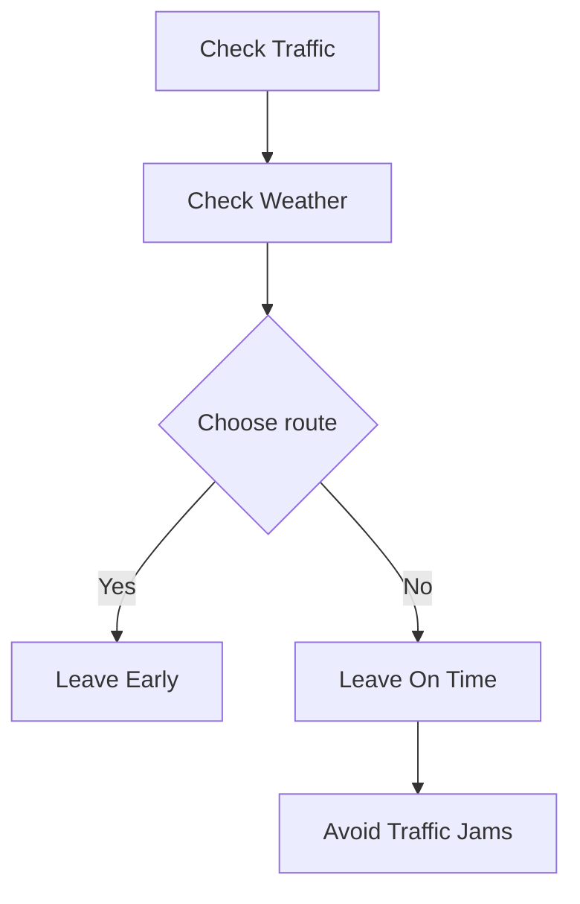
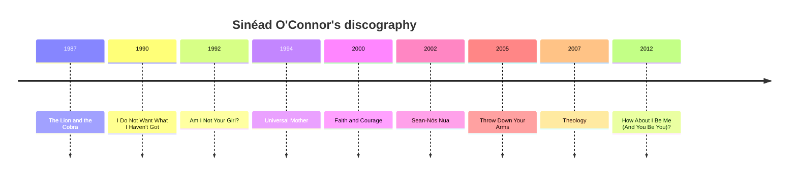

# Workflows with LLM functions

## Introduction

In this computational Markdown document we discuss and demonstrate the inclusion and integration of
Large Language Model (LLM) functions into different types of Raku workflows.

Since LLMs hallucinate results, it becomes necessary to manipulate their inputs, the outputs, or both. 
Therefore, having a system for managing, coordinating, and streamlining LLM requests, 
along with methods for incorporating these requests into the "playgrounds" of a certain programming language, 
would be highly beneficial.

This is what the package 
["LLM::Functions"](https://raku.land/zef:antononcube/LLM::Functions), [AAp1],
aims to do in Raku and Raku's ecosystem. 

### Dynamic duo

LLMs are celebrated for producing good to great results, but they have a few big issues. 
The content they generate can be inconsistent, prone to hallucination, and sometimes biased, making it unreliable.
The form, or stylistic structure, may also vary widely, with a lack of determinism and sensitivity 
to hyperparameters contributing to challenges in reproducibility. 
Moreover, customization and debugging can be complex due to these inconsistencies. 

The lack of reliability and reproducibility in both content and form underscore
the need for streamlining, managing, and transforming LLM inquiries and results.

Raku, with its unique approach to text manipulation, not surprisingly complements LLMs nicely. 
While Raku might not be everyone's favorite language and has certain intricacies that take some getting used to, 
its strengths in handling text patterns are hard to ignore. ***Creating well-crafted pairings of Raku with LLMs 
can broaden Raku's adoption and utilization.***

"LLM::Functions" establishes a (functional programming) connection between Raku's capabilities and the vast potential of LLMs. 
Ideally that promising LLM-Raku pairing is further strengthened and enriched into something that some might call a "dynamic duo."

**Remark:** For an example of a mature effort with the same mission (and naming, and design) see [SW1] and [WRIp1].

**Remark:** And yes, for Mathematica or Wolfram Language (WL) it can be also said:
*Creating well-crafted pairings of WL with LLMs can broaden WL's adoption and utilization.*
WL, though, is much better positioned for integrating with multi-modal LLMs because of WL's
ability to create and manipulate symbolic representation of different types of objects 
(audio, images, and video included), and WL's very advanced notebook technology.

### Standard enhancements

To enhance the pairing of Raku with LLMs, it is *also* essential to have:
- LLM prompt repository with many well documented prompts
- Polyglot parsing of dates, numbers, regular expressions, data formats, grammar specs, etc.  

For an example of the former see the Wolfram Prompt Repository, [WRIr1].
For examples of the latter see [AAp4], [MSp1, MSp2].

**Remark:** I like the idea of having ready to apply "power" tokens like `<local-number>`
provided by "Intl::Token::Number", [MSp1].

**Remark:** For some reason the developer of 
"Intl::Token::Number", [MSp1], and "Polyglot::Regexen", [MSp2], prefers to make 
[Brainfuck](https://en.wikipedia.org/wiki/Brainfuck) 
[parsers](https://github.com/alabamenhu/PolyglotBrainfuck) and 
travel to Canada to [talk about it](https://www.youtube.com/watch?v=LSnkFfE7vPg)
than making those packages ready to be used by "LLM::Functions", [AAp1], and "Text::SubParsers", [AAp4].

### Interactivity is needed

Generally speaking, using LLM functions in Raku (or Mathematica, or Python, or R) requires 
good tools for [Read Eval Print Loop (REPL)](https://en.wikipedia.org/wiki/Read–eval–print_loop).

Notebooks are best for LLM utilization because notebooks offer an interactive environment where
LLM whisperers, LLM tamers, neural net navigators, and bot wranglers can write code, run it, see the results, 
and tweak the code -- all in one place.

Raku currently has (at least) two notebook solutions: 
1. ["Jupyter::Kernel"](https://raku.land/cpan:BDUGGAN/Jupyter::Kernel) with the [Jupyter framework](https://jupyter.org)
2. ["Text::CodeProcessing"](https://raku.land/?q=Text%3A%3ACodeProcessing) 
and ["RakuMode" for Mathematica](https://resources.wolframcloud.com/PacletRepository/resources/AntonAntonov/RakuMode/), [AA2].

Raku second best LLM-REPL solutions are those like 
[Comma's REPL](https://commaide.com/features) and 
[Emacs Raku Mode](https://github.com/Raku/raku-mode). 

"Just" using scripts is an option, but since LLM queries have certain time lag and usage expenses, it is not a good one:
- We cannot see the intermediate results and adjust accordingly
- Multiple (slow) executions would be needed to get desired results

**Remark:** The very first version of this article was made "Text::CodeProcessing" via Markdown execution (or weaving.)
Then Comma's REPL was used, for extending and refining the examples. "Jupyter::Kernel" was also used
for a few of the sections.


### Article structure

Here are sections of the article:

- **General structure of LLM-based workflows**   
  ... Formulating and visualizing the overall process used in all LLM workflow examples.
- **Plot data**   
  ... Plotting LLM-retrieved data.
- **Normalizing outputs**   
  ... Examples of how LLM-function outputs can be "normalized" using other LLM functions.
- **Conversion to Raku objects**   
  ... Conversion of LLM-outputs in Raku physical units objects.
- **Chemical formulas**   
  ... Retrieving chemical formulas and investigating them.
- **Making (embedded) Mermaid diagrams**   
  ... Straightforward application of LLM abilities and literate programming tools.
- **Named entity recognition**  
  ... How obtain music album names and release dates and tabulate or plot them.
- **Statistics of output data types**   
  ... Illustration why programmers need streamlining solutions for LLMs.
- **Other workflows**   
  ... Outline of other workflows using LLM chat objects. (Also provided by "LLM::Functions".)

**Remark:** Most of the sections have a sub-section titled "Exercise questions". 
The reader is the secondary target audience for those. The primary target are LLMs to respond them.
(Another article is going to discuss the staging and evaluating of those LLM answers.) 

### Packages and LLM access

The following Raku packages used below:

```perl6 , results=hide
use LLM::Functions;
use Text::SubParsers;

use Data::Reshapers;
use Data::TypeSystem;
use Data::Generators;
use Data::Summarizers;
use Data::ExampleDatasets;

use Text::Plot;
use JavaScript::D3;

use Physics::Unit;

use Chemistry::Stoichiometry;

use JSON::Fast;
use HTTP::Tiny;
```

"Out of the box"
["LLM::Functions"](https://raku.land/zef:antononcube/LLM::Functions) uses
["WWW::OpenAI"](https://raku.land/zef:antononcube/WWW::OpenAI), [AAp2], and
["WWW::PaLM"](https://raku.land/zef:antononcube/WWW::PaLM), [AAp3].
Other LLM access packages can utilized via appropriate LLM configurations.

The LLM functions below use the LLM authorization tokens that are kept
in the OS environment. See [AAp2] and [AAp3] for details how to setup LLM access.

The Markdown document is executed (or "weaved") with the CLI script of the package
["Text::CodeProcessing"](https://raku.land/zef:antononcube/Text::CodeProcessing), [AA5].
"Text::CodeProcessing" has features that allow the weaved documents to have render-ready 
Markdown cells, like, tables, Mermaid-JS diagrams, or JavaScript plots.


----

## General structure of LLM-based workflows

All systematic approaches of unfolding and refining workflows based on LLM functions, 
will include several decision points and iterations to ensure satisfactory results.

This flowchart outlines such a systematic approach:



Here is a corresponding description:

- **Start**: The beginning of the process.
- **Outline a workflow**: The stage where a human outlines a general workflow for the process.
- **Make LLM function(s)**: Creation of specific LLM function(s).
- **Make pipeline**: Construction of a pipeline to integrate the LLM function(s).
- **Evaluate LLM function(s)**: Evaluation of the created LLM function(s).
- **Asses LLM's Outputs**: A human assesses the outputs from the LLM.
- **Good or workable results?**: A decision point to check whether the results are good or workable.
- **Can you programmatically change the outputs?**: If not satisfactory, a decision point to check if the outputs can be changed programmatically.
  - *The human acts like a real programmer.*
- **Can you verbalize the required change?**: If not programmable, a decision point to check if the changes can be verbalized.
  - *The human programming is delegated to the LLM.*
- **Can you specify the change as a set of training rules?**: If not verbalizable, a decision point to check if the change can be specified as training rules.
  - *The human cannot program or verbalize the required changes, but can provide examples of those changes.*
- **Is it better to make additional LLM function(s)?**: If changes can be verbalized, a decision point to check whether it is better to make additional LLM function(s), or it is better to change prompts or output descriptions. 
- **Make additional LLM function(s)**: Make additional LLM function(s) (since it is considered to be the better option.)  
- **Change prompts of LLM function(s)**: Change prompts of already created LLM function(s).
- **Change output description(s) of LLM function(s)**: Change output description(s) of already created LLM function(s).
- **Apply suitable (sub-)parsers**: If changes can be programmed, choose, or program, and apply suitable parser(s) or sub-parser(s) for LLM's outputs.
- **Program output transformations**: Transform the outputs of the (sub-)parser(s) programmatically.
- **Overall satisfactory results?**: A decision point to assess whether the results are overall satisfactory.
- **Make LLM example function**: If changes can be specified as training rules, make an example function for the LLM.
- **End**: The end of the process.

To summarise:
- We work within an iterative process for refining the results of LLM function(s) pipeline.
- If the overall results are not satisfactory, we loop back to the outlining workflow stage.
- If additional LLM functions are made, we return to the pipeline creation stage.
- Our (human) inability or unwillingness to program transformations has a few decision steps for delegation to LLMs.

**Remark:** We leave as exercises to the reader to see how the workflows programmed below fit the flowchart above.

**Remark:** The mapping of the workflow code below onto the flowchart can be made using an LLM. 

------

## Plot data

**Workflow:** Consider a workflow with the following steps:

1. Request an LLM to produce in JSON format a dictionary of certain numerical quantity during a certain year.
2. The corresponding LLM function converts the JSON text into Raku data structure.
3. Print or summarize obtained data in tabular form
4. A plot is made with the obtained data.

Here is a general quantities finder LLM function:

```perl6 
my &qf3 = llm-function(
        { "What are the $^a of $^b in $^c? Give the result as name-number dictionary in JSON format." },
        llm-evaluator => llm-configuration('openai', temperature => 0.2),
        form => sub-parser('JSON'));
```
```
# -> **@args, *%args { #`(Block|2385281116944) ... }
```

### Countries GDP

Consider finding and plotting the GDP of top 10 largest countries:

```perl6 
my $gdp1 = &qf3('GDP', 'top 10 largest countries', '2022')
```
```
# {Brazil => 2.5 trillion USD, China => 20.2 trillion USD, France => 2.7 trillion USD, Germany => 3.8 trillion USD, India => 7.2 trillion USD, Italy => 2.2 trillion USD, Japan => 5.3 trillion USD, Russia => 2.3 trillion USD, United Kingdom => 3.0 trillion USD, United States => 25.3 trillion USD}
```

Here is a corresponding table:

```perl6 
to-pretty-table($gdp1)
```
```
# +-------------------+----------------+
# |       Value       |      Key       |
# +-------------------+----------------+
# |  2.2 trillion USD |     Italy      |
# |  2.3 trillion USD |     Russia     |
# |  5.3 trillion USD |     Japan      |
# |  3.8 trillion USD |    Germany     |
# |  7.2 trillion USD |     India      |
# |  3.0 trillion USD | United Kingdom |
# | 25.3 trillion USD | United States  |
# |  2.5 trillion USD |     Brazil     |
# |  2.7 trillion USD |     France     |
# | 20.2 trillion USD |     China      |
# +-------------------+----------------+
```

Here is a plot attempt:

```perl6 
text-list-plot($gdp1.values)
```
```
#ERROR: The second argument is expected to be a Positional with Numeric objects.
# Nil
```

Here is another one based on the most frequent "non-compliant" output form:

```perl6 
text-list-plot($gdp1.values.map({ sub-parser(Numeric).subparse($_).first }))
```
```
# +---+----------+-----------+----------+-----------+--------+       
# |                                                          |       
# +                                     *                    +  25.00
# |                                                          |       
# +                                                      *   +  20.00
# |                                                          |       
# +                                                          +  15.00
# |                                                          |       
# |                                                          |       
# +                                                          +  10.00
# |                          *                               |       
# +              *                                           +   5.00
# |   *    *           *          *           *     *        |       
# +                                                          +   0.00
# +---+----------+-----------+----------+-----------+--------+       
#     0.00       2.00        4.00       6.00        8.00
```

Here we the GDP for all countries and make the corresponding Pareto principle plot:

```perl6 , eval=FALSE
my $gdp2 = &qf3('GDP', 'top 30 countries', '2018')
```

Here is a plot attempt:

```perl6 , eval=FALSE
text-pareto-principle-plot($gdp2.values)
```

Here is another one based on the most frequent "non-compliant" output form:

```perl6 , eval=FALSE
text-pareto-principle-plot($gdp2.rotor(2)>>.[1])
```

### Gold medals

```perl6 
my $gmd = &qf3("counts of Olymipic gold medals", "countries", "the last decade");
```
```
# {Australia => 33, China => 70, France => 28, Germany => 38, Great Britain => 50, Italy => 19, Japan => 28, Russia => 45, South Korea => 24, United States => 109}
```

Here is a corresponding table:

```perl6 
to-pretty-table($gmd)
```
```
# +-------+---------------+
# | Value |      Key      |
# +-------+---------------+
# |   45  |     Russia    |
# |   24  |  South Korea  |
# |   33  |   Australia   |
# |   28  |     France    |
# |   38  |    Germany    |
# |   19  |     Italy     |
# |   70  |     China     |
# |   50  | Great Britain |
# |   28  |     Japan     |
# |  109  | United States |
# +-------+---------------+
```

Here is a plot attempt:

```perl6 
text-list-plot($gmd.values)
```
```
# +---+----------+-----------+----------+-----------+--------+        
# |                                                          |        
# |                                                      *   |        
# +                                                          +  100.00
# |                                                          |        
# +                                                          +   80.00
# |                                     *                    |        
# +                                                          +   60.00
# |                                                          |        
# |   *                                       *              |        
# +                          *                               +   40.00
# |              *     *                            *        |        
# +        *                      *                          +   20.00
# |                                                          |        
# +---+----------+-----------+----------+-----------+--------+        
#     0.00       2.00        4.00       6.00        8.00
```

### Exercise questions

- How does the code in this section maps on the the flowchart in the section "General structure of LLM-based workflows"?
- Come up with other arguments for the three slots of `&qf3` and execute workflow. 

-------

## Refining and adapting outputs

**Workflow:** We want to transform text, so it can be in a certain expected or ready to process format.
For example:

- Remove certain pesky symbols and strings from LLM results
- Put a Raku (or JSON) dataset into a tabular data format suitable for immediate rendering
- Convert a dataset into a plotting language spec

### Normalizing numerical outputs

The following *LLM example* function "normalizes" outputs that that have numerical values with certain number
localization or currency units:

```perl6 
my &num-norm = llm-example-function(['1,034' => '1_034', '13,003,553' => '13_003_553', '9,323,003,553' => '9_323_003_553',
                                     '43 thousand USD' => '23E3', '3.9 thousand' => '3.9E3',
                                     '23 million USD' => '23E6', '2.3 million' => '2.3E6',
                                     '3.2343 trillion USD' => '3.2343E12', '0.3 trillion' => '0.3E12']);
```
```
# -> **@args, *%args { #`(Block|2385306775984) ... }
```

This LLM function can be useful to transform outputs of other LLM functions (before utilizing those outputs further.)

Here is an example of normalizing the top 10 countries GDP query output above:

```perl6 
&num-norm($gdp1.join(' '))
```
```
# Italy: 2.2E12 USD, Russia: 2.3E12 USD, Japan: 5.3E12 USD, Germany: 3.8E12 USD, India: 7.2E12 USD, United Kingdom: 3.0E12 USD, United States: 25.3E12 USD, Brazil: 2.5E12 USD, France: 2.7E12 USD, China: 20.2E12 USD
```

### Dataset into tabular format

Here is an LLM function that transforms the plain text data above in GitHub Markdown table:

```perl6 
my &fgt = llm-function({ "Transform the plain-text table $_ into a GitHub table." })
```
```
# -> **@args, *%args { #`(Block|2385306787432) ... }
```

Here is an example application:

```perl6 , results=asis
&fgt(to-pretty-table($gdp1))
```
| Key           | Value              |
|---------------|--------------------|
| Italy         | 2.2 trillion USD   |
| Russia        | 2.3 trillion USD   |
| Japan         | 5.3 trillion USD   |
| Germany       | 3.8 trillion USD   |
| India         | 7.2 trillion USD   |
| United Kingdom| 3.0 trillion USD   |
| United States | 25.3 trillion USD  |
| Brazil        | 2.5 trillion USD   |
| France        | 2.7 trillion USD   |
| China         | 20.2 trillion USD  |


Let us define a function that translates the dataset by converting to JSON format first,
and then converting into a GitHub Markdown table:

```perl6 
my &fjgt = llm-function({ "Transform the JSON data $_ into a GitHub table." })
```
```
# -> **@args, *%args { #`(Block|2385306833000) ... }
```

Here is an example application:

```perl6 , results=asis
&fjgt(to-json($gdp1))
```
| Country | GDP (in USD) |
| ------ | ------------ |
| Italy | 2.2 trillion USD |
| Russia | 2.3 trillion USD |
| Japan | 5.3 trillion USD |
| Germany | 3.8 trillion USD |
| India | 7.2 trillion USD |
| United Kingdom | 3.0 trillion USD |
| United States | 25.3 trillion USD |
| Brazil | 2.5 trillion USD |
| France | 2.7 trillion USD |
| China | 20.2 trillion USD |


### Dataset into diagrams

Here we define a reformatting function that translates JSON data into Mermaid diagrams:

```perl6 
my &fjmmd = llm-function({ "Transform the JSON data $^a into a Mermaid $^b spec." })
```
```
# -> **@args, *%args { #`(Block|2385306833720) ... }
```

Here we convert the medals data into a pie chart:

```perl6 , output.prompt=NONE, output.lang=mermaid
&fjmmd(to-json($gmd), 'pie chart')
```


Here is a more "data creative" example:

1. First we get a dataset and cross-tabulate it
2. Then we ask an LLM make the corresponding flow chart, class- or state diagram for it

Here is a cross-tabulation of two variables from the Titanic dataset:

```perl6 
my %ct = cross-tabulate(get-titanic-dataset(), 'passengerSex', 'passengerClass')
```
```
# {female => {1st => 144, 2nd => 106, 3rd => 216}, male => {1st => 179, 2nd => 171, 3rd => 493}}
```

Here we convert the contingency matrix into a flow chart:

```perl6 , output.prompt=NONE, output.lang=mermaid
&fjmmd(to-json(%ct), 'flow chart')
```


Here we convert the contingency matrix into a state diagram :

```perl6 , output.prompt=NONE, output.lang=mermaid
&fjmmd(to-json(%ct), 'state diagram')
```


### Exercise questions

- To which parts of the flowchart above the workflow in this section corresponds to?
- What is preferable: one LLM-function with complicated prompt an argument specs, 
  or several LLM-functions with simpler structure prompts and arguments? 

------

## Conversion to Raku objects

**Workflow:** We want to retrieve different physical quantities and make corresponding Raku objects.
(For further scientific computations with them.)

The following LLM example function transforms different kinds of physical quantity specs into Raku code
for the module ["Physics::Units"](https://raku.land/zef:librasteve/Physics::Unit):

```perl6 
my &pu = llm-example-function(
        ['11,042 m/s' => 'GetUnit("11_042 m/s")',
         '4,380,042 J' => 'GetUnit("4_380_042 J")',
         '304.342 m/s^2' => 'GetUnit("304.342 m/s^2")'],
        llm-evaluator => 'PaLM');
```
```
# -> **@args, *%args { #`(Block|2385301876608) ... }
```

Here is an example of speed query function:

```perl6 
my &fs = llm-function({ "What is the average speed of $^a in the units of $^b?" }, llm-evaluator => 'PaLM');
```
```
# -> **@args, *%args { #`(Block|2385301877040) ... }
```

Here is a concrete query:

```perl6 
my $rs1 = &fs('rocket leaving Earth', 'meters per second');
```
```
# 11,186 m/s
```

Here we convert the LLM output into Raku code for making a unit object:

```perl6 
my $rs2 = &pu($rs1);
```
```
# GetUnit("11_186 m/s")
```

Here we evaluate the Raku code (into an object):

```perl6 
use MONKEY-SEE-NO-EVAL;
my  $uObj = EVAL($rs2);

$uObj.raku;
```
```
# Unit.new( factor => 11186, offset => 0, defn => '11_186 m/s', type => Speed,
#   dims => [1,0,-1,0,0,0,0,0], dmix => ("s"=>-1,"m"=>1).MixHash, names => ['11_186 m/s'] );
```

Of course, the steps above can be combined into one function.
In general, though, care should be taken to handle or prevent situations in which function inputs and outputs
do not agree with each other.

### Exercise questions

- Write one Raku function that combines the LLM-functions above?
- What kind of computations involve the discussed unit objects?

------

## Chemical formulas

**Workflow:** Assume that we want to:

- Obtain a list of Stoichiometry equations according to some criteria
- Evaluate the consistency of the equations
- Find the molecular masses of the components for each equation
- Tabulate the formulas and found component molecular masses

Here we define LLM functions for retrieving chemical formulas with specified species:

```perl6 
my &cfn = llm-function(
        { "Give $^a chemical stoichiometry formulas that includes $^b. Give the result as a JSON list." },
        llm-evaluator => 'OpenAI', form => sub-parser('JSON'));
```
```
# -> **@args, *%args { #`(Block|2385298711776) ... }
```

Here is a query:

```perl6 
my $chemRes1 = &cfn(3, 'sulfur');
```
```
# [2S + 3O2 → 2SO3 CaSO4 + 2HCl → CaCl2 + SO2 + H2O 2Na2S + 3Cl2 → 2NaCl + S8]
```

Let us convince ourselves that we got a list of strings:

```perl6
deduce-type($chemRes1)
```
```
# Vector(Atom((Str)), 3)
```

Let us see to we have consistent reactions the "right" equations by checking that 
the molecular masses on Left Hand Sides (LHSs) and Right Hand Side (RHSs) are the same:

```perl6
to-pretty-table(transpose( %(formula => $chemRes1.Array, balancing => molecular-mass($chemRes1)>>.gist ) ))
```
```
# +------------------------------------+----------------------------------+
# |             balancing              |             formula              |
# +------------------------------------+----------------------------------+
# |         160.114 => 160.114         |         2S + 3O2 → 2SO3          |
# |         209.05 => 193.051          | CaSO4 + 2HCl → CaCl2 + SO2 + H2O |
# | 368.77907712 => 373.35953856000003 |    2Na2S + 3Cl2 → 2NaCl + S8     |
# +------------------------------------+----------------------------------+
```

**Remark:** If the column "balancing" shows two different numbers separated by "=>" that 
means the LLM hallucinated inconsistent chemical reaction equation.
(Because the LLM does not know, or disregarded for some reason, the 
[law of conservation of mass](https://en.wikipedia.org/wiki/Conservation_of_mass).) 

Here we define a regex that parses chemical components:

```perl6 
sub chem-component(Str $x) {
  with Chemistry::Stoichiometry::Grammar.parse($x, rule => 'mult-molecule') {
    return $_.Str.subst(/^ \d+/, '') => molecular-mass($_.Str);
  }
  return Nil;
}
```
```
# &chem-component
```

Here for each formula we extract the chemical components and find the corresponding molecular masses:

```perl6 
my @chemData = $chemRes1.map({ [formula => $_, |sub-parser(&chem-component).subparse($_).grep({ $_ ~~ Pair })].Hash });
```
```
# [{O2 => 95.994, S => 64.12, SO3 => 160.114, formula => 2S + 3O2 → 2SO3} {CaCl2 => 110.97800000000001, CaSO4 => 136.13400000000001, H2O => 18.015, HCl => 72.91600000000001, SO2 => 64.058, formula => CaSO4 + 2HCl → CaCl2 + SO2 + H2O} {Cl2 => 212.70000000000002, Na2S => 156.07907712000002, NaCl => 116.87953856000001, S8 => 256.48, formula => 2Na2S + 3Cl2 → 2NaCl + S8}]
```

Here we all unique column names (keys) in the obtained dataset:

```perl6 
my @colnames = @chemData>>.keys.flat.unique.sort
```
```
# [CaCl2 CaSO4 Cl2 H2O HCl Na2S NaCl O2 S S8 SO2 SO3 formula]
```

Here we tabulate the result:

```perl6 
to-pretty-table(@chemData, align => 'l', field-names => @colnames)
```
```
# +------------+------------+------------+-----------+-----------+------------+------------+-----------+-----------+------------+-----------+------------+----------------------------------+
# | CaCl2      | CaSO4      | Cl2        | H2O       | HCl       | Na2S       | NaCl       | O2        | S         | S8         | SO2       | SO3        | formula                          |
# +------------+------------+------------+-----------+-----------+------------+------------+-----------+-----------+------------+-----------+------------+----------------------------------+
# |            |            |            |           |           |            |            | 95.994000 | 64.120000 |            |           | 160.114000 | 2S + 3O2 → 2SO3                  |
# | 110.978000 | 136.134000 |            | 18.015000 | 72.916000 |            |            |           |           |            | 64.058000 |            | CaSO4 + 2HCl → CaCl2 + SO2 + H2O |
# |            |            | 212.700000 |           |           | 156.079077 | 116.879539 |           |           | 256.480000 |           |            | 2Na2S + 3Cl2 → 2NaCl + S8        |
# +------------+------------+------------+-----------+-----------+------------+------------+-----------+-----------+------------+-----------+------------+----------------------------------+
```

### Alternative workflow and solution

Assume that we only wanted to extract the chemical components together with their molecular masses
from the LLM generated equations.

Then we:
- Use the function `chem-component` defined above as a sub-parser in the retrieval LLM-function
- Pick `Pair` objects from the LLM function result 

Here is the LLM function:

```perl6 
my &cfnp = llm-function(
        { "Give $^a chemical stoichiometry formulas that includes $^b." },
        llm-evaluator => 'OpenAI', form => sub-parser(&chem-component));
```
```
# -> **@args, *%args { #`(Block|2385298803880) ... }
```

Here is an invocation:

```perl6
my $chemRes2 = &cfnp(4, 'sulfur and hydrogen');
```
```
# [
# 
# 1.  H2S => 34.076  +  O2 => 31.998  →  SO2 => 64.058  +  H2O => 18.015 
# 2.  S => 32.06  +  H2 => 4.032  →  H2S => 34.076 
# 3.  S8 => 256.48  +  H2 => 16.128  →  H2S => 272.608 
# 4.  SO2 => 128.116  +  H2O => 36.03  →  S => 32.06  +  H2O => 72.06]
```

Here we filter result's elements:

```perl6
$chemRes2.grep(* ~~ Pair)
```
```
# (H2S => 34.076 O2 => 31.998 SO2 => 64.058 H2O => 18.015 S => 32.06 H2 => 4.032 H2S => 34.076 S8 => 256.48 H2 => 16.128 H2S => 272.608 SO2 => 128.116 H2O => 36.03 S => 32.06 H2O => 72.06)
```

### Exercise questions

- What is a good approach to evaluate the ability of LLMs to respect the conservation of mass law?
- Is it better for that evaluation to use predominantly Raku code or mostly LLM-functions?

------

## Making (embedded) Mermaid diagrams

**Workflow:** We want to get a "quick start"
[Mermaid-JS](https://mermaid.js.org)
code for certain type of diagrams.

Here is an LLM function for generating a Mermaid JS spec:

```perl6 
my &fmmd = llm-function({ "Generate the Mermaid-JS code of a $^a for $^b." })
```
```
# -> **@args, *%args { #`(Block|2385298841744) ... }
```

Here we request to get the code of pie chart for the continent sizes:

```perl6 , results=asis
my $mmdRes = &fmmd("pie chart", "relative continent sizes")
```



Here, "just in case", we normalize the numbers of the result and "dump" the code as Markdown code cell:

```perl6 , output.prompt=NONE, output.lang=mermaid
$mmdRes.subst(:g, '%', '').subst(:g, ',', '').subst("{'`' x 3}mermaid", '').subst("{'`' x 3}", '')
```


Here is a flow chart request:

```perl6 , results=asis
&fmmd("flow chart", "going to work in the morning avoiding traffic jams and reacting to weather")
```



### Exercise questions

- What changes of the code in this section should be made in order to produce Plant-UML specs?

------

## Named entity recognition

**Workflow:** We want to download text from the Web, extract the names of certain type of entities from it,
and visualize relationships between them.

For example, we might want to extract all album names and their release dates from
a biographical web page of a certain music artist, and make a timeline plot.


```raku
my &fner = llm-function({"Extract $^a from the text: $^b . Give the result in a JSON format"},                     
                        llm-evaluator => 'PaLM', 
                        form => sub-parser('JSON'))
```
```
# -> **@args, *%args { #`(Block|2385298848944) ... }
```

Here is way to get a biography and discography of music artist from Wikipedia:

```raku, eval=FALSE
my $url = 'https://en.wikipedia.org/wiki/Sinéad_O%27Connor';
my $response = HTTP::Tiny.new.get: $url;            

die "Failed!\n" unless $response<success>;
say "response status: $response<status> $response<reason>";

my $text = $response<content>.decode;
say "text size: {$text.chars}";
```

But now we have to convert the HTML code into plain text, *and* the text is too large
to process at once with LLMs. (Currently LLMs have ≈ 4096 ± 2048 tokens limits.)

**Remark:** A more completely worked out workflow would have included 
the breaking up of the text into suitably sized chunks, and combining the LLM processed
processed results.

Instead, I am going to ask an LLM to produce artist's bio and discography and then 
we going to pretend we got it from some repository or encyclopedia.

Here we get the text:

```raku
my $text = llm-function(llm-evaluator => llm-configuration('PaLM', max-tokens=> 500))("What is Sinéad O'Connor's bio and discography?")
```
```
# Sinéad O'Connor (born Sinéad Marie Bernadette O'Connor on 8 December 1966) is an Irish singer-songwriter. She rose to fame in the late 1980s with her debut album The Lion and the Cobra, which was certified platinum in the United States and the United Kingdom. Her second album, I Do Not Want What I Haven't Got, was an international success, reaching number one in the UK and selling over 10 million copies worldwide.
# 
# O'Connor has released 10 studio albums, four live albums, and four compilation albums. Her most recent studio album, I'm Not Bossy, I'm the Boss, was released in 2014.
# 
# O'Connor has won two Grammy Awards, two MTV Video Music Awards, and an Ivor Novello Award. She has also been nominated for an Academy Award and a Golden Globe Award.
# 
# In addition to her music career, O'Connor has been an outspoken advocate for human rights and social justice. She has been involved in a number of controversies, including her public criticism of the Catholic Church and her performance of Bob Marley's "War" at the 1992 Grammy Awards.
# 
# O'Connor has been diagnosed with bipolar disorder and has spoken openly about her struggles with mental illness. She has also been involved in a number of legal disputes, including a custody battle with her former husband, Jake Reynolds.
# 
# Despite her personal struggles, O'Connor remains a popular and influential singer-songwriter. She continues to tour and release new music, and she remains a powerful voice for social justice.
# 
# **Discography**
# 
# * The Lion and the Cobra (1987)
# * I Do Not Want What I Haven't Got (1990)
# * Am I Not Your Girl? (1992)
# * Universal Mother (1994)
# * Faith and Courage (2000)
# * Sean-Nós Nua (2002)
# * Throw Down Your Arms (2005)
# * Theology (2007)
# * How About I Be Me (And You Be You)? (2012)
# * I'm Not Bossy, I'm the Boss (2014)
```

Here we Named Entity Recognition (NER) via the LLM function defined above:

```perl6
my $albRes = &fner('album names and years', $text);
```
```
# [```json
# { albums : [ name => The Lion and the Cobra year => 1987 year => 1990 name => I Do Not Want What I Haven't Got name => Am I Not Your Girl? year => 1992 name => Universal Mother year => 1994 year => 2000 name => Faith and Courage name => Sean-Nós Nua year => 2002 year => 2005 name => Throw Down Your Arms year => 2007 name => Theology year => 2012 name => How About I Be Me (And You Be You)? ,
#     { name : "I'm Not Boss]
```

LLMs can produce NER data in several different structures. 
Using the function `deduce-type` from 
["Data::TypeSystem"](https://raku.land/zef:antononcube/Data::TypeSystem):

```perl6
deduce-type($albRes);
```
```
# Vector((Any), 24)
```

Here are a few data type results based in multiple executions of `&fner`:

```
# Vector((Any), 24)
# Tuple([Atom((Str)), Pair(Atom((Str)), Vector(Struct([name, year], [Str, Int]), 7)), Atom((Str))])
```

Based in our study of the result data type signatures, 
in this workflow we process a result `&fner` with this code:

```perl6
my $albRes2 = $albRes.grep({ $_ ~~ Pair }).rotor(2)>>.Hash; 
if not so $albRes2 { $albRes2 = $albRes.grep(* ~~ Pair).Hash<albums> }

say $albRes2;
```
```
# ({name => The Lion and the Cobra, year => 1987} {name => I Do Not Want What I Haven't Got, year => 1990} {name => Am I Not Your Girl?, year => 1992} {name => Universal Mother, year => 1994} {name => Faith and Courage, year => 2000} {name => Sean-Nós Nua, year => 2002} {name => Throw Down Your Arms, year => 2005} {name => Theology, year => 2007} {name => How About I Be Me (And You Be You)?, year => 2012})
```

Here we tabulate the result:

```perl6
to-pretty-table($albRes2)
```
```
# +-------------------------------------+------+
# |                 name                | year |
# +-------------------------------------+------+
# |        The Lion and the Cobra       | 1987 |
# |   I Do Not Want What I Haven't Got  | 1990 |
# |         Am I Not Your Girl?         | 1992 |
# |           Universal Mother          | 1994 |
# |          Faith and Courage          | 2000 |
# |             Sean-Nós Nua            | 2002 |
# |         Throw Down Your Arms        | 2005 |
# |               Theology              | 2007 |
# | How About I Be Me (And You Be You)? | 2012 |
# +-------------------------------------+------+
```

Here we make a Mermaid-JS timeline plot (after we have figured out the structure of LLM's function output):

```perl6, output.lang=mermaid, output.prompt=NONE
my @timeline = ['timeline', "title Sinéad O'Connor's discography"];
for |$albRes2 -> %record {
    @timeline.append( "{%record<year>} : {%record<name>}");
}
@timeline.join("\n\t");
```


### Exercise questions

- How the LLM-functions above should be changed in order to produce timeline plots of different wars?
- How the Raku code should be changed to produce timeline plots with Python? (Instead of Mermaid-JS.) 

------

## Statistics of output data types

**Workflow:** We want to see and evaluate the distribution of data types given by LLM-functions:
1. Make a pipeline LLM-functions
2. Create a list of random inputs "expected" by the pipeline
   - Or use the same input multiple times.
3. Deduce the data type of each output
4. Compute descriptive statistics

**Remark:** These kind of statistical workflows can be slow and expensive.
(With the current line-up of LLM services.)

Let us reuse the workflow from the previous section and enhance it with 
data type outputs finding. More precisely we:
1. Generate random music artist names (using a LLM query)
2. Retrieve short biography and discography for each music artist
3. Extract album-and-release-date data for each artist (with NER-by-LLM)
4. Deduce the type for each output, using several different type representations

The data types are investigated with the functions `deduce-type` and `record-types` of 
["Data::TypeSystem"](https://raku.land/zef:antononcube/Data::TypeSystem), [AAp6],
and `tally` and `records-summary` of
["Data::Summarizers"](https://raku.land/zef:antononcube/Data::Summarizers), [AAp7].

Here we define a data retrieval function:

```perl6
my &fdb = llm-function({"What is the short biography and discography of the artist $_?"}, llm-evaluator => llm-configuration('PaLM', max-tokens=> 500));
```
```
# -> **@args, *%args { #`(Block|2385306464360) ... }
```

Here we define (again) the NER function:

```perl6
my &fner = llm-function({"Extract $^a from the text: $^b . Give the result in a JSON format"},                     
                        llm-evaluator => 'PaLM', 
                        form => sub-parser('JSON'))
```
```
# -> **@args, *%args { #`(Block|2385306464792) ... }
```

Here we find 10 random music artists:

```perl6
my @artistNames = |llm-function()("Give 10 random music artist names in a list in JSON format.", 
                                  llm-evalutor=>'PaLM', 
                                  form => sub-parser('JSON'))
```
```
# [Eminem Taylor Swift Drake Ed Sheeran Adele Post Malone The Weeknd Lady Gaga Ariana Grande Billie Eilish]
```

Here is a loop the generates the biographies and does NER over them:

```perl6
my @dbRes = do for @artistNames -> $a {
    #say '=' x 6, " $a " , '=' x 6; 
    my $text = &fdb($a);
    #say $text;
    #say '-' x 12;
    my $recs = &fner('album names and release dates', $text);    
    #say $recs;
    $recs
}
```
```
# [[```json albums => [{name => Infinite, release_date => 1996} {name => The Slim Shady LP, release_date => 1999} {name => The Marshall Mathers LP, release_date => 2000} {name => The Eminem Show, release_date => 2002} {name => Encore, release_date => 2004} {name => Relapse, release_date => 2009} {name => Recovery, release_date => 2010} {name => The Marshall Mathers LP 2, release_date => 2013}] ```] [```json
# { albums : [ release_date => 2006-10-24 name => Taylor Swift release_date => 2008-11-11 name => Fearless release_date => 2010-10-25 name => Speak Now release_date => 2012-10-22 name => Red name => 1989 release_date => 2014-10-27 name => Reputation release_date => 2017-11-10 release_date => 2019-08-23 name => Lover release_date => 2020-07-24 name => Folklore ,] [```json albums => [{name => Thank Me Later, release_date => 2010} {name => Take Care, release_date => 2011} {name => Nothing Was the Same, release_date => 2013} {name => Views, release_date => 2016} {name => Scorpion, release_date => 2018}] ```] [```json albums => [{name => +, release_date => 2011} {name => ×, release_date => 2014} {name => ÷, release_date => 2017} {name => =, release_date => 2022}] ```] [```json albums => [{name => 19, release_date => 2008} {name => 21, release_date => 2011} {name => 25, release_date => 2015} {name => 30, release_date => 2021}] ```] [```json albums => [{name => Stoney, release_date => 2016} {name => Beerbongs & Bentleys, release_date => 2018} {name => Hollywood's Bleeding, release_date => 2019} {name => Twelve Carat Toothache, release_date => 2022}] ```] [```json albums => [{name => House of Balloons, release_date => 2011} {name => Thursday, release_date => 2011} {name => Echoes of Silence, release_date => 2011} {name => Kiss Land, release_date => 2013} {name => Beauty Behind the Madness, release_date => 2015} {name => Starboy, release_date => 2016} {name => After Hours, release_date => 2020}] ```] [```json albums => [{name => The Fame, release_date => 2008} {name => The Fame Monster, release_date => 2009} {name => Born This Way, release_date => 2011} {name => Artpop, release_date => 2013} {name => Cheek to Cheek (with Tony Bennett), release_date => 2014} {name => Joanne, release_date => 2016} {name => A Star Is Born (Original Motion Picture Soundtrack) (with Bradley Cooper), release_date => 2018} {name => Chromatica, release_date => 2020}] ```] [```json albums => [{name => Yours Truly, release_date => 2013} {name => My Everything, release_date => 2014} {name => Dangerous Woman, release_date => 2016} {name => Sweetener, release_date => 2018} {name => Thank U, Next, release_date => 2019}] ```] [```json albums => [{name => Don't Smile at Me, release_date => 2017} {name => When We All Fall Asleep, Where Do We Go?, release_date => 2019} {name => Happier Than Ever, release_date => 2021}] ```]]
```

Here we call `deduce-type` to LLM output:

```perl6
.say for @dbRes.map({ deduce-type($_) })
```
```
# Tuple([Atom((Str)), Pair(Atom((Str)), Vector(Assoc(Atom((Str)), Atom((Str)), 2), 8)), Atom((Str))])
# Vector((Any), 20)
# Tuple([Atom((Str)), Pair(Atom((Str)), Vector(Assoc(Atom((Str)), Atom((Str)), 2), 5)), Atom((Str))])
# Tuple([Atom((Str)), Pair(Atom((Str)), Vector(Assoc(Atom((Str)), Atom((Str)), 2), 4)), Atom((Str))])
# Tuple([Atom((Str)), Pair(Atom((Str)), Vector(Assoc(Atom((Str)), Atom((Str)), 2), 4)), Atom((Str))])
# Tuple([Atom((Str)), Pair(Atom((Str)), Vector(Assoc(Atom((Str)), Atom((Str)), 2), 4)), Atom((Str))])
# Tuple([Atom((Str)), Pair(Atom((Str)), Vector(Assoc(Atom((Str)), Atom((Str)), 2), 7)), Atom((Str))])
# Tuple([Atom((Str)), Pair(Atom((Str)), Vector(Assoc(Atom((Str)), Atom((Str)), 2), 8)), Atom((Str))])
# Tuple([Atom((Str)), Pair(Atom((Str)), Vector(Assoc(Atom((Str)), Atom((Str)), 2), 5)), Atom((Str))])
# Tuple([Atom((Str)), Pair(Atom((Str)), Vector(Assoc(Atom((Str)), Atom((Str)), 2), 3)), Atom((Str))])
```

Here we redo the type deduction using the adverb `:tally`:

```perl6
.say for @dbRes.map({ deduce-type($_):tally })
```
```
# Tuple([Atom((Str)) => 2, Pair(Atom((Str)), Vector(Assoc(Atom((Str)), Atom((Str)), 2), 8)) => 1], 3)
# Tuple([Atom((Str)) => 4, Pair(Atom((Str)), Atom((Str))) => 16], 20)
# Tuple([Atom((Str)) => 2, Pair(Atom((Str)), Vector(Assoc(Atom((Str)), Atom((Str)), 2), 5)) => 1], 3)
# Tuple([Atom((Str)) => 2, Pair(Atom((Str)), Vector(Assoc(Atom((Str)), Atom((Str)), 2), 4)) => 1], 3)
# Tuple([Atom((Str)) => 2, Pair(Atom((Str)), Vector(Assoc(Atom((Str)), Atom((Str)), 2), 4)) => 1], 3)
# Tuple([Atom((Str)) => 2, Pair(Atom((Str)), Vector(Assoc(Atom((Str)), Atom((Str)), 2), 4)) => 1], 3)
# Tuple([Atom((Str)) => 2, Pair(Atom((Str)), Vector(Assoc(Atom((Str)), Atom((Str)), 2), 7)) => 1], 3)
# Tuple([Atom((Str)) => 2, Pair(Atom((Str)), Vector(Assoc(Atom((Str)), Atom((Str)), 2), 8)) => 1], 3)
# Tuple([Atom((Str)) => 2, Pair(Atom((Str)), Vector(Assoc(Atom((Str)), Atom((Str)), 2), 5)) => 1], 3)
# Tuple([Atom((Str)) => 2, Pair(Atom((Str)), Vector(Assoc(Atom((Str)), Atom((Str)), 2), 3)) => 1], 3)
```

We see that the LLM outputs produce lists of `Pair` objects:

```perl6
.say for @dbRes.map({record-types($_)})
```
```
# ((Str) (Pair) (Str))
# ((Str) (Str) (Str) (Pair) (Pair) (Pair) (Pair) (Pair) (Pair) (Pair) (Pair) (Pair) (Pair) (Pair) (Pair) (Pair) (Pair) (Pair) (Pair) (Str))
# ((Str) (Pair) (Str))
# ((Str) (Pair) (Str))
# ((Str) (Pair) (Str))
# ((Str) (Pair) (Str))
# ((Str) (Pair) (Str))
# ((Str) (Pair) (Str))
# ((Str) (Pair) (Str))
# ((Str) (Pair) (Str))
```

Another tallying call:

```perl6
.say for @dbRes.map({record-types($_).map(*.^name).&tally})
```
```
# {Pair => 1, Str => 2}
# {Pair => 16, Str => 4}
# {Pair => 1, Str => 2}
# {Pair => 1, Str => 2}
# {Pair => 1, Str => 2}
# {Pair => 1, Str => 2}
# {Pair => 1, Str => 2}
# {Pair => 1, Str => 2}
# {Pair => 1, Str => 2}
# {Pair => 1, Str => 2}
````

The statistics show that most likely the output we get from the execution of the LLM-functions pipeline
is a list of a few strings and 4-12 `Pair` objects. Hence, we might decide to use the transformation
`.grep({ $_ ~~ Pair }).rotor(2)` (as in the previous section.)

------

## Other workflows

In the future other workflows are going to be described:

- Interactive building of grammars
- Using LLM-based code writing assistants
- Test suite generation via Gherkin specifications
  - Here is a [teaser](https://github.com/antononcube/Raku-LLM-Functions/blob/main/docs/Convert-tests-into-Gherkin-specs_woven.md).
- (Reliable) code generation from help pages

Most likely all of the listed workflow would use chat objects and engineered prompts.


------

## References

### Articles

[AA1] Anton Antonov,
["Generating documents via templates and LLMs"](https://rakuforprediction.wordpress.com/2023/07/11/generating-documents-via-templates-and-llms/),
(2023),
[RakuForPrediction at WordPress](https://rakuforprediction.wordpress.com).

[AA2] Anton Antonov,
["Connecting Mathematica and Raku"](https://rakuforprediction.wordpress.com/2021/12/30/connecting-mathematica-and-raku/),
(2021),
[RakuForPrediction at WordPress](https://rakuforprediction.wordpress.com).

[SW1] Stephen Wolfram,
["The New World of LLM Functions: Integrating LLM Technology into the Wolfram Language"](https://writings.stephenwolfram.com/2023/05/the-new-world-of-llm-functions-integrating-llm-technology-into-the-wolfram-language/),
(2023),
[Stephen Wolfram Writings](https://writings.stephenwolfram.com).

### Repositories, sites

[WRIr1] Wolfram Research, Inc.
[Wolfram Prompt Repository](https://resources.wolframcloud.com/PromptRepository/).

### Packages, paclets

[AAp1] Anton Antonov,
[LLM::Functions Raku package](https://github.com/antononcube/Raku-LLM-Functions),
(2023),
[GitHub/antononcube](https://github.com/antononcube).

[AAp2] Anton Antonov,
[WWW::OpenAI Raku package](https://github.com/antononcube/Raku-WWW-OpenAI),
(2023),
[GitHub/antononcube](https://github.com/antononcube).

[AAp3] Anton Antonov,
[WWW::PaLM Raku package](https://github.com/antononcube/Raku-WWW-PaLM),
(2023),
[GitHub/antononcube](https://github.com/antononcube).

[AAp4] Anton Antonov,
[Text::SubParsers Raku package](https://github.com/antononcube/Raku-Text-SubParsers),
(2023),
[GitHub/antononcube](https://github.com/antononcube).

[AAp5] Anton Antonov,
[Text::CodeProcessing Raku package](https://github.com/antononcube/Raku-Text-CodeProcessing),
(2021),
[GitHub/antononcube](https://github.com/antononcube).

[AAp6] Anton Antonov,
[Data::TypeSystem Raku package](https://github.com/antononcube/Raku-Data-TypeSystem),
(2023),
[GitHub/antononcube](https://github.com/antononcube).

[AAp7] Anton Antonov,
[Data::Summarizers Raku package](https://github.com/antononcube/Raku-Data-Summarizers),
(2021-2023),
[GitHub/antononcube](https://github.com/antononcube).

[MSp1] Matthew Stuckwisch,
[Intl::Token::Number Raku package](https://github.com/alabamenhu/IntlTokenNumber),
(2021),
[GitHub/alabamenhu](https://github.com/alabamenhu).

[MSp2] Matthew Stuckwisch,
[Polyglot::Regexen Raku package](https://github.com/alabamenhu/PolyglotRegexen),
(2022),
[GitHub/alabamenhu](https://github.com/alabamenhu).

[WRIp1] Wolfram Research, Inc.,
[LLMFunctions WL paclet](https://resources.wolframcloud.com/PacletRepository/resources/Wolfram/LLMFunctions/),
(2023),
[Wolfram Language Paclet Repository](https://resources.wolframcloud.com/PacletRepository/).