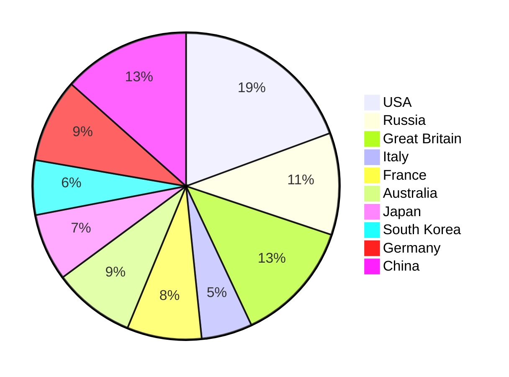
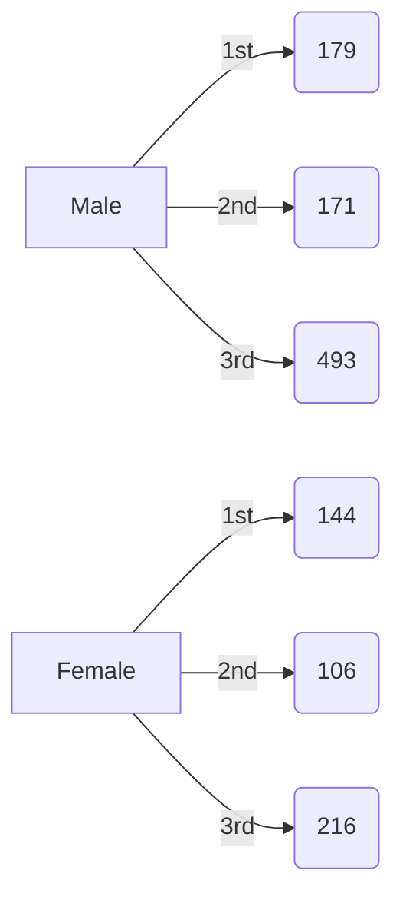
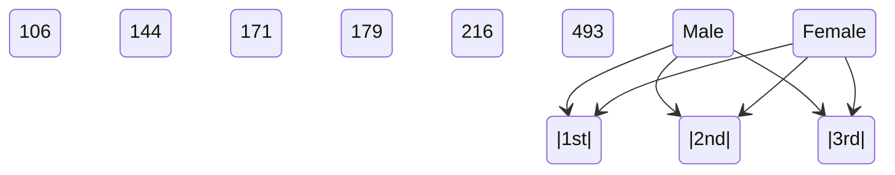
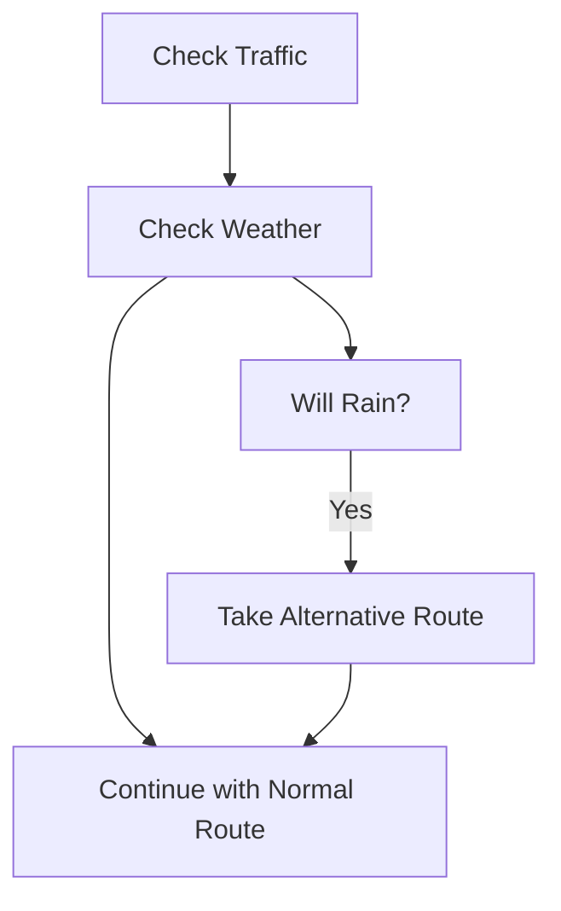
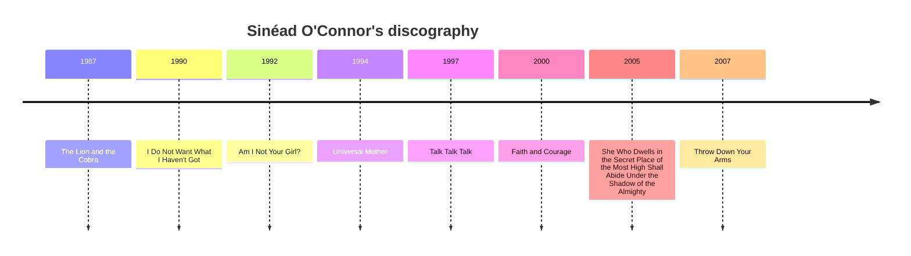

# Workflows with LLM functions

## Introduction

In this computational Markdown document we discuss and demonstrate the inclusion and integration of
Large Language Model (LLM) functions into different types of Raku workflows.

Since LLMs hallucinate results, it becomes necessary to manipulate their inputs, the outputs, or both. 
Therefore, having a system for managing, coordinating, and streamlining LLM requests, 
along with methods for incorporating these requests into the "playgrounds" of a certain programming language, 
would be highly beneficial.

This is what the package 
["LLM::Functions"](https://raku.land/zef:antononcube/LLM::Functions), [AAp1],
aims to do in Raku and Raku's ecosystem. 

### Dynamic duo

LLMs are celebrated for producing good to great results, but they have a few big issues. 
The content they generate can be inconsistent, prone to hallucination, and sometimes biased, making it unreliable.
The form, or stylistic structure, may also vary widely, with a lack of determinism and sensitivity 
to hyperparameters contributing to challenges in reproducibility. 
Moreover, customization and debugging can be complex due to these inconsistencies. 

The lack of reliability and reproducibility in both content and form underscore
the need for streamlining, managing, and transforming LLM inquiries and results.

Raku, with its unique approach to text manipulation, not surprisingly complements LLMs nicely. 
While Raku might not be everyone's favorite language and has certain intricacies that take some getting used to, 
its strengths in handling text patterns are hard to ignore. ***Creating well-crafted pairings of Raku with LLMs 
can broaden Raku's adoption and utilization.***

"LLM::Functions" establishes a (functional programming) connection between Raku's capabilities and the vast potential of LLMs. 
Ideally that promising LLM-Raku pairing is further strengthened and enriched into something that some might call a "dynamic duo."

To enhance the pairing of Raku with LLMs, it's *also* essential to have:
- LLM prompt repository with many well documented prompts; see [WRIr1]
- Ready to use "power" tokens like `<local-number>`, [MS1]

### Tooling

Generally speaking, using LLM functions in Raku (or Mathematica, or Python, or R) requires 
good tools for [Read Eval Print Loop (REPL)](https://en.wikipedia.org/wiki/Read–eval–print_loop).

Notebooks are best for LLM utilization because notebooks offer an interactive environment where
LLM whisperers, LLM tamers, neural net navigators, and bot wranglers can write code, run it, see the results, 
and tweak the code—all in one place.

There are (at least) two notebook solutions for Raku right now: 
1) ["Jupyter::Kernel"](https://raku.land/cpan:BDUGGAN/Jupyter::Kernel) with the [Jupyter framework](https://jupyter.org)
2) ["Text::CodeProcessing"](https://raku.land/?q=Text%3A%3ACodeProcessing) and ["RakuMode" for Mathematica](https://resources.wolframcloud.com/PacletRepository/resources/AntonAntonov/RakuMode/).

Second best LLM-REPL solutions are those like 
[Comma's REPL](https://commaide.com/features) and 
[Emacs Raku Mode](https://github.com/Raku/raku-mode). 

"Just" using scripts is an option, but since LLM queries have certain time lag and usage expenses, it is not a good one:
- We cannot see the intermediate results and adjust accordingly
- Multiple (slow) executions would be needed to get desired results

**Remark:** The very first version of this article was made "Text::CodeProcessing" via Markdown execution (or weaving.)
Then Comma's REPL was used, for extending and refining the examples. "Jupyter::Kernel" was also used
for a few of the sections.


### Article structure

Here are sections of the article:

- **Flowchart**   
  ... Visualizing the overall process used in all LLM workflow examples.
- **Plot data**   
  ... Plotting LLM-retrieved data.
- **Normalizing outputs**   
  ... Examples of how LLM-function outputs can be "normalized" using other LLM functions.
- **Conversion to Raku objects**   
  ... Conversion of LLM-outputs in Raku physical units objects.
- **Chemical formulas**   
  ... Retrieving chemical formulas and investigating them.
- **Making (embedded) Mermaid diagrams**   
  ... Straightforward application of LLM abilities and literate programming tools.
- **Named entity recognition**  
  ... How obtain music album names and release dates and tabulate or plot them.
- **Other workflows**   
  ... Outline of other workflows using LLM chat objects. (Also provided by "LLM::Functions".)

### Packages and LLM access

The following Raku packages used below:

```perl6 , results=hide
use LLM::Functions;
use Text::SubParsers;

use Data::Reshapers;
use Data::TypeSystem;
use Data::Generators;
use Data::Summarizers;
use Data::ExampleDatasets;

use Text::Plot;
use JavaScript::D3;

use Physics::Unit;

use Chemistry::Stoichiometry;

use JSON::Fast;
use HTTP::Tiny;
```

"Out of the box"
["LLM::Functions"](https://raku.land/zef:antononcube/LLM::Functions) uses
["WWW::OpenAI"](https://raku.land/zef:antononcube/WWW::OpenAI), [AAp2], and
["WWW::PaLM"](https://raku.land/zef:antononcube/WWW::PaLM), [AAp3].
Other LLM access packages can utilized via appropriate LLM configurations.

The LLM functions below use the LLM authorization tokens that are kept
in the OS environment. See [AAp2] and [AAp3] for details how to setup LLM access.

The Markdown document is executed (or "weaved") with the CLI script of the package
["Text::CodeProcessing"](https://raku.land/zef:antononcube/Text::CodeProcessing), [AA5].
"Text::CodeProcessing" has features that allow the weaved documents to have render-ready 
Markdown cells, like, tables, Mermaid-JS diagrams, or JavaScript plots.


----

## Flowchart

This flowchart outlines a systematic approach to developing and refining LLM functions, 
with several decision points and iterations to ensure satisfactory results.


Here is a corresponding description:

- **Start**: The beginning of the process.
- **Outline a workflow**: The stage where a human outlines a general workflow for the process.
- **Make LLM function(s)**: Creation of specific LLM function(s).
- **Make pipeline**: Construction of a pipeline to integrate the LLM function(s).
- **Evaluate LLM function(s)**: Evaluation of the created LLM function(s).
- **Asses LLM's Outputs**: A human assesses the outputs from the LLM.
- **Good or workable results?**: A decision point to check whether the results are good or workable.
- **Can you programmatically change the outputs?**: If not satisfactory, a decision point to check if the outputs can be changed programmatically.
  - *The human acts like a real programmer.*
- **Can you verbalize the required change?**: If not programmable, a decision point to check if the changes can be verbalized.
  - *The human programming is delegated to the LLM.*
- **Can you specify the change as a set of training rules?**: If not verbalizable, a decision point to check if the change can be specified as training rules.
  - *The human cannot program or verbalize the required changes, but can provide examples of those changes.*
- **Make additional LLM function(s)**: If changes can be verbalized, make additional LLM function(s).
- **Apply suitable (sub-)parsers**: If changes can be programmed, choose, or program, and apply suitable parser(s) or sub-parser(s) for LLM's outputs.
- **Program output transformations**: Transform the outputs of the (sub-)parser(s) programmatically.
- **Overall satisfactory results?**: A decision point to assess whether the results are overall satisfactory.
- **Make LLM example function**: If changes can be specified as training rules, make an example function for the LLM.
- **End**: The end of the process.

To summarise:
- The flowchart has a loop providing an iterative process for refining the results of LLM function(s) pipeline.
- If the overall results are not satisfactory, it loops back to the outlining workflow stage.
- If additional LLM functions are made, it returns to the pipeline creation stage.
- The human inability or unwillingness to program transformations has a few decision steps for delegation to LLM .

------

## Plot data

**Workflow:** Consider a workflow with the following steps:

1. Request an LLM to produce in JSON format a dictionary of certain numerical quantity during a certain year.
2. The corresponding LLM function converts the JSON text into Raku data structure.
3. Print or summarize obtained data in tabular form
4. A plot is made with the obtained data.

Here is a general quantities finder LLM function:

```perl6 
my &qf3 = llm-function(
        { "What are the $^a of $^b in $^c? Give the result as name-number dictionary in JSON format." },
        llm-evaluator => llm-configuration('openai', temperature => 0.2),
        form => sub-parser('JSON'));
```
```
# -> **@args, *%args { #`(Block|3678545501368) ... }
```

### Countries GDP

Consider finding and plotting the GDP of top 10 largest countries:

```perl6 
my $gdp1 = &qf3('GDP', 'top 10 largest countries', '2022')
```
```
# {Brazil => 2.7 trillion, China => 17.7 trillion, France => 2.8 trillion, Germany => 3.9 trillion, India => 7.5 trillion, Italy => 2.1 trillion, Japan => 5.3 trillion, Russia => 1.9 trillion, United Kingdom => 3.2 trillion, United States => 25.5 trillion}
```

Here is a corresponding table:

```perl6 
to-pretty-table($gdp1)
```
```
# +---------------+----------------+
# |     Value     |      Key       |
# +---------------+----------------+
# |  2.7 trillion |     Brazil     |
# |  3.9 trillion |    Germany     |
# |  7.5 trillion |     India      |
# |  2.8 trillion |     France     |
# |  1.9 trillion |     Russia     |
# |  2.1 trillion |     Italy      |
# | 25.5 trillion | United States  |
# |  5.3 trillion |     Japan      |
# |  3.2 trillion | United Kingdom |
# | 17.7 trillion |     China      |
# +---------------+----------------+
```

Here is a plot attempt:

```perl6 
text-list-plot($gdp1.values)
```
```
#ERROR: The second argument is expected to be a Positional with Numeric objects.
# Nil
```

Here is another one based on the most frequent "non-compliant" output form:

```perl6 
text-list-plot($gdp1.values.map({ sub-parser(Numeric).subparse($_).first }))
```
```
# +---+----------+-----------+----------+-----------+--------+       
# |                                                          |       
# +                                     *                    +  25.00
# |                                                          |       
# +                                                          +  20.00
# |                                                      *   |       
# +                                                          +  15.00
# |                                                          |       
# |                                                          |       
# +                                                          +  10.00
# |              *                                           |       
# +                                           *              +   5.00
# |   *    *           *     *    *                 *        |       
# +                                                          +   0.00
# +---+----------+-----------+----------+-----------+--------+       
#     0.00       2.00        4.00       6.00        8.00
```

Here we the GDP for all countries and make the corresponding Pareto principle plot:

```perl6 , eval=FALSE
my $gdp2 = &qf3('GDP', 'top 30 countries', '2018')
```

Here is a plot attempt:

```perl6 , eval=FALSE
text-pareto-principle-plot($gdp2.values)
```

Here is another one based on the most frequent "non-compliant" output form:

```perl6 , eval=FALSE
text-pareto-principle-plot($gdp2.rotor(2)>>.[1])
```

### Gold medals

```perl6 
my $gmd = &qf3("counts of Olymipic gold medals", "countries", "the last decade");
```
```
# {Australia => 45, China => 70, France => 41, Germany => 46, Great Britain => 67, Italy => 28, Japan => 37, Russia => 56, South Korea => 30, USA => 101}
```

Here is a corresponding table:

```perl6 
to-pretty-table($gmd)
```
```
# +-------+---------------+
# | Value |      Key      |
# +-------+---------------+
# |  101  |      USA      |
# |   56  |     Russia    |
# |   67  | Great Britain |
# |   28  |     Italy     |
# |   41  |     France    |
# |   45  |   Australia   |
# |   37  |     Japan     |
# |   30  |  South Korea  |
# |   46  |    Germany    |
# |   70  |     China     |
# +-------+---------------+
```

Here is a plot attempt:

```perl6 
text-list-plot($gmd.values)
```
```
# +---+----------+-----------+----------+-----------+--------+        
# |                                                          |        
# +   *                                                      +  100.00
# |                                                          |        
# |                                                          |        
# +                                                          +   80.00
# |                                                      *   |        
# |              *                                           |        
# +        *                                                 +   60.00
# |                                                          |        
# |                               *                 *        |        
# +                          *          *                    +   40.00
# |                    *                      *              |        
# |                                                          |        
# +---+----------+-----------+----------+-----------+--------+        
#     0.00       2.00        4.00       6.00        8.00
```

-------

## Normalizing outputs

**Workflow:** We want to transform text, so it can be in certain expected or ready process format.
For example:

- Remove certain pesky symbols and strings from LLM results
- Put a Raku (or JSON) dataset into a tabular data format suitable for immediate rendering
- Convert a dataset into a plotting language spec

### Normalizing numerical outputs

The following *LLM example* function "normalizes" outputs that that have numerical values with certain number
localization or currency units:

```perl6 
my &num-norm = llm-example-function(['1,034' => '1_034', '13,003,553' => '13_003_553', '9,323,003,553' => '9_323_003_553',
                                     '43 thousand USD' => '23E3', '3.9 thousand' => '3.9E3',
                                     '23 million USD' => '23E6', '2.3 million' => '2.3E6',
                                     '3.2343 trillion USD' => '3.2343E12', '0.3 trillion' => '0.3E12']);
```
```
# -> **@args, *%args { #`(Block|3678564007536) ... }
```

This LLM function can be useful to transform outputs of other LLM functions (before utilizing those outputs further.)

Here is an example of normalizing the top 10 countries GDP query output above:

```perl6 
&num-norm($gdp1.join(' '))
```
```
# Brazil	2.7E12 Germany	3.9E12 India	7.5E12 France	2.8E12 Russia	1.9E12 Italy	2.1E12 United States	25.5E12 Japan	5.3E12 United Kingdom	3.2E12 China	17.7E12
```

### Dataset into tabular format

Here is an LLM function that transforms the plain text data above in GitHub Markdown table:

```perl6 
my &fgt = llm-function({ "Transform the plain-text table $_ into a GitHub table." })
```
```
# -> **@args, *%args { #`(Block|3678564022256) ... }
```

Here is an example application:

```perl6 , results=asis
&fgt(to-pretty-table($gdp1))
```
| Key            | Value         | 
| -------------- | ------------- | 
| Brazil         | 2.7 trillion  | 
| Germany        | 3.9 trillion  | 
| India          | 7.5 trillion  | 
| France         | 2.8 trillion  | 
| Russia         | 1.9 trillion  | 
| Italy          | 2.1 trillion  | 
| United States  | 25.5 trillion | 
| Japan          | 5.3 trillion  | 
| United Kingdom | 3.2 trillion  | 
| China          | 17.7 trillion |


Let us define a function that translates the dataset by converting to JSON format first,
and then converting into a GitHub Markdown table:

```perl6 
my &fjgt = llm-function({ "Transform the JSON data $_ into a GitHub table." })
```
```
# -> **@args, *%args { #`(Block|3678564047200) ... }
```

Here is an example application:

```perl6 , results=asis
&fjgt(to-json($gdp1))
```
Country | GDP
------- | ---
Brazil | 2.7 trillion
Germany | 3.9 trillion
India | 7.5 trillion
France | 2.8 trillion
Russia | 1.9 trillion
Italy | 2.1 trillion
United States | 25.5 trillion
Japan | 5.3 trillion
United Kingdom | 3.2 trillion
China | 17.7 trillion


### Dataset into diagrams

Here we define a reformatting function that translates JSON data into Mermaid diagrams:

```perl6 
my &fjmmd = llm-function({ "Transform the JSON data $^a into a Mermaid $^b spec." })
```
```
# -> **@args, *%args { #`(Block|3678564047920) ... }
```

Here we convert the medals data into a pie chart:

```perl6 , output.prompt=NONE, output.lang=mermaid
&fjmmd(to-json($gmd), 'pie chart')
```


Here is a more "data creative" example:

1. First we get a dataset and cross-tabulate it
2. Then we ask an LLM make the corresponding flow chart, class- or state diagram for it

Here is a cross-tabulation of two variables from the Titanic dataset:

```perl6 
my %ct = cross-tabulate(get-titanic-dataset(), 'passengerSex', 'passengerClass')
```
```
# {female => {1st => 144, 2nd => 106, 3rd => 216}, male => {1st => 179, 2nd => 171, 3rd => 493}}
```

Here we convert the contingency matrix into a flow chart:

```perl6 , output.prompt=NONE, output.lang=mermaid
&fjmmd(to-json(%ct), 'flow chart')
```


Here we convert the contingency matrix into a state diagram :

```perl6 , output.prompt=NONE, output.lang=mermaid
&fjmmd(to-json(%ct), 'state diagram')
```


------

## Conversion to Raku objects

**Workflow:** We want to retrieve different physical quantities and make corresponding Raku objects.
(For further scientific computations with them.)

The following LLM example function transforms different kinds of physical quantity specs into Raku code
for the module ["Physics::Units"](https://raku.land/zef:librasteve/Physics::Unit):

```perl6 
my &pu = llm-example-function(
        ['11,042 m/s' => 'GetUnit("11_042 m/s")',
         '4,380,042 J' => 'GetUnit("4_380_042 J")',
         '304.342 m/s^2' => 'GetUnit("304.342 m/s^2")'],
        llm-evaluator => 'PaLM');
```
```
# -> **@args, *%args { #`(Block|3678345866192) ... }
```

Here is an example of speed query function:

```perl6 
my &fs = llm-function({ "What is the average speed of $^a in the units of $^b?" }, llm-evaluator => 'PaLM');
```
```
# -> **@args, *%args { #`(Block|3678345887680) ... }
```

Here is a concrete query:

```perl6 
my $rs1 = &fs('rocket leaving Earth', 'meters per second');
```
```
# 11,000 m/s
```

Here we convert the LLM output into Raku code for making a unit object:

```perl6 
my $rs2 = &pu($rs1);
```
```
# GetUnit("11_000 m/s")
```

Here we evaluate the Raku code (into an object):

```perl6 
use MONKEY-SEE-NO-EVAL;
my  $uObj = EVAL($rs2);

$uObj.raku;
```
```
# Unit.new( factor => 11000, offset => 0, defn => '11_000 m/s', type => Speed,
#   dims => [1,0,-1,0,0,0,0,0], dmix => ("s"=>-1,"m"=>1).MixHash, names => ['11_000 m/s'] );
```

Of course, the steps above can be combined into one function.
In general, though, care should be taken handle or prevent the situations in which function inputs and outputs
do not agree with each other.

------

## Chemical formulas

**Workflow:** Assume that we want to:

- Obtain a list of Stoichiometry equations according to some criteria
- Evaluate the consistency of the equations
- Find the molecular masses of the components for each equation
- Tabulate the formulas and found component molecular masses

Here we define LLM functions for retrieving chemical formulas with specified species:

```perl6 
my &cf = llm-function({ "Give a chemical formula that includes $^a." }, llm-evaluator => 'OpenAI');
my &cfn = llm-function(
        { "Give $^a chemical stoichiometry formulas that includes $^b. Give the result as a JSON list." },
        llm-evaluator => 'OpenAI', form => sub-parser('JSON'));
```
```
# -> **@args, *%args { #`(Block|3678507591384) ... }
```

Here is a query:

```perl6 
my $chemRes = &cfn(3, 'sulfur');
```
```
# [Answer: S + O2 → SO2 2S + 3O2 → 2SO3 S + H2O → H2S + O2]
```

Let us convince ourselves that we got a list of strings:

```perl6
deduce-type($chemRes)
```
```
# Vector(Atom((Str)), 4)
```

Let us see to we have consistent reactions the "right" equations by checking that 
the molecular masses on Left Hand Sides (LHSs) and Right Hand Side (RHSs) are the same:

```perl6
to-pretty-table(transpose( %(formula => $chemRes.Array, balancing => molecular-mass($chemRes)>>.gist ) ))
```
```
# +--------------------+--------------------+
# |     balancing      |      formula       |
# +--------------------+--------------------+
# |        Nil         |      Answer:       |
# |  64.058 => 64.058  |    S + O2 → SO2    |
# | 160.114 => 160.114 |  2S + 3O2 → 2SO3   |
# |  50.075 => 66.074  | S + H2O → H2S + O2 |
# +--------------------+--------------------+
```

**Remark:** If the column "balancing" shows two different numbers separated by "=>" that 
means the LLM hallucinated inconsistent chemical reaction equation.

Here we define a regex that parses chemical components:

```perl6 
sub chem-component(Str $x) {
    with Chemistry::Stoichiometry::Grammar.parse($x, rule => 'mult-molecule') { $_.Str => molecular-mass($_.Str) }
}
```
```
# &chem-component
```

Here for each formula we extract the chemical components and find the corresponding molecular masses:

```perl6 
my @chemData = $chemRes.map({ [formula => $_, |sub-parser(&chem-component).subparse($_).grep({ $_ ~~ Pair })].Hash });
```
```
#ERROR: No interpretations found with the given function for the given input.
# [{formula => Answer:} { O2 => 31.998,  SO2 => 64.058, S => 32.06, formula => S + O2 → SO2} {2S => 64.12, 2SO3 => 160.114, 3O2 => 95.994, formula => 2S + 3O2 → 2SO3} { H2O => 18.015,  H2S => 34.076,  O2 => 31.998, S => 32.06, formula => S + H2O → H2S + O2}]
```

Here we all unique column names (keys) in the obtained dataset:

```perl6 
my @colnames = @chemData>>.keys.flat.unique.sort
```
```
# [ H2O  H2S  O2  SO2 2S 2SO3 3O2 S formula]
```

Here we tabulate the result:

```perl6 
to-pretty-table(@chemData, align => 'l', field-names => @colnames)
```
```
# +-----------+-----------+-----------+-----------+-----------+------------+-----------+-----------+--------------------+
# |  H2O      |  H2S      |  O2       |  SO2      | 2S        | 2SO3       | 3O2       | S         | formula            |
# +-----------+-----------+-----------+-----------+-----------+------------+-----------+-----------+--------------------+
# |           |           |           |           |           |            |           |           | Answer:            |
# |           |           | 31.998000 | 64.058000 |           |            |           | 32.060000 | S + O2 → SO2       |
# |           |           |           |           | 64.120000 | 160.114000 | 95.994000 |           | 2S + 3O2 → 2SO3    |
# | 18.015000 | 34.076000 | 31.998000 |           |           |            |           | 32.060000 | S + H2O → H2S + O2 |
# +-----------+-----------+-----------+-----------+-----------+------------+-----------+-----------+--------------------+
```

------

## Making (embedded) Mermaid diagrams

**Workflow:** We to get "quick start"
[Mermaid-JS](https://mermaid.js.org)
code for certain type of diagrams.

Here is an LLM function for generating a Mermaid JS spec:

```perl6 
my &fmmd = llm-function({ "Generate the Mermaid-JS code of a $^a for $^b." })
```
```
# -> **@args, *%args { #`(Block|3678563740288) ... }
```

Here we request to get the code of pie chart for the continent sizes:

```perl6 , results=asis
my $mmdRes = &fmmd("pie chart", "relative continent sizes")
```
pie title Relative Continent Sizes 
        Africa : 20
        Antarctica : 5
        Asia : 30
        Australia : 8
        Europe : 25
        North America : 17
        South America : 5


Here, "just in case", we normalize the numbers of the result and "dump" the code as Markdown code cell:

```perl6 , output.prompt=NONE, output.lang=mermaid
$mmdRes.subst(:g, '%', '').subst(:g, ',', '').subst("{'`' x 3}mermaid", '').subst("{'`' x 3}", '')
```


Here is a flow chart request:

```perl6 , results=asis
&fmmd("flow chart", "going to work in the morning avoiding traffic jams and reacting to weather")
```



------

## Named entity recognition

**Workflow:** We want to download text from the Web, extract the names of certain type of entities from it,
and visualize relationships between them.

For example, we might want to extract all album names and their release dates from
a biographical web page of a certain music artist, and make a timeline plot.


```raku
my &fner = llm-function({"Extract $^a from the text: $^b . Give the result in a JSON format"},                     
                        llm-evaluator => 'PaLM', 
                        form => sub-parser('JSON'))
```
```
# -> **@args, *%args { #`(Block|3678563775272) ... }
```

Here is way to get a biography and discography of music artist from Wikipedia:

```raku, eval=FALSE
my $url = 'https://en.wikipedia.org/wiki/Sinéad_O%27Connor';
my $response = HTTP::Tiny.new.get: $url;            

die "Failed!\n" unless $response<success>;
say "response status: $response<status> $response<reason>";

my $text = $response<content>.decode;
say "text size: {$text.chars}";
```

But now we have to convert the HTML code into plain text, *and* the text is too large
to process at once with LLMs. (Currently LLMs have ≈ 4096 ± 2048 tokens limits.)

**Remark:** A more completely worked out workflow would have included 
the breaking up of the text into suitably sized chunks, and combining the LLM processed
processed results.

Instead, I am going to ask an LLM to produce artist's bio and discography and then 
we going to pretend we got it from some repository or encyclopedia.

Here we get the text:

```raku
my $text = llm-function(llm-evaluator => llm-configuration('PaLM', max-tokens=> 500))("What is Sinéad O'Connor's bio and discography?")
```
```
# **Biography**
# 
# Sinéad O'Connor (born Sinéad Marie Bernadette O'Connor on 8 December 1966) is an Irish singer-songwriter. She rose to fame in the late 1980s with her debut album, The Lion and the Cobra (1987), which was followed by I Do Not Want What I Haven't Got (1990), which featured the hit singles "Nothing Compares 2 U" and "The Emperor's New Clothes". O'Connor's music has been described as "eclectic", drawing on influences from folk, rock, soul, and R&B. She has also been known for her outspoken personality and her activism for human rights and social justice.
# 
# O'Connor has released 10 studio albums, 4 live albums, 6 compilation albums, and 24 singles. Her most recent album, I'm Not Bossy, I'm the Boss, was released in 2014.
# 
# **Discography**
# 
# * The Lion and the Cobra (1987)
# * I Do Not Want What I Haven't Got (1990)
# * Am I Not Your Girl? (1992)
# * Universal Mother (1994)
# * Talk Talk Talk (1997)
# * Faith and Courage (2000)
# * She Who Dwells in the Secret Place of the Most High Shall Abide Under the Shadow of the Almighty (2005)
# * Throw Down Your Arms (2007)
# * How About I Be Me (And You Be You)? (2012)
# * I'm Not Bossy, I'm the Boss (2014)
# 
# **Awards and nominations**
# 
# * Grammy Award for Best New Artist (1990)
# * Grammy Award for Best Female Pop Vocal Performance ("Nothing Compares 2 U") (1991)
# * Brit Award for Best International Female Solo Artist (1991)
# * MTV Video Music Award for Best Female Video ("Nothing Compares 2 U") (1991)
# * World Music Award for World's Best-Selling Irish Female Artist (1991)
# * Q Award for Best Female Singer (1
```

Here we Named Entity Recognition (NER) via the LLM function defined above:

```perl6
my $albRes = &fner('album names and years', $text);
```
```
# [```json
# { albums : [ year => 1987 name => The Lion and the Cobra year => 1990 name => I Do Not Want What I Haven't Got year => 1992 name => Am I Not Your Girl? name => Universal Mother year => 1994 year => 1997 name => Talk Talk Talk name => Faith and Courage year => 2000 year => 2005 name => She Who Dwells in the Secret Place of the Most High Shall Abide Under the Shadow of the Almighty year => 2007 name => Throw Down Your Arms ,
#     { name How About I Be Me (And You Be You)? year 2012]
```

LLMs can produce NER data in several different structures. 
Using the function `deduce-type` from 
["Data::TypeSystem"](https://raku.land/zef:antononcube/Data::TypeSystem):

```perl6
deduce-type($albRes);
```
```
# Vector((Any), 24)
```

After some studying the result we process it with this code:

```perl6
$albRes = $albRes.grep({ $_ ~~ Pair }).rotor(2)>>.Hash
```
```
# ({name => The Lion and the Cobra, year => 1987} {name => I Do Not Want What I Haven't Got, year => 1990} {name => Am I Not Your Girl?, year => 1992} {name => Universal Mother, year => 1994} {name => Talk Talk Talk, year => 1997} {name => Faith and Courage, year => 2000} {name => She Who Dwells in the Secret Place of the Most High Shall Abide Under the Shadow of the Almighty, year => 2005} {name => Throw Down Your Arms, year => 2007})
```

Here we tabulate the result:

```perl6
to-pretty-table($albRes)
```
```
# +--------------------------------------------------------------------------------------------------+------+
# |                                               name                                               | year |
# +--------------------------------------------------------------------------------------------------+------+
# |                                      The Lion and the Cobra                                      | 1987 |
# |                                 I Do Not Want What I Haven't Got                                 | 1990 |
# |                                       Am I Not Your Girl?                                        | 1992 |
# |                                         Universal Mother                                         | 1994 |
# |                                          Talk Talk Talk                                          | 1997 |
# |                                        Faith and Courage                                         | 2000 |
# | She Who Dwells in the Secret Place of the Most High Shall Abide Under the Shadow of the Almighty | 2005 |
# |                                       Throw Down Your Arms                                       | 2007 |
# +--------------------------------------------------------------------------------------------------+------+
```

Here we make a Mermaid-JS timeline plot (after we have figured out the structure of LLM's function output):

```perl6, output.lang=mermaid, output.prompt=NONE
my @timeline = ['timeline', "title Sinéad O'Connor's discography"];
for |$albRes -> %record {
    @timeline.append( "{%record<year>} : {%record<name>}");
}
@timeline.join("\n\t");
```


------

## Other workflows

In the future other workflows are going to be described:

- Interactive building of grammars
- Using LLM-based code writing assistants
- Test suite generation via Gherkin specifications
  - Here is a [teaser](https://github.com/antononcube/Raku-LLM-Functions/blob/main/docs/Convert-tests-into-Gherkin-specs_woven.md).
- (Reliable) code generation from help pages

Most likely all of the listed workflow would use chat objects and engineered prompts.


------

## References

### Repositories, sites

[WRIr1] Wolfram Research, Inc.
[Wolfram Prompt Repository](https://resources.wolframcloud.com/PromptRepository/).

### Packages

[AAp1] Anton Antonov,
[LLM::Functions Raku package](https://github.com/antononcube/Raku-LLM-Functions),
(2023),
[GitHub/antononcube](https://github.com/antononcube).

[AAp2] Anton Antonov,
[WWW::OpenAI Raku package](https://github.com/antononcube/Raku-WWW-OpenAI),
(2023),
[GitHub/antononcube](https://github.com/antononcube).

[AAp3] Anton Antonov,
[WWW::PaLM Raku package](https://github.com/antononcube/Raku-WWW-PaLM),
(2023),
[GitHub/antononcube](https://github.com/antononcube).

[AAp4] Anton Antonov,
[Text::SubParsers Raku package](https://github.com/antononcube/Raku-Text-SubParsers),
(2023),
[GitHub/antononcube](https://github.com/antononcube).

[AAp5] Anton Antonov,
[Text::CodeProcessing Raku package](https://github.com/antononcube/Raku-Text-CodeProcessing),
(2021),
[GitHub/antononcube](https://github.com/antononcube).

[MS1] Matthew Stuckwisch,
[Intl::Token::Number Raku package](https://github.com/alabamenhu/IntlTokenNumber),
(2021),
[GitHub/alabamenhu](https://github.com/alabamenhu).